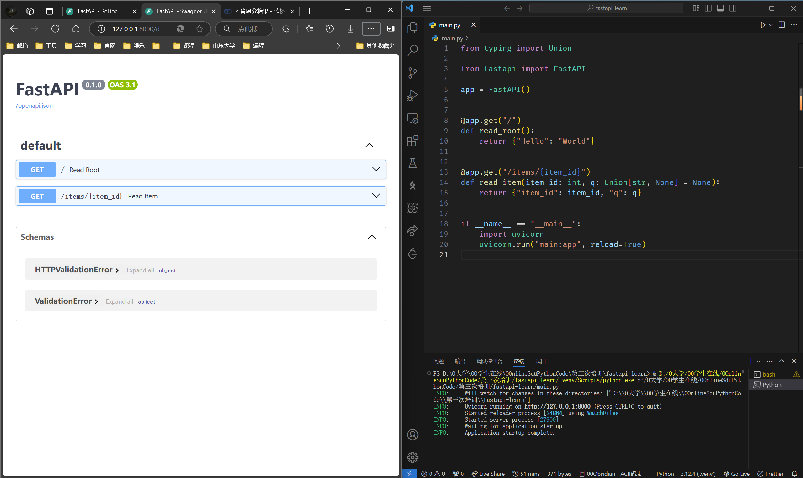
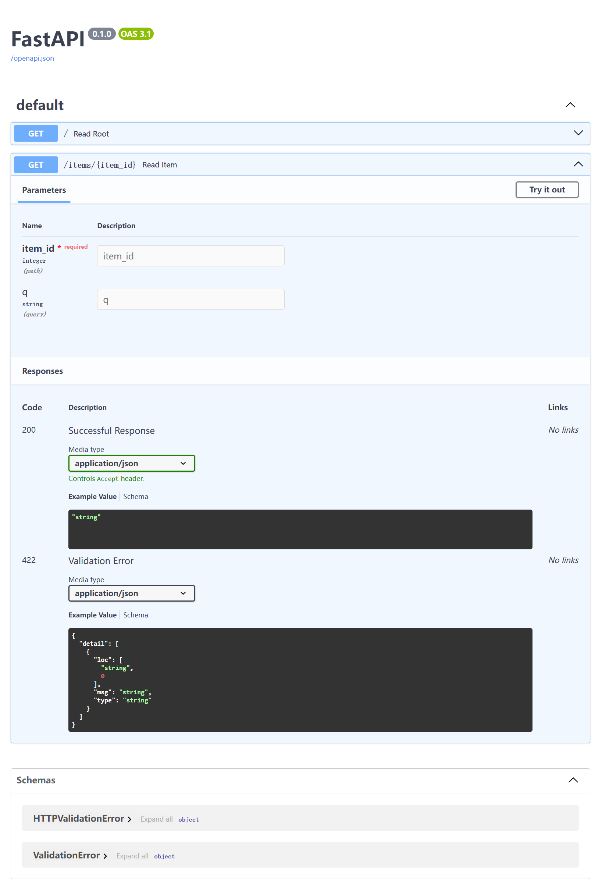
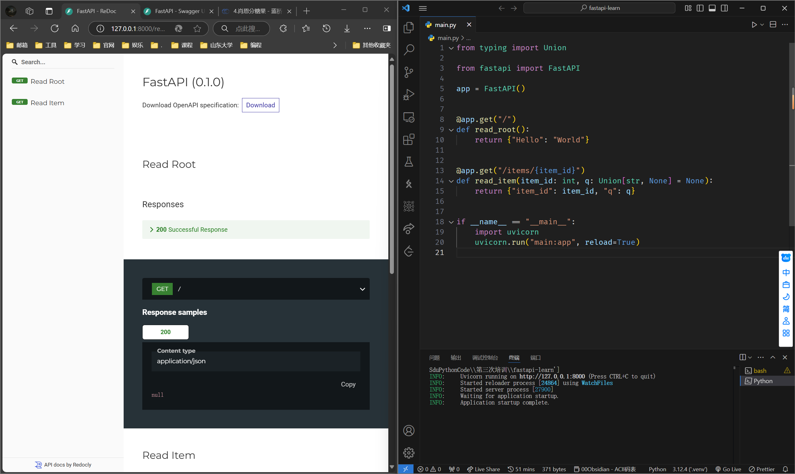

<span id="20241208214752-9p6aodi" style="display: none;"></span>---

# 1 安装

```bash
pip install fastapi
```

你还会需要一个 ASGI 服务器，生产环境可以使用 [Uvicorn](https://www.uvicorn.org/) 或者 [Hypercorn](https://github.com/pgjones/hypercorn)。

> ASGI 服务器：异步服务器网关接口，定义了一套标准的接口规范，用于连接 Web 服务器和应用框架，能实现异步处理和响应
>
> 它将电脑变成一台服务器，能够使我们在我们的电脑上来接收网络请求，并做出响应。

这里我们用 Uvicorn，它是一个高性能轻量级的 ASGI 服务器

```bash
pip install "uvicorn[standard]"
```

# 2 示例

## 2.1 创建

* 创建一个 `main.py`​ 文件并写入以下内容:

```python
# Python 3.8+
from typing import Union
from fastapi import FastAPI

app = FastAPI()


@app.get("/")
def read_root():
    return {"Hello": "World"}


@app.get("/items/{item_id}")
def read_item(item_id: int, q: Union[str, None] = None):
    return {"item_id": item_id, "q": q}
```

## 2.2 运行

### 2.2.1 方法一：指令启动

通过以下 `uvicorn`​ 指令来启动服务器：

```bash
uvicorn main:app --reload
```

> ###### 关于 `uvicorn main:app --reload`​ 命令......
>
> ​`uvicorn main:app`​ 命令含义如下:
>
> * ​`main`​：`main.py`​ 文件（一个 Python "模块"）。
> * ​`app`​：在 `main.py`​ 文件中通过 `app = FastAPI()`​ 创建的对象。
> * ​`--reload`​：让服务器在更新代码后重新启动。仅在开发时使用该选项。

之后终端里会有提示信息：

```bash
INFO:     Will watch for changes in these directories: ['D:\\0大学\\00学生在线\\0OnlineSduPythonCode\\第三次培训\\fastapi-learn']
INFO:     Uvicorn running on http://127.0.0.1:8000 (Press CTRL+C to quit)
INFO:     Started reloader process [30480] using WatchFiles
INFO:     Started server process [18564]
INFO:     Waiting for application startup.
INFO:     Application startup complete.
```

**按 Ctrl+C 退出服务器**

### 2.2.2 方法二：在 `main.py`​ 中加入代码

此方法更为方便，可以直接 `F5`​ 运行。

```python
if __name__ == "__main__":
    import uvicorn
    uvicorn.run("main:app", reload=True)
```

​`uvicorn.run()`​ 函数的常用参数含义：

* 第一个参数 `"main:app"`​：***文件名***和***FastAPI对象***的名字

* 第二个参数 `reload`​：设为 `True`​，每次更改运行时进行重新加载

## 2.3 测试与使用

### 2.3.1 直接访问

使用浏览器访问 [http://127.0.0.1:8000/items/5?q=somequery](http://127.0.0.1:8000/items/5?q=somequery)。

> ​`/items/`​ 是 `main.py`​ 中 API 定义的路径

你将会看到如下 JSON 响应：

```json
{"item_id": 5, "q": "somequery"}
```

你已经创建了一个具有以下功能的 API：

* 通过 *路径* `/`​ 和 `/items/{item_id}`​ 接受 HTTP 请求。
* 以上 *路径* 都接受 `GET`​ *操作*（也被称为 HTTP *方法*）。
* ​`/items/{item_id}`​ *路径* 有一个 *路径参数* `item_id`​ 并且应该为 `int`​ 类型。
* ​`/items/{item_id}`​ *路径* 有一个可选的 `str`​ 类型的 *查询参数* `q`​。

### 2.3.2 交互式 API 文档

#### 2.3.2.1 Swagger UI

现在访问 [http://127.0.0.1:8000/docs](http://127.0.0.1:8000/docs)。

你会看到自动生成的交互式 API 文档（由 [Swagger UI](https://github.com/swagger-api/swagger-ui)生成）：

​​

点开详情页，像这样↓

​​

* ​`Parameters`​：参数
* ​`Responses`​：响应
* ​`Try it out`​：点一下，可以测试 API

  * 在下面的 `Parameters`​ 的输入框里输入参数，点 `Execute`​(执行)按钮，就会模拟浏览器给 API 发一个网络请求
* ​`/openapi.json`​：点击之后显示 Swagger UI 渲染的页面的原 json 格式数据

#### 2.3.2.2 ReDoc

访问 [http://127.0.0.1:8000/redoc](http://127.0.0.1:8000/redoc)。

你会看到另一个自动生成的文档（由 [ReDoc](https://github.com/Rebilly/ReDoc) 生成）：

​​

* 优点：好看

* 缺点：不可交互，只能看

# 概念

## 路径

这里的「路径」指的是 URL 中从第一个 `/`​ 起的后半部分。

所以，在一个这样的 URL 中：

```
https://example.com/items/foo
```

...路径会是：

```
/items/foo
```

 **「路径」也通常被称为**​ ***「端点」或「路由」***​ **。**

**开发 API 时，「路径」是用来分离「关注点」和「资源」的主要手段。**

‍
