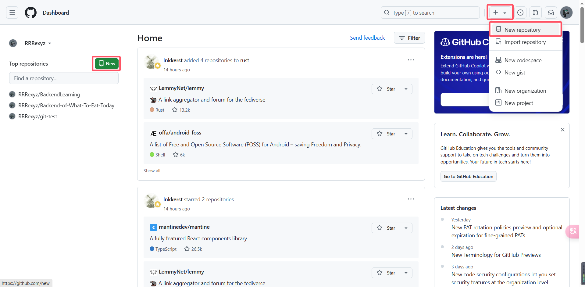
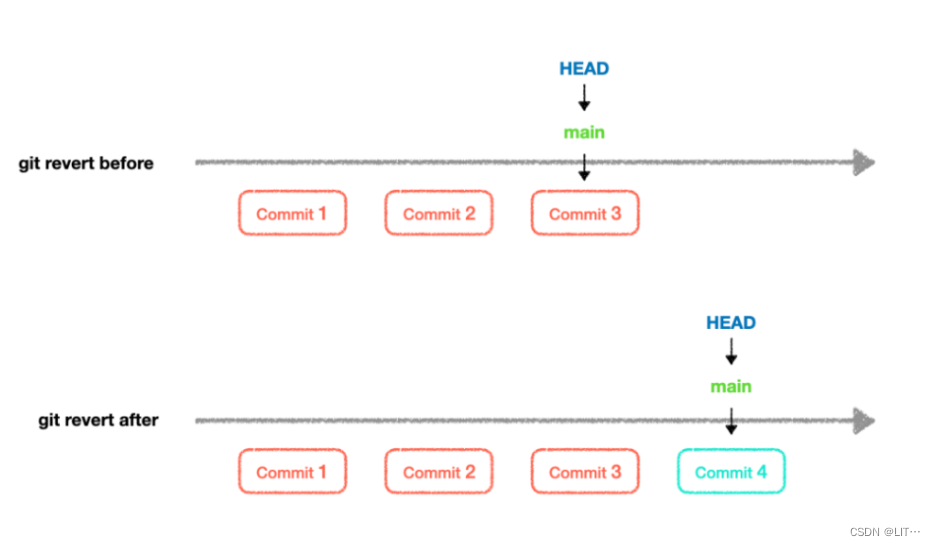

<span id="20250114210328-rb4yknv" style="display: none;"></span>---

## 1 Git的功能

Git是一个版本控制软件，主要用于解决在多人合作开发过程中因频繁的版本迭代和代码修改导致的管理混乱问题。它允许开发者轻松地追踪和管理代码的变化，确保每个更改都有明确的记录。与传统的版本管理方式相比，Git提供了更高效和灵活的管理手段，使得团队成员可以并行工作，而不会相互干扰。此外，Git还支持代码还原和版本回溯，使得开发者能够轻松地切换到之前的版本，大大提高了开发效率和代码质量。

大家现在可能还体会不到这个*版本控制* 的概念。举个例子让大家感受一下：

现在你和你的小伙伴决定开发一个项目，因为项目庞大，你们需要分工协作，每个人完成一部分功能，最后汇总到一起。同时由于工作量大，在开发时你可能今天写一点，明天写一点，然后突然有事情搁置了一星期，等有空了再回来继续写。

那么在这个过程中，就会产生大量的*版本*。在没有Git的情况下，你只能手动备份，由此产生大量的*备份文件*，而这些备份文件会占用大量的磁盘空间，并且你不知道各个版本之间的区别，因此难以管理。

某一天你突然发现你的代码无法正常运行了，或者突然发现当前方案有问题，这时你就需要回退到之前的版本。在没有Git的情况下，你只能手动寻找对应的备份文件，复制相应内容到当前版本。而在Git的帮助下，你只需要一条命令，就可以轻松地回退到之前的版本。

## 2 Git的基本操作

### 2.1 1.创建远程仓库

首先，我们需要创建一个远程仓库，也就是你项目的云端存储库，一般使用GitHub/Gitee平台。下面都以GitHub为例。

​

登录GitHub后，左边的仓库预览和右上方头像边上的加号图标，都可以创建新仓库。

​​

输入仓库名称（只能用英文），描述（可选），选择公开或私有，然后点击“Create repository”按钮。

​​

然后会进入上面的界面。这里GitHub已经给出了相关的命令行指令。

### 2.2 2.命令行指令

命令行，也被称为命令提示符或终端，是一种可以直接输入文本命令与计算机进行交互的界面。与图形用户界面（GUI）相比，命令行更加强大和灵活，可以执行更复杂的操作。

对于一句命令行指令来说，一般由三部分组成：命令、选项、参数。

* 命令：指定要执行的操作，即做什么。
* 选项：附加命令的附加信息，即怎么做。
* 参数：命令所需的输入或执行的对象，即对谁做。

其中选项和参数是可选的，不指定选项则会执行默认选项，也可以选择多个选项，有些命令不需要参数，有些命令则需要多个参数。

在Windows系统中大大弱化了命令行的地位，但对于高端的程序员来说，命令行依然是不可缺少的工具。

这里只介绍极度常用的几个通用命令和快捷键。

* cd：切换目录(change directory)。

```bash
cd ..           // 切换到上级目录
```

* clear：清屏。

```bash
clear
```

* Ctrl+C：中断正在运行的程序或者丢弃当前输入。
* 方向键↑：输入上一条命令。
* 方向键↓：输入下一条命令。
* 方向键←：向左移动光标。
* 方向键→：向右移动光标。
* 回车Enter：执行命令。

### 2.3 3.初始化仓库进行版本管理

从上面的图里我们也可以看到，GitHub给出了两种协议来进行仓库的通信。

* HTTPS协议：使用用户名和密码进行通信，安全性低。配置相对简单。
* SSH协议：使用SSH密钥对进行加密通信，安全性高。配置相对繁琐。

#### 2.3.1 使用HTTPS协议与仓库通信

创建一个空的工程文件夹，用VSCode 打开，然后开启终端（快捷键貌似是 `Ctrl`​ + `` ` ``​）。

依次运行（一行一行）GitHub给出的初始化HTTPS协议的命令。

```bash
echo "# git-test" >> README.md  
git init
git add README.md
git commit -m "first commit"
git branch -M main
git remote add origin https://github.com/RRRexyz/git-test.git
git push -u origin main
```

来拆解一下每一句命令的含义：

1. ​`echo "# git-test" >> README.md`​：在当前目录下创建一个名为README.md的文件，并在文件开头插入一行内容。
2. ​`git init`​：初始化一个Git仓库。
3. ​`git add README.md`​：将刚才创建的README.md文件添加到暂存区。
4. ​`git commit -m "first commit"`​：将暂存区的改动提交到本地仓库，提交说明为“first commit”。
5. ​`git branch -M main`​：将本地默认分支重命名为main。
6. ​`git remote add origin https://github.com/RRRexyz/git-test.git`​：连接到一个远程仓库，并命名为origin。
7. ​`git push -u origin main`​：将本地仓库的main分支推送到远程仓库。

##### 2.3.1.1 设置用户名与邮箱

如果是第一次执行上述操作的话，那么大概率到第4步的时候就会遇到报错，类似于"User name and email must be set before commit."。这是因为HTTP协议中提交代码时需要提供用户名和邮箱以确认提交者的身份。这时需要先设置用户名和邮箱。

```bash
git config --global user.name "your name"
git config --global user.email "your email"
```

将双引号中的内容替换为自己的用户名和邮箱然后运行这两条命令即可。其中 `--global`​ 选项表示全局设置，表示之后的Git操作都将使用这个用户名和邮箱。

*如果你想要针对某个仓库单独设置用户名和邮箱，则不需要加*  *​`--global`​*​ *选项。*

---

执行完上述命令后，我们刷新GitHub仓库，就可以看到刚才推送的README.md文件了。

##### 2.3.1.2 添加文件、提交文件

现在让我们来添加一些文件：

* index.html
* main.js
* style.css

我们要把这三个文件添加到暂存区，并提交到本地仓库。

```bash
git add index.html main.js style.css
git commit -m "add 3 files"
```

接着我们再推送到远程仓库。这里不用指定分支，会默认推送到当前分支。

```bash
git push
```

刷新GitHub仓库，就可以看到刚才推送的三个文件了。

如果你发现每次push时会要求输入用户名和密码，那么可以使用

```bash
git config --global credential.helper store  
```

命令来保存用户名和密码，之后就不需要每次都输入了。

如果要一次性添加大量文件的话，可以用

```bash
git add .
```

一个 `.`​ 表示当前目录下所有文件。

##### 2.3.1.3 取消跟踪文件

如果要你误跟踪了不需要跟踪的文件，可以用

```bash
git rm --cached 文件名
```

来撤销对这些文件的跟踪。

如果你要跟踪目录中大部分文件，但又不想跟踪某小部分文件（**注意：这是非常常见的情况，在实际项目中几乎都是这种情况**），此时可以引入 `.gitignore`​ 文件，来指定忽略目录下的一些文件。

​`.gitignore`​ 文件的格式是每行一个匹配模式，匹配模式可以是文件名、目录名、通配符。

​`.gitignore`​ 文件的格式规则比较复杂，这是只介绍一些常用的格式：

```bash
# 一个#加空格表示注释，注释行的内容不会生效

# 忽略某文件，直接写文件名，会忽略所有叫该名字的文件，无论这个文件在哪个文件夹
intro.txt

# 忽略某一文件夹下的某一文件
doc/notes.txt

# 忽略所有某一后缀名的文件（一个星号是通配符，可以匹配任意字符）
*.png
*.txt
# 但是某一特定文件为例外，可以用 ! 号取消忽略
!important.txt

# 忽略某目录及其子目录下的所有文件
build/

# 忽略所有temp开头的文件和目录
temp*  
```

这样，这些文件就不会被跟踪，也不会被提交到仓库。*还有更多高级的用法，大家可以自行搜索。*

##### 2.3.1.4 更详细的提交说明

如果在提交时想要输入更详细的提交说明，可以不使用 `-m`​ 选项(`m`​ 选项代表在命令行中输入提交说明)。直接用

```bash
git commit
```

此时会在VSCode中打开一个编辑器，可以在其中输入更详细的提交说明。写好以后关闭文件即表示提交完成。

现在你可以再尝试修改一些文件，然后提交并推送到仓库。

##### 2.3.1.5 查看提交记录

然后我们就获得了一些不同的版本。使用命令

```bash
git log
```

可以查看提交历史。这个命令会列出所有提交记录，包括提交ID、提交说明、提交时间、提交者、邮箱、提交内容。

##### 2.3.1.6 版本回退

如果想回退到之前的版本，可以使用命令

```bash
git reset --hard commit_id
```

或者

```bash
git reset --soft commit_id
```

其中 `commit_id`​ 是你想要回退到的版本的ID。

使用 `hard`​ 选项会移动HEAD指针并重置索引和工作区，彻底删除了提交以及暂存区和工作区的修改。通常用于确定需要完全丢弃某些提交和对应更改的情况。

使用 `soft`​ 选项只会移动HEAD指针，暂存区和工作目录中的更改都会保留在工作目录中，以便再次提交。用于想要保留更改并重新组织提交的情况，或者在分支切换时保持工作目录整洁。

​​

对于回退版本，还有一个命令

```bash
git revert commit_id
```

可以创建一个新的提交，用来撤销指定提交所做的更改。

​​

那如果我们回退到了老版本以后又反悔了，想要再次前进到新版本，却不知道新版本的ID号，该怎么办呢？事实上，Git提供了一个 `git reflog`​ 命令，可以查看所有的版本更迭记录，包括已经被删除的提交记录。只需要

```bash
git reflog
```

就可以查看我们所有commit的更迭记录。

---

##### 2.3.1.7 多线开发

以上讲的都是单线开发的情况，只有一个main分支。如果存在多线开发的话，就需要创建多个分支。

创建分支：

```bash
git branch 分支名
```

切换分支：

```bash
git checkout 分支名
```

创建并切换到分支：

```bash
git checkout -b 分支名 
```

分支重命名：

```bash
git branch -m 旧分支名 新分支名
```

将本地默认分支重命名：

```bash
git branch -M 分支名
```

删除本地分支：

```bash
git branch -d 分支名
```

删除远程分支：

```bash
git push origin --delete 分支名
```

查看本地分支：

```bash
git branch
```

查看远程分支：

```bash
git branch -r
```

查看所有分支：

```bash
git branch -a
```

将本地分支的更改推送到一个远程仓库中不存在的新分支（与本地同名），并且设置上游跟踪（upstream tracking），主要用于首次推送本地分支时：

```bash
git push -u origin 分支名 
```

将远程仓库origin中的分支更改拉取到本地仓库：

```bash
git fetch origin 分支名
```

创建一个新的本地分支来跟踪远程分支

```bash
git checkout -b 本地分支名 远程分支名
```

合并分支：

```bash
git merge 分支名   
# 如果有冲突，需要手动解决冲突
```

合并两个没有历史关联的分支：

```bash
git merge 分支名 --allow-unrelated-histories
```

---

将GitHub仓库中的内容克隆到本地：

```bash
git clone 仓库地址
```

#### 2.3.2 使用SSH协议与仓库通信

SSH协议的命令行指令与HTTPS协议的命令行指令基本相同，只是远程仓库的url地址不同。

但是要想使用SSH协议进行远程推送，需要先配置SSH密钥对。

首先在终端中运行

```bash
cat ~/.ssh/id_rsa.pub
```

如果输出信息为没有找到该文件，则说明还没有生成SSH密钥对。

那么运行

```bash
ssh-keygen -t rsa -b 4096 -C "your_email@example.com"
```

其中 `-t`​ 选项指定生成的密钥类型为RSA，`-b`​ 选项指定密钥长度为4096，`-C`​ 选项指定邮箱地址。

然后会出现一系列提示，全都保持默认一直回车即可。

生成完毕后再运行

```bash
cat ~/.ssh/id_rsa.pub
```

会输出一长串字符，这个就是我们所说的SSH公钥。

在GitHub中点击个人头像，选择Settings，左边栏选择SSH and GPG keys，右边点击New SSH key按钮，将刚才生成的SSH公钥粘贴到Key中，Title随便填，Key type不用改，然后点击Add SSH key按钮。

现在我们就可以使用SSH协议进行远程推送了。
