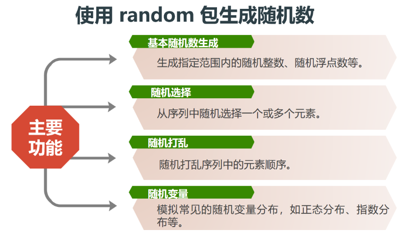

‍

---

> ### 2.2.1 `random`​ 库
>
> #### 2.2.1.1 主要功能
>
> 
>
> #### 2.2.1.2 子函数
>
> - `random()`：生成一个\[0.0, 1.0)之间的随机浮点数。
> - `uniform(a, b)`：生成一个\[a, b]之间的随机浮点数。
> - `randint(a, b)`：生成一个\[a, b]之间的随机整数。
> - `randrange([start,] stop[, step])`：生成一个\[start, stop)之间以step为步长的随机整数。
> - `choice(seq)`：从非空序列seq中随机选择一个元素。
> - `shuffle(list)`：将list中的元素随机打乱。
> - `sample(population, k)`：从population中随机选择k个不重复的元素。
> - `normalvariate(mu, sigma)`：生成一个符合正态分布的随机数，mu是均值，sigma是标准差。
>
> #### 2.2.1.3 `dir()`​ 函数
>
> 查看函数名称
>
> `dir(funcName)` 返回该库中的所有函数名称
>
> #### 2.2.1.4 `help()`​ 函数
>
> 带说明的函数列表
>
> `help(funcName)` 返回该库中所有函数详细说明

‍
