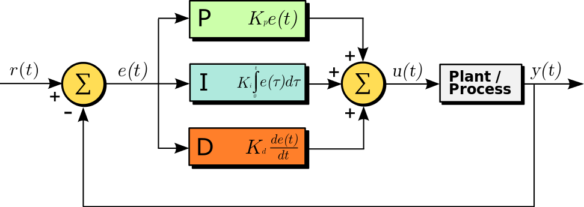

# 1. 四轴飞行器基本知识

## 1.1. PID 控制

P 是指比例项，即误差的大小与控制量的大小成正比。

I 是指积分项，即误差的积分，即误差的变化量。

D 是指微分项，即误差的变化率。

PID 控制的基本思想是：通过调整 P、I、D 三个参数，使得输出控制量与输入误差之间达到最佳匹配。

### 1.1.1. 基本公式

连续时间的 PID 控制公式：

$$u(t) = K_p e(t) + K_i \int^t_0 e(t) \mathrm{d}t + K_d \frac{\mathrm{d} }{\mathrm{d} x} e(t)$$

离散时间的 PID 控制公式：

$$u(k) = K_p e(k) + K_i \sum_{i=0}^k e(i) + K_d \big(e(k) - e(k-1)\big)$$

