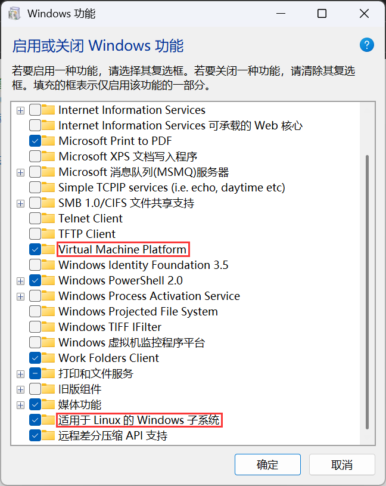

WSL 全称为 Windows Subsystem for Linux，是一个适用于 Windows 的 Linux 子系统，可以在 Windows 系统上原生运行 Linux。

# 安装 WSL

## 启用 Windows 功能

首先，需要开启适用于 Linux 的 Windows 子系统、Virtual Machine Platform 功能。

方法是打开 Windows 控制面板，点击“程序”，然后点击“启用或关闭 Windows 功能”，勾选“适用于 Linux 的 Windows 子系统”复选框以及“Virtual Machine Platform”复选框。



## 安装 Hyper-V

Windows 11 家庭版默认没有 Hyper-V 组件，需要手动下载。

新建一个文本文档，输入以下内容并保存为 `Hyper-V.cmd`：

```powershell
pushd "%~dp0"
dir /b %SystemRoot%\servicing\Packages\*Hyper-V*.mum >hyper-v.txt
for /f %%i in ('findstr /i . hyper-v.txt 2^>nul') do dism /online /norestart /add-package:"%SystemRoot%\servicing\Packages\%%i"
del hyper-v.txt
Dism /online /enable-feature /featurename:Microsoft-Hyper-V-All /LimitAccess /ALL
```

然后双击运行，等待安装完成。

## 下载 WSL

在 Powershell 中输入以下命令下载：

```powershell
wsl --install
```

## 下载 Linux 发行版

在 Microsoft Store 中搜索并下载需要的 Linux 发行版。

# 在 WSL 中使用 Windows 代理

WSL 和 Windows 共享端口，因此可以使用 Windows 上的代理端口来给 WSL 进行加速。

## 使用 `proxychains` 工具

### 安装 `proxychains`

```bash
sudo apt install proxychains
```

安装完成后，编辑 `/etc/proxychains.conf` 文件：

```bash
sudo nano /etc/proxychains.conf
```

修改最后一行的端口为 Windows 上的代理端口，例如：

```text
socks5 127.0.0.1 7897
```

### 使用 `proxychains`

在需要使用代理的命令前加上 `proxychains`，例如：

```bash
proxychains git clone https://github.com/xxx/xxx
```
