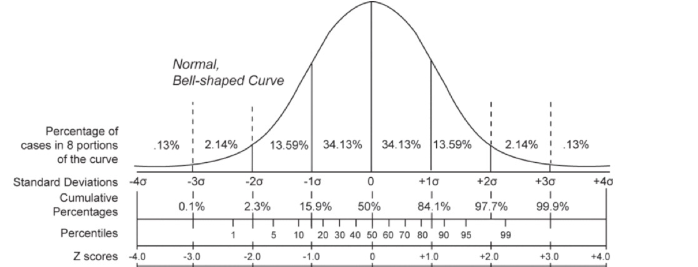
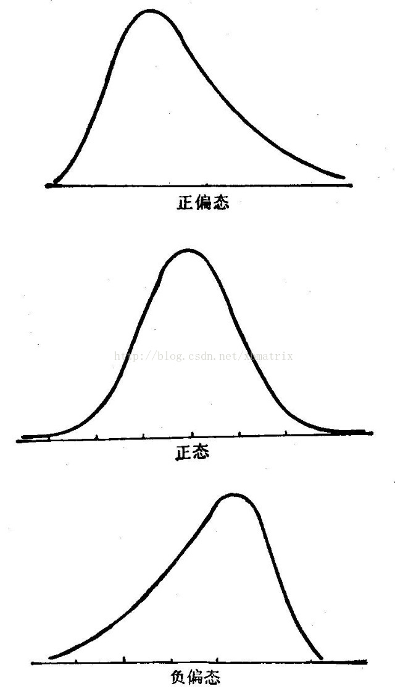

# 1. 正态分布 Normal Distribution

## 1.1. 定义

正态分布（Normal Distribution）是一种连续型的概率分布，其密度函数为：

$$ f(x)=\frac{1}{\sqrt{2\pi}\sigma} e^{-\frac{(x-\mu)^2}{2\sigma^2}} $$

其中，$\mu$ 为均值（mean），$\sigma$ 为标准差（standard deviation）。

要知道一个标准差内概率为 $68%$，两个标准差内概率为 $95%$，三个标准差内概率为 $99.7%$。

# 2. Z 分数/标准分数 Z-score/Standard Score

Z分数（Z-score）是一种将原始数据转换为标准分数的过程。

$$ z = \frac{x-\mu}{\sigma} $$

**理解**：以标准差 $\sigma$ 为“尺子”去度量某一原始数据 $x$ 与均值 $\mu$ 的距离。

**作用**：用于将不同量纲或单位的数据转换为统一的尺度，以便于比较和分析。

# 3. 基本统计量 Basic Statistics

## 3.1. 均值 Mean

数据集的平均数，记作 $\mu$。

$$ \mu = \frac{1}{N}\sum_{i=1}^N x_i $$

## 3.2. 中位数 Median

数据集的中间值。

## 3.3. 众数 Mode

数据集中出现次数最多的值。

## 3.4. 方差 Variance

$$ \sigma^2 = \frac{1}{N}\sum_{i=1}^N (x_i-\mu)^2 $$

## 3.5. 标准差 Standard Deviation

$$ \sigma = \sqrt{\frac{1}{N}\sum_{i=1}^N (x_i-\mu)^2} $$

## 3.6. 贝塞尔修正 Bessel's Correction

$$ s = \sqrt{\frac{1}{N-1}\sum_{i=1}^N (x_i-\bar{x})^2} $$

## 3.7. 峰度 Skewness

## 3.8. 偏度 Kurtosis

分为正偏态（Positive Skewness）、负偏态（Negative Skewness）和零偏态（Zero Skewness）即正态分布。

- 正偏态：右偏，尾部长，偏度大于0。
- 负偏态：左偏，尾部短，偏度小于0。
- 零偏态：无偏，即为正态分布，偏度等于0。

# 4. 中心极限定理 Central Limit Theorem

中心极限定理（Central Limit Theorem，CLT）是指样本均值收敛于正态分布。

30 个以上就可以视为大样本，样本均值近似服从正态分布。

# 5. 相关系数 Correlation Coefficient

## 5.1. Pearson's r

$$ r = \frac{\sum_{i=1}^N (x_i-\bar{x})(y_i-\bar{y})}{\sqrt{\sum_{i=1}^N (x_i-\bar{x})^2}\sqrt{\sum_{i=1}^N (y_i-\bar{y})^2}} $$

# 6. Testing of the Difference

## 6.1. Mathematical hypotheses

