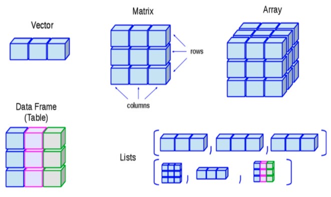

# 1. 读写

## 1.1. 控制台输出

```R
# 输出到控制台
print("Hello, world!")

# 或是直接写变量名
x <- 10
x
```

## 1.2. 设定工作目录

在工作时，进行文件操作时，我们需要先指定目标工作目录。

使用函数 `setwd()` 来设定工作目录。括号里面写上要设定的目录路径。

设定完成以后，可以使用 `print(getwd())` 来查看当前工作目录。

## 1.3. 读写文件

### 1.3.1. 读文件

使用 `read.csv()` 来读取 CSV 文件，返回格式为数据框。

```R
# 读取 CSV 文件
data <- read.csv("data.csv")
```

可以通过 `data$列名` 来访问数据框中的列。

### 1.3.2. 写文件

#### 1.3.2.1. txt 文件

使用 `sink()` 函数。

首先需要重定向到文件：`sink("filename.txt", append = TRUE)`

- `filename.txt` - 要写入的文件名。
- `append = TRUE` - 是否追加到文件末尾。不追加则会覆盖原文件。

接着就可以用在控制台输出的语句来写入文件。

输出结束后，使用 `sink()` 函数关闭文件（参数为空）。

#### 1.3.2.2. pdf 文件

方法类似，需要先重定向到一个 pdf 文件，在输出结束后还需要关闭文件。

不同在于，重定向使用 `pdf("filename.pdf")`，关闭文件使用 `dev.off()`。

中间可以使用 `plot()` 函数等来绘制图形。

```R
pdf("filename.pdf")
plot(1:10， 1:10)
dev.off()
```

#### 1.3.2.3. png 文件

方法和 pdf 文件类似，但需要使用 `png()` 函数。

```R
png("filename.png")
plot(1:10， 1:10)
dev.off()
```

# 2. 数据类型

- 向量 Vector
- 矩阵 Matrix
- 数组 Array
- 数据框 Data Frame
- 因子 Factor
- 列表 List



## 2.1. 向量 Vector

创建：使用 `c()` 函数，将元素用逗号隔开。

```R
v1 <- c(1, 2, 3)
v2 <- c("a", "b", "c")
v3 <- c(TRUE, FALSE, TRUE)
```

## 2.2. 矩阵 Matrix

### 2.2.1. 创建

#### 2.2.1.1. 使用 `matrix()` 函数创建矩阵

创建：使用 `matrix()` 函数，指定填充值、行数、列数。如果填充值比总数少，将会重复补充值。

```R
m1 <- matrix(1:10, nrow = 2, ncol = 5)
m2 <- matrix(1:4, nrow = 5, ncol = 5)
m1
m2
```

```R
> m1
     [,1] [,2] [,3] [,4] [,5]
[1,]    1    3    5    7    9
[2,]    2    4    6    8   10
> m2
     [,1] [,2] [,3] [,4] [,5]
[1,]    1    2    3    4    1
[2,]    2    3    4    1    2
[3,]    3    4    1    2    3
[4,]    4    1    2    3    4
[5,]    1    2    3    4    1
```

#### 2.2.1.2. 使用 `cbind()` 和 `rbind()` 函数合并矩阵

合并：使用 `cbind()` 和 `rbind()` 函数，分别将两个矩阵沿列和行方向进行合并。

也可将向量合并为矩阵。向量不管哪种合并方式，都并排合并。

### 2.2.2. 转置

使用 `t()` 函数进行转置，返回转置后的矩阵。

```R
m1
m2 = t(m1) # m2 为转置后的 m1
```

### 2.2.3. 对角线操作

使用 `diag()` 函数进行对角线操作，代表的是矩阵的对角线元素组成的向量。

可以通过赋值语句来修改对角线元素。

### 2.2.4. 小技巧

#### 2.2.4.1. 赋值

已知矩阵 `m`，向量 `x`、`y` 和 `v`，想要将 `v[i]` 的值赋给 `m` 在第 `x[i]` 行第 `y[i]` 列的元素。

```R
m[cbind(x, y)] <- v
```

## 2.3. 数组 Array

与矩阵类似，但可以有多个维度。

## 2.4. 数据框 Data Frame

数据框是 R 中最常用的一种数据结构。数据框由一组有相同结构的列组成，每一列可以是不同类型的数据。

## 2.5. 因子 Factor

因子是 R 中用于表示分类变量的数据类型。

# 3. 基本运算

## 3.1. 加减乘除

不仅可以对数字进行运算，还可以对向量、矩阵、数组等进行运算。

如 `c(1, 2, 3) + c(4, 5, 6)` 结果为 `c(5, 7, 9)`。

大小相同的向量、矩阵、数组等可以进行对应位置的加减乘除运算。

## 3.2. 指数运算

使用 `^` 或者 `**` 进行指数运算。

## 3.3. 取余与整除

- 取余运算：使用 `%%` 运算符
- 整除运算：使用 `%/%` 运算符

# 4. 常用函数

## 4.1. 随机数生成

1. runif - uniform 产生均匀分布的随机数。
    - `runif(count, lower, upper)`
        - 产生 `count` 个均匀分布的随机数，范围在 `lower` 和 `upper` 之间。
2. rnorm - normal 产生正态分布的随机数。
    - `rnorm(count, mean, sd)`
        - 产生 `count` 个正态分布的随机数，均值为 `mean`，标准差为 `sd`。
3. sample - 从一个已有的数据集中随机抽取指定个数的元素。
    - `sample(vector, size, replace)`
        - 从 `vector` 中随机抽取 `size` 个元素，`replace` 为 `TRUE` 时可以重复抽取。

## 4.2. 序列生成

1. sequ - sequence 生成等差数列。
    - `seq(from, to, by)`
        - 生成从 `from` 到 `to` 之间，步长为 `by` 的等差数列。
2. rep - repetition 重复生成元素。
    - `rep(element, times)`
        - 重复 `element` `times` 次。
    - `rep(element_vec, times_vec)`
        - 重复，且 `element_vec` 每个元素重复次数由 `times_vec` 的对应元素指定。
    - `rep(element, l=length)`
        - 重复 `element`，生成长度为 `l` 的向量。

## 4.3. 统计函数

1. mean - 计算平均值。
    - `mean(x)`
        - 计算 `x` 的平均值。
2. sd - 计算标准差。
    - `sd(x)`
        - 计算 `x` 的标准差。
3. max - 计算最大值。
    - `max(x)`
        - 计算 `x` 的最大值。
4. min - 计算最小值。
    - `min(x)`
        - 计算 `x` 的最小值。
5. sum - 计算和。
    - `sum(x)`
        - 计算 `x` 的和。
6. sqrt - 计算平方根。
    - `sqrt(x)`
        - 计算 `x` 的平方根。
7. range - 计算范围。
    - `range(x)`
        - 计算 `x` 的范围。
8. length - 计算长度。
    - `length(x)`
        - 计算 `x` 的长度，会包含 `NA` 值。

## 4.4. NA(Not Available) 处理

数据中可能包含缺失值，如果存在缺失值，会导致一些统计函数无法正常运行。

如：`mean(c(1, 2, NA))` 会输出 `NA`

所以用以下函数来处理数据，去除 `NA` 值。

1. is.na - 判断是否为 NA。
    - `is.na(x)`
        - 逐个输出每一个元素是否为 `NA` 的布尔值。

例如给 `a <- c(1, 2, NA, 4, NA)` 去除 `NA` 值，可以用以下代码：

```R
a_new <- a[!is.na(a)]
```

过滤器会只保留布尔值为 `TRUE` 的元素，所以得到的 `a_new` 为 `c(1, 2, 4)`。

## 4.5. `apply()` 函数

`apply()` 函数可以对矩阵、数组等进行操作。

使用方法：`apply(X, MARGIN, FUNCTION)`

- `X` - 矩阵、数组等。
- `MARGIN` - 1 表示对行操作，2 表示对列操作。
- `FUNCTION` - 要进行的操作函数。

如：

1. `apply(X, 1, mean)` - 对矩阵 `X` 的每一行求平均值。
2. `apply(X, 2, mean)` - 对矩阵 `X` 的每一列求平均值。
3. `apply(X, 1, myFunc)` - 对矩阵 `X` 的每一行调用函数 `myFunc`。

# 5. R Strings

## 5.1. 拼接

1. paste - 连接字符串。
    - `paste(string1, string2, ...)`
        - 连接多个字符串，默认用空格分隔，可以用 `sep` 参数指定分隔符。
2. paste0 - 连接字符串，不用空格分隔。
    - `paste0(string1, string2, ...)`
        - 连接多个字符串，不用空格分隔。

# 6. R Loops

## 6.1. for 循环

```R
for (i in 1:10)
{
    print(i)
}
```

# 7. R Functions

## 7.1. 创建函数

```R
# 定义函数
my_func <- function(x)
{
    return(x * 2)
}

# 调用函数
my_func(3)
```

# 8. 包的安装与使用

## 8.1. 安装

```R
install.packages("包名")
```

## 8.2. 启用包

在 R Studio 中的 Packages 选项卡中勾选需要的包。

然后在代码中使用 `library("包名")` 函数启用包。