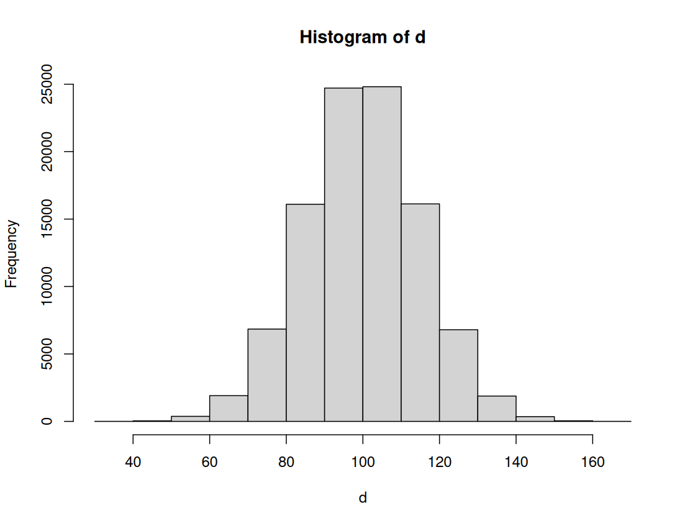

# 蒙特卡洛方法

蒙特卡洛方法是利用随机数来模拟实验，并通过随机抽样的方法来估计实验的结果。蒙特卡洛方法的基本思想是：

1. 随机地生成一个样本空间，即包含所有可能结果的集合。
2. 随机地从样本空间中抽取若干个样本，作为实验的观察结果。
3. 利用抽样的结果估计实验的结果。

## 计算 $\pi$ 的值

```R
# 蒙特卡洛方法计算pi值
monte_carlo_pi <- function(n) {
    x <- runif(n, 0, 1)
    y <- runif(n, 0, 1)
    r <- sqrt(x^2 + y^2)
    pi_estimate <- sum(r < 1) / n * 4
    return(pi_estimate)
}
print(monte_carlo_pi(1e6))
```

# 正态分布模拟

```R
# Simulation
num <- 100000
d <- rnorm(num, mean = 100, sd = 15)
hist(d)

s <- sum(d >= 85 & d <= 115)
s / num
```



且 `s / num` 的值接近 0.68，与正态分布的理论值相符。

# 中心极限定理的实现

```R
# Silulate the central limit theorem

# number of population
n = 10000

# sample size
s <- 3000

# sampling frequency
f = 5000

popu <- runif(n, min = 1, max = 100)
# hist(popu)

library(moments)
skewness(popu)
kurtosis(popu)

central <- function(size, freq) {
    means <- c()
    for (i in 1:freq) {
        samp <- sample(popu, size, replace = TRUE)
        means <- c(means, mean(samp))
    }
    return(means)
}

sample_means = central(s, f)
hist(sample_means)
skewness(sample_means)
kurtosis(sample_means)
```