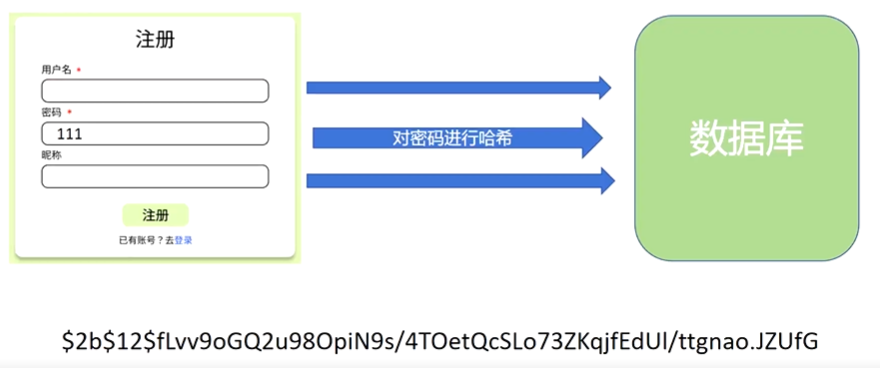

‍

---

# 1 FastAPI应用基本结构

- 导入 `FastAPI`​。
- 创建一个 `app`​ 实例。
- 编写一个**路径操作装饰器**（如 `@app.get("/")`​）。
- 编写一个**路径操作函数**（如下面的 `def root(): ...`​）。
- 运行开发服务器（如 `uvicorn main:app --reload`​）。

```python
# Python 3.8+
from fastapi import FastAPI

app = FastAPI()  # 创建FastAPI对象


@app.get("/")  # 装饰器，定义API的请求方法和路径
async def root():
    return {"message": "Hello World"}


if __name__ == "__main__":
    import uvicorn

    uvicorn.run("main:app", reload=True)  # 一般会指定四个参数
```

## 1.1 启动开发服务器

```python
import uvicorn
uvicorn.run()
```

其中，`uvicorn.run()`​函数内一般指定四个参数：

1. 应用的名字：`app="主程序文件名:FastAPI对象名"`​
2. 主机地址（不指定则取默认值127.0.0.1）：`host="127.0.0.1"`​
3. 端口号（不指定默认为8000，如果8000被占用了，可以用其他的端口号）：`port=8000`​
4. reload 重载模式：设为 True 以后会在代码修改后自动重载，开发时建议开启，**但在正式生产环境中应该把它关掉**。`reload=True`​

### <span id="20250113102814-bsvjwb5" style="display: none;"></span>1.1.1 响应状态码

启动以后在终端会输出服务器运行的日志，像这个样子，告诉你服务器运行的URL。我们按住Ctrl键点击这个URL，就可以直接访问。后面还说了Ctrl+C可以停止服务器。我们后面每次发送网络请求的时候，这里都会输出相应的日志。包括请求的端口号，请求方法，请求路径，请求参数，响应状态码。

这个响应状态码，具体来说就是HTTP状态码（HTTP Status Code）是用以表示网页服务器超文本传输协议响应状态的3位数字代码，第一位数字表示响应类别。

|响应码|类别|解释|
| --------| -----------------------------| --------------------------------------|
|1xx|信息性响应（Informational）|表示请求已经接受，正在继续处理|
|**2xx**|**成功响应（Successful**）|表示请求已经被成功接收、理解并接受|
|3xx|重定向信息（Redirection）|表示要完成请求必须进行更进一步的操作|
|**4xx**|**客户端错误响应（Client Error**）|表示请求有语法错误，或者请求无法实现|
|**5xx**|**服务器错误响应（Server Error）**|表示服务器未能实现合法的请求|

[14 响应状态码](#20250120144034-rp7qdzx)

具体的常见的状态码有：

- 200 OK‌：请求已成功，服务器返回所请求的资源。
- ‌201 Created‌：请求已成功，服务器创建了新的资源。
- ‌400 Bad Request‌：请求无效。
- ‌401 Unauthorized‌：需要身份验证。
- 403 Forbidden‌：服务器拒绝请求。
- ‌404 Not Found‌：资源未找到。
- 500 Internal Server Error‌：服务器内部错误。
- 502 Bad Gateway‌：网关错误。
- 503 Service Unavailable‌：服务器暂时不可用。

# 2 API 实例

## 2.1 创建

```python
app = FastAPI()
```

### 2.1.1 参数

#### 2.1.1.1 `title`​

用于设置应用标题，如图


#### 2.1.1.2 `version`​

版本

#### 2.1.1.3 `openapi_tags`​

api 模块分类

```python
tags_metadata = [
    {
        "name": "用户模块",
        "description": "用于用户注册、登录、注销的API，包括token生成和验证。",
    },
    {
        "name": "后台管理端",
        "description": "用于管理员增删查改帖子相关内容的API。",
    },
    {
        "name": "前台用户端",
        "description": "用于用户增删查改帖子相关内容的API。",
    },
]

app = FastAPI(title="论坛", version="0.0.1", openapi_tags=tags_metadata)

```

## 2.2 子类

### 2.2.1 `APIRouter`​ 类

是 `FastAPI`​ 类的子类

#### 2.2.1.1 用法

用于分模块写路径操作函数：

- 在各自的模块中新建 `router`​ 变量，其为一个 `APIRouter`​ 类
- 用和操作 `FastAPI`​ 一样的方式来写路径操作函数

#### 2.2.1.2 连接到主对象

用 `.include_router()`​ 方法

​`tags`​ 参数用于分组。

```python
app.include_router(backstage.router, tags=["后台管理端"], prefix="/api")
app.include_router(frontstage.router, tags=["前台用户端"], prefix="/api")
app.include_router(authorization.router, tags=["用户模块"], prefix="/api")
```

# 3 路径参数

**路径参数**就是把参数塞进URL路径里面进行传递。

像*f-string一样的占位符*来表示参数的值，实际的参数值将替换占位符部分。

```python
# Python 3.8+
from fastapi import FastAPI

app = FastAPI()


@app.get("/items/{item_id}")
async def read_item(item_id):
    return {"item_id": item_id}
```

这段代码把路径参数 `item_id`​ 的值传递给路径函数的参数 `item_id`​。

运行示例并访问 [http://127.0.0.1:8000/items/foo](http://127.0.0.1:8000/items/foo)，可获得如下响应：

```json
{"item_id":"foo"}
```

## 3.1 声明路径参数的类型

使用 Python 标准类型注解，声明路径操作函数中路径参数的类型。

```python
# Python 3.8+
@app.get("/items/{item_id}")
async def read_item(item_id: int):
    return {"item_id": item_id}
```

本例把 `item_id`​ 的类型声明为 `int`​。

类型声明将为函数提供错误检查、代码补全等编辑器支持。

## 3.2 数据转换

运行示例并访问 [http://127.0.0.1:8000/items/3](http://127.0.0.1:8000/items/3)，返回的响应如下：

```json
{"item_id":3}
```

注意，函数接收并返回的值是 `3`​（ `int`​），不是 `"3"`​（`str`​）。

**FastAPI** 通过类型声明自动**解析**请求中的数据。

## 3.3 数据校验

FastAPI 借助 Pydantic 的力量在请求的时候自动帮我们进行类型校验。

通过浏览器访问 [http://127.0.0.1:8000/items/foo](http://127.0.0.1:8000/items/foo)，接收如下 HTTP 错误信息，并同时在终端日志会出现 422 Unprocessable Entity：

```json
{
    "detail": [
        {
            "loc": [
                "path",
                "item_id"
            ],
            "msg": "value is not a valid integer",
            "type": "type_error.integer"
        }
    ]
}
```

这是因为路径参数 `item_id`​ 的值 （`"foo"`​）的类型不是 `int`​。

值的类型不是 `int`​ 而是浮点数（`float`​）时也会显示同样的错误，比如： [http://127.0.0.1:8000/items/4.2。](http://127.0.0.1:8000/items/4.2)

---

**FastAPI** 使用 Python 类型声明实现了数据校验。

注意，上面的错误清晰地指出了未通过校验的具体原因。

这在开发调试与 API 交互的代码时非常有用。

## 3.4 顺序很重要

有时，*路径操作*中的路径是写死的。

比如要使用 `/users/me`​ 获取当前用户的数据。

然后还要使用 `/users/{user_id}`​，通过用户 ID 获取指定用户的数据。

由于*路径操作*是**按顺序依次运行**的，因此，一定要在 `/users/{user_id}`​ 之前声明 `/users/me`​ ：

```python
# Python 3.8+
from fastapi import FastAPI

app = FastAPI()


@app.get("/users/me")
async def read_user_me():
    return {"user_id": "the current user"}


@app.get("/users/{user_id}")
async def read_user(user_id: str):
    return {"user_id": user_id}
```

否则，`/users/{user_id}`​ 将匹配 `/users/me`​，FastAPI 会**认为**正在接收值为 `"me"`​ 的 `user_id`​ 参数。

## 3.5 预设值

路径操作使用 Python 的 `Enum`​ 类型接收预设的*路径参数*。

### <span id="20250113234222-4xgzq4b" style="display: none;"></span>3.5.1 创建 `Enum`​ 类

导入 `Enum`​ 并创建继承自 `str`​ 和 `Enum`​ 的子类。

通过从 `str`​ 继承，API 文档就能把值的类型定义为**字符串**，并且能正确渲染。

然后，创建包含固定值的类属性，这些固定值是可用的有效值：

```python
# Python 3.8+
from enum import Enum

from fastapi import FastAPI


class ModelName(str, Enum):
    alexnet = "alexnet"
    resnet = "resnet"
    lenet = "lenet"


app = FastAPI()


@app.get("/models/{model_name}")
async def get_model(model_name: ModelName):
    if model_name is ModelName.alexnet:
        return {"model_name": model_name, "message": "Deep Learning FTW!"}

    if model_name.value == "lenet":
        return {"model_name": model_name, "message": "LeCNN all the images"}

    return {"model_name": model_name, "message": "Have some residuals"}
```

> Python 3.4 及之后版本支持[枚举（即 enums）](https://docs.python.org/zh-cn/3/library/enum.html)。
>
> **AlexNet**、**ResNet**、**LeNet** 是机器学习模型。

### 3.5.2 查看文档

API 文档会显示预定义*路径参数*的可用值：


### 3.5.3 使用 Python *枚举类型*

*路径参数*的值是枚举的元素。

```python
# Python 3.8+
@app.get("/models/{model_name}")
async def get_model(model_name: ModelName):
    if model_name is ModelName.alexnet:
        return {"model_name": model_name, "message": "Deep Learning FTW!"}

    if model_name.value == "lenet":
        return {"model_name": model_name, "message": "LeCNN all the images"}

    return {"model_name": model_name, "message": "Have some residuals"}
```

#### 3.5.3.1 比较*枚举元素*

枚举类 `ModelName`​ 中的*枚举元素*支持比较操作

#### 3.5.3.2 获取*枚举值*

使用 `model_name.value`​ 或 `your_enum_member.value`​ 获取实际的值（本例中为**字符串**）

使用 `ModelName.lenet.value`​ 也能获取值 `"lenet"`​

#### 3.5.3.3 返回*枚举元素*

即使嵌套在 JSON 请求体里（例如， `dict`​），也可以从*路径操作*返回*枚举元素*。

返回给客户端之前，要把枚举元素转换为对应的值（本例中为字符串）

```python
# Python 3.8+
@app.get("/models/{model_name}")
async def get_model(model_name: ModelName):
    if model_name is ModelName.alexnet:
        return {"model_name": model_name, "message": "Deep Learning FTW!"}
```

客户端中的 JSON 响应如下：

```json
{
  "model_name": "alexnet",
  "message": "Deep Learning FTW!"
}
```

## 3.6 包含路径的路径参数

假设*路径操作*的路径为 `/files/{file_path}`​。

但需要 `file_path`​ 中也包含*路径*，比如，`home/johndoe/myfile.txt`​。

此时，该文件的 URL 是这样的：`/files/home/johndoe/myfile.txt`​。

### 3.6.1 OpenAPI 支持

OpenAPI 不支持声明包含路径的*路径参数*，因为这会导致测试和定义更加困难。

不过，仍可使用 Starlette 内置工具在 **FastAPI** 中实现这一功能。

而且不影响文档正常运行，但是不会添加该参数包含路径的说明。

### 3.6.2 路径转换器

直接使用 Starlette 的选项声明包含*路径*的*路径参数*：

```
/files/{file_path:path}
```

本例中，参数名为 `file_path`​，结尾部分的 `:path`​ 说明该参数应匹配*路径*。

用法如下：

```python
# Python 3.8+
from fastapi import FastAPI

app = FastAPI()


@app.get("/files/{file_path:path}")
async def read_file(file_path: str):
    return {"file_path": file_path}
```

提示

注意，包含 `/home/johndoe/myfile.txt`​ 的路径参数要以斜杠（`/`​）开头。

本例中的 URL 是 `/files//home/johndoe/myfile.txt`​。注意，`files`​ 和 `home`​ 之间要使用**双斜杠**（`//`​）。

# 4 查询参数

声明的参数不是路径参数时，路径操作函数会把该参数自动解释为**查询**参数。

查询参数也是塞进URL里面进行传递，用**查询字符串**来表示。查询字符串是**键值对的集合**，这些键值对位于 URL 的 `?`​ 之后，以 `&`​ 分隔。

```python
# Python 3.8+
from fastapi import FastAPI

app = FastAPI()

fake_items_db = [{"item_name": "Foo"}, {"item_name": "Bar"}, {"item_name": "Baz"}]


@app.get("/items/")
async def read_item(skip: int = 0, limit: int = 10):
    return fake_items_db[skip : skip + limit]
```

例如，以下 URL 中：

```
http://127.0.0.1:8000/items/?skip=0&limit=10
```

查询参数为：

- ​`skip`​：值为 `0`​
- ​`limit`​：值为 `10`​

这些值都是 URL 的组成部分，因此，它们的类型**本应**是字符串。

但声明 Python 类型（上例中为 `int`​）之后，这些值就会转换为声明的类型，并进行类型校验。

所有应用于路径参数的流程也适用于查询参数：

- （显而易见的）编辑器支持
- 数据**解析**
- 数据校验
- API 文档

## 4.1 默认值

查询参数不是路径的固定内容，它是可选的，还支持默认值。

上例用 `skip=0`​ 和 `limit=10`​ 设定默认值。

访问 URL：

```
http://127.0.0.1:8000/items/
```

与访问以下地址相同：

```
http://127.0.0.1:8000/items/?skip=0&limit=10
```

但如果访问：

```
http://127.0.0.1:8000/items/?skip=20
```

查询参数的值就是：

- ​`skip=20`​：在 URL 中设定的值
- ​`limit=10`​：使用默认值

## 4.2 用途与例子

查询参数常用于传递筛选、分类这种请求的参数，例如搜索功能，内容分页等。我们在搜索引擎比如百度当中输入关键词然后搜索，你就会发现网址中就用查询参数的形式包裹了你搜索的内容。

```python
# Python 3.8+
from enum import Enum
from fastapi import FastAPI

app = FastAPI()

user_db = [
    {"id": 1, "name": "John", "phone": "1234567890"},
    {"id": 2, "name": "Jane", "phone": "9876543210"},
    {"id": 3, "name": "Bob", "phone": "5555555555"},
]


class Username(str, Enum):
    John = "John"
    Jane = "Jane"
    Bob = "Bob"


@app.get("/users/{user_name}", description="Get user by name")
def get_user(user_name: Username):
    for user in user_db:
        if user["name"] == user_name:
            return user


@app.get("/users", description="Get all users")
def get_all_users(skip: int = 0, limit: int = 3):
    return user_db[skip : skip + limit]
```

这里我们数据库中有5条数据，但是在一个页面上只能显示得下3条数据，所以我们用skip和limit两个参数来实现分页功能。limit参数指定每页显示的数据量，skip参数指定跳过前面多少条数据，由当前页数乘以limit得到。然后通过列表的切片操作就可以很方便地获取到每一页的内容。

这里因为我们定义了两个有点相似的路径操作函数，仅凭函数名和参数名可能不太容易区分它们的功能，所以我们可以在装饰器里面添加一个description参数来描述API的详细功能。这里添加的描述信息会在API文档详情中显示。


# 5 路径与查询参数的使用

路径参数和查询参数一般是在GET和DELETE请求中使用，POST,PUT,PATCHE等请求中也可以使用，但不是很推荐，因为它们一般会传递比较复杂的数据结构，我们通常会使用专门的请求体。

# 6 请求体

FastAPI 使用**请求体**从客户端（例如浏览器）向 API 发送数据。

**请求体**是客户端发送给 API 的数据。**响应体**是 API 发送给客户端的数据。

API 基本上肯定要发送**响应体**，但是客户端不一定发送**请求体**。

FastAPI 支持多种请求体类型，包括 JSON、表单、文件等。但是 JSON 基本上占据90%的使用场景。

JSON请求体的本质很简单，其实就是把参数以键值对的形式写成JSON，然后发送给服务器。

```python
# Python 3.10+
from fastapi import FastAPI
from pydantic import BaseModel


class Item(BaseModel):
    name: str
    description: str | None = None
    price: float
    tax: float | None = None


app = FastAPI()


@app.post("/items/")
async def create_item(item: Item):
    return item
```

## 6.1 导入 Pydantic 的 `BaseModel`​

在FastAPI中，我们使用Pydantic来定义请求体。

从 `pydantic`​ 中导入 `BaseModel`​：

```python
from pydantic import BaseModel
```

## 6.2 创建数据模型

把数据模型声明为继承 `BaseModel`​ 的类。

使用 Python 标准类型声明所有属性：

```python
class Item(BaseModel):
    name: str
    description: str | None = None
    price: float
    tax: float | None = None
```

与声明查询参数一样，包含默认值的模型属性是可选的，否则就是必选的。默认值为 `None`​ 的模型属性也是可选的。

例如，上述模型声明如下 JSON **对象**（即 Python **字典**）：

```json
{
    "name": "Foo",
    "description": "An optional description",
    "price": 45.2,
    "tax": 3.5
}
```

……由于 `description`​ 和 `tax`​ 是可选的（默认值为 `None`​），下面的 JSON **对象**也有效：

```json
{
    "name": "Foo",
    "price": 45.2
}
```

## 6.3 声明请求体参数

使用与声明路径和查询参数相同的方式声明请求体，把请求体添加至*路径操作*：

```python
@app.post("/items/")
async def create_item(item: Item):
    return item
```

此处，请求体参数的类型为 `Item`​ 模型。

## 6.4 结论

仅使用 Python 类型声明，**FastAPI** 就可以：

- 以 JSON 形式读取请求体
- （在必要时）把请求体转换为对应的类型
- 校验数据：

  - 数据无效时返回错误信息，并指出错误数据的确切位置和内容
- 把接收的数据赋值给参数 `item`​

  - 把函数中请求体参数的类型声明为 `Item`​，还能获得代码补全等编辑器支持
- 为模型生成 [JSON Schema](https://json-schema.org/)，在项目中所需的位置使用
- 这些概图是 OpenAPI 概图的部件，用于 API 文档 UI

## 6.5 注意

在使用 JSON 请求体的时候，需要注意的是，不同字段之间用逗号分隔，然后最后一个字段后面不能有逗号，否则 Python 将不能把 JSON 解析成字典，会报错。

# 7 查询参数和字符串校验

## 7.1 额外的校验

我们打算添加约束条件：即使 `q`​ 是可选的，但只要提供了该参数，则该参数值**不能超过50个字符的长度**。

```python
# Python 3.10+ - non-Annotated
from fastapi import FastAPI, Query

app = FastAPI()


@app.get("/items/")
async def read_items(q: str | None = Query(default=None, max_length=50)):
    results = {"items": [{"item_id": "Foo"}, {"item_id": "Bar"}]}
    if q:
        results.update({"q": q})
    return results
```

这里使用的是 `Query`​ 函数，其主要用法是指定一些参数的值，然后这个函数返回一个返回值。

### 7.1.1 导入 `Query`​

为此，首先从 `fastapi`​ 导入 `Query`​：

```python
from fastapi import FastAPI, Query
```

## 7.2 使用 `Query`​ 作为默认值

现在，将 `Query`​ 用作查询参数的默认值，并将它的 `max_length`​ 参数设置为 50：

```python
@app.get("/items/")
async def read_items(q: str | None = Query(default=None, max_length=50)):
	pass
```

---

由于我们必须用 `Query(default=None)`​ 替换默认值 `None`​，`Query`​ 的第一个参数同样也是用于定义默认值。

所以：

```python
q: str | None = Query(default=None)
```

或者

```python
from typing import Union
q: Union[str, None] = Query(default=None)
```

使得参数可选。

但是 `Query`​ 显式地将其声明为查询参数。

---

然后，我们可以将更多的参数传递给 `Query`​。在本例中，适用于字符串的 `max_length`​ 参数：

```python
q: str | None = Query(default=None, max_length=50)
```

将会校验数据，在数据无效时展示清晰的错误信息，并在 OpenAPI 模式的*路径操作*中记录该参数。

---

还有一些常用的参数，如：

​`min_length`​ `gt`​ `ge`​ `lt`​ `le`​

## 7.3 声明为必需参数

用 `Query`​ 声明参数，例如以下

```python
q: str | None = Query(default=None, min_length=3)
```

因此，当你在使用 `Query`​ 且需要声明一个值是必需的时，只需不声明默认参数：

```python
# Python 3.8+ - non-Annotated
q: str = Query(min_length=3)
```

### 7.3.1 使用省略号(`...`​)声明必需参数

有另一种方法可以显式的声明一个值是必需的，即将默认参数的默认值设为 `...`​ ：

```python
# Python 3.8+ - non-Annotated
q: str = Query(default=..., min_length=3)
```

这将使 **FastAPI** 知道此查询参数是必需的。

### 7.3.2 使用`None`​声明必需参数

你可以声明一个参数可以接收`None`​值，但它仍然是必需的。这将强制客户端发送一个值，即使该值是`None`​。

为此，你可以声明`None`​是一个有效的类型，并仍然使用`default=...`​：

```python
q: str | None = Query(default=..., min_length=3)
```

# 8 路径参数和数值校验

与使用 `Query`​ 为查询参数声明更多的校验和元数据的方式相同，你也可以使用 `Path`​ 为路径参数声明相同类型的校验和元数据。

```python
# Python 3.10+
from typing import Annotated

from fastapi import FastAPI, Path, Query

app = FastAPI()


@app.get("/items/{item_id}")
async def read_items(
    item_id: Annotated[int, Path(title="The ID of the item to get")],
    q: Annotated[str | None, Query(alias="item-query")] = None,
):
    results = {"item_id": item_id}
    if q:
        results.update({"q": q})
    return results
```

## 8.1 `Annotated`​ 函数

​`Annotated`​ 直译过来是注解，用法是:

```python
Annotated[数据类型, Query()/Path()]
```

## 8.2 导入 `Path`​

首先，从 `fastapi`​ 导入 `Path`​：

```python
# Python 3.10+
from typing import Annotated
```

## 8.3 声明元数据

你可以声明与 `Query`​ 相同的所有参数。

例如，要声明路径参数 `item_id`​的 `title`​ 元数据值，你可以输入：

```python
# Python 3.10+
from typing import Annotated

from fastapi import FastAPI, Path, Query

app = FastAPI()


@app.get("/items/{item_id}")
async def read_items(
    item_id: Annotated[int, Path(title="The ID of the item to get")],
    q: Annotated[str | None, Query(alias="item-query")] = None,
):
    results = {"item_id": item_id}
    if q:
        results.update({"q": q})
    return results
```

其中，下面语句

```python
q: Annotated[str | None, Query(alias="item-query")] = None

# 或使用以下语句
q: str | None = Query(default=None, alias="item-query")
```

​`Query`​ 函数的 `alias`​ 参数使用别名来指定查询参数的名称。 例如，可以将查询参数命名为 `item-query`​，但在函数中使用 `q`​。

​`title`​ 和 `description`​ 用于在生成的 OpenAPI 文档中为查询参数添加标题和描述。

> 路径参数总是必需的，因为它必须是路径的一部分。
>
> 所以，你应该在声明时使用 `...`​ 将其标记为必需参数。
>
> 然而，即使你使用 `None`​ 声明路径参数或设置一个其他默认值也不会有任何影响，它依然会是必需参数。

## 8.4 按需对参数排序

假设你想要声明一个必需的 `str`​ 类型查询参数 `q`​。

而且你不需要为该参数声明任何其他内容，所以实际上你并不需要使用 `Query`​。

但是你仍然需要使用 `Path`​ 来声明路径参数 `item_id`​。

*如果你将带有「默认值」的参数放在没有「默认值」的参数之前，Python 将会报错。*

但是你可以对其重新排序，并将不带默认值的值（查询参数 `q`​）放到最前面。

对 **FastAPI** 来说这无关紧要。它将通过参数的名称、类型和默认值声明（`Query`​、`Path`​ 等）来检测参数，而不在乎参数的顺序。

因此，你可以将函数声明为：

```python
# Python 3.8+ - non-Annotated
from fastapi import FastAPI, Path

app = FastAPI()


@app.get("/items/{item_id}")
async def read_items(q: str, item_id: int = Path(title="The ID of the item to get")):
    results = {"item_id": item_id}
    if q:
        results.update({"q": q})
    return results
```

## 8.5 按需对参数排序的技巧

如果你想不使用 `Query`​ 声明没有默认值的查询参数 `q`​，同时使用 `Path`​ 声明路径参数 `item_id`​，并使它们的顺序与上面不同，Python 对此有一些特殊的语法。

传递 `*`​ 作为函数的第一个参数。

Python 不会对该 `*`​ 做任何事情，但是它将知道之后的所有参数都应作为关键字参数（键值对），也被称为 `kwargs`​，来调用。即使它们没有默认值。

```python
# Python 3.8+ - non-Annotated
from fastapi import FastAPI, Path

app = FastAPI()


@app.get("/items/{item_id}")
async def read_items(*, item_id: int = Path(title="The ID of the item to get"), q: str):
    results = {"item_id": item_id}
    if q:
        results.update({"q": q})
    return results
```

## 8.6 数值校验：大于等于

使用 `Query`​ 和 `Path`​（以及你将在后面看到的其他类）可以声明字符串约束，但也可以声明数值约束。

像下面这样，添加 `ge=1`​ 后，`item_id`​ 将必须是一个大于（`g`​reater than）或等于（`e`​qual）`1`​ 的整数。

```python
# Python 3.8+ - non-Annotated
from fastapi import FastAPI, Path

app = FastAPI()


@app.get("/items/{item_id}")
async def read_items(
    *, item_id: int = Path(title="The ID of the item to get", ge=1), q: str
):
    results = {"item_id": item_id}
    if q:
        results.update({"q": q})
    return results
```

## 8.7 数值校验：大于和小于等于

同样的规则适用于：

- ​`gt`​：大于（`g`​reater `t`​han）
- ​`le`​：小于等于（`l`​ess than or `e`​qual）

```python
# Python 3.8+ - non-Annotated
from fastapi import FastAPI, Path

app = FastAPI()


@app.get("/items/{item_id}")
async def read_items(
    *,
    item_id: int = Path(title="The ID of the item to get", gt=0, le=1000),
    q: str,
):
    results = {"item_id": item_id}
    if q:
        results.update({"q": q})
    return results
```

## 8.8 数值校验：浮点数、大于和小于

数值校验同样适用于 `float`​ 值。

能够声明 `gt`​ 而不仅仅是 `ge`​ 在这个前提下变得重要起来。例如，你可以要求一个值必须大于 `0`​，即使它小于 `1`​。

因此，`0.5`​ 将是有效值。但是 `0.0`​或 `0`​ 不是。

对于 `lt`​ 也是一样的。

```python
# Python 3.8+ - non-Annotated
from fastapi import FastAPI, Path, Query

app = FastAPI()


@app.get("/items/{item_id}")
async def read_items(
    *,
    item_id: int = Path(title="The ID of the item to get", ge=0, le=1000),
    q: str,
    size: float = Query(gt=0, lt=10.5),
):
    results = {"item_id": item_id}
    if q:
        results.update({"q": q})
    if size:
        results.update({"size": size})
    return results
```

## 8.9 总结

你能够以与 [查询参数和字符串校验](https://fastapi.tiangolo.com/zh/tutorial/query-params-str-validations/) 相同的方式使用 `Query`​、`Path`​（以及其他你还没见过的类）声明元数据和字符串校验。

而且你还可以声明数值校验：

- ​`gt`​：大于（`g`​reater `t`​han）
- ​`ge`​：大于等于（`g`​reater than or `e`​qual）
- ​`lt`​：小于（`l`​ess `t`​han）
- ​`le`​：小于等于（`l`​ess than or `e`​qual）

---

- ​`Query`​、`Path`​ 以及你后面会看到的其他类继承自一个共同的 `Param`​ 类（不需要直接使用它）。
- 而且它们都共享相同的所有你已看到并用于添加额外校验和元数据的参数。

---

**技术细节：**

当你从 `fastapi`​ 导入 `Query`​、`Path`​ 和其他同类对象时，它们实际上是函数。

当被调用时，它们返回同名类的实例。

如此，你导入 `Query`​ 这个函数。当你调用它时，它将返回一个同样命名为 `Query`​ 的类的实例。

因为使用了这些函数（而不是直接使用类），所以你的编辑器不会标记有关其类型的错误。

这样，你可以使用常规的编辑器和编码工具，而不必添加自定义配置来忽略这些错误。

（？这部分目前还不了解 2025.1.17，刚学到这个位置）

# 9 请求体校验 - 字段

与在*路径操作函数*中使用 `Query`​、`Path`​ 、`Body`​ 声明校验与元数据的方式一样，可以使用 Pydantic 的 `Field`​ 在 Pydantic 模型内部声明校验和元数据。

```python
# Python 3.10+
from typing import Annotated

from fastapi import Body, FastAPI
from pydantic import BaseModel, Field

app = FastAPI()


class Item(BaseModel):
    name: str
    description: str | None = Field(
        default=None, title="The description of the item", max_length=300
    )
    price: float = Field(gt=0, description="The price must be greater than zero")
    tax: float | None = None


@app.put("/items/{item_id}")
async def update_item(item_id: int, item: Annotated[Item, Body(embed=True)]):
    results = {"item_id": item_id, "item": item}
    return results
```

## 9.1 `Field`​ 函数和 `Body`​ 函数的区别

- ​`Body`​ 主要用于路径操作函数的参数中
- `Field`​ 主要用在 Pydantic 模型中定义字段及属性

## 9.2 导入 `Field`​

首先，从 Pydantic 中导入 `Field`​：

```python
# Python 3.10+
from typing import Annotated
from fastapi import Body, FastAPI
from pydantic import BaseModel, Field
```

❗**警告：**

注意，与从 `fastapi`​ 导入 `Query`​，`Path`​、`Body`​ 不同，要直接从 `pydantic`​ 导入 `Field`​ 。

## 9.3 声明模型属性

然后，使用 `Field`​ 定义模型的属性：

```python
# Python 3.10+
from typing import Annotated

from fastapi import Body, FastAPI
from pydantic import BaseModel, Field

app = FastAPI()


class Item(BaseModel):
    name: str
    description: str | None = Field(
        default=None, title="The description of the item", max_length=300
    )
    price: float = Field(gt=0, description="The price must be greater than zero")
    tax: float | None = None
```

​`Field`​ 的工作方式和 `Query`​、`Path`​、`Body`​ 相同，参数也相同。

---

**技术细节：**

实际上，`Query`​、`Path`​ 都是 `Params`​ 的子类，而 `Params`​ 类又是 Pydantic 中 `FieldInfo`​ 的子类。

Pydantic 的 `Field`​ 返回也是 `FieldInfo`​ 的类实例。

​`Body`​ 直接返回的也是 `FieldInfo`​ 的子类的对象。后文还会介绍一些 `Body`​ 的子类。

注意，从 `fastapi`​ 导入的 `Query`​、`Path`​ 等对象实际上都是返回特殊类的函数。

---

**提示：**

注意，模型属性的类型、默认值及 `Field`​ 的代码结构与*路径操作函数*的参数相同，只不过是用 `Field`​ 替换了`Path`​、`Query`​、`Body`​。

## 9.4 添加更多信息

​`Field`​、`Query`​、`Body`​ 等对象里可以声明更多信息，并且 JSON Schema 中也会集成这些信息。

*声明示例*一章中将详细介绍添加更多信息的知识。

## 9.5 小结

Pydantic 的 `Field`​ 可以为模型属性声明更多校验和元数据。

传递 JSON Schema 元数据还可以使用更多关键字参数。

# 10 请求体示例

您可以在JSON模式中定义额外的信息。

一个常见的用例是添加一个将在文档中显示的`example`​。

有几种方法可以声明额外的 JSON 模式信息。

## 10.1 Pydantic `schema_extra`​

您可以使用 `Config`​ 和 `schema_extra`​ 为Pydantic模型声明一个示例，如[Pydantic 文档：定制 Schema ](https://docs.pydantic.dev/latest/concepts/json_schema/#schema-customization)中所述:

```python
# Python 3.10+
from fastapi import FastAPI
from pydantic import BaseModel

app = FastAPI()


class Item(BaseModel):
    name: str
    description: str | None = None
    price: float
    tax: float | None = None

    model_config = {
        "json_schema_extra": {
            "examples": [
                {
                    "name": "Foo",
                    "description": "A very nice Item",
                    "price": 35.4,
                    "tax": 3.2,
                }
            ]
        }
    }


@app.put("/items/{item_id}")
async def update_item(item_id: int, item: Item):
    results = {"item_id": item_id, "item": item}
    return results
```

这些额外的信息将按原样添加到输出的JSON模式中。

## 10.2 `Field`​ 的附加参数

在 `Field`​, `Path`​, `Query`​, `Body`​ 和其他你之后将会看到的工厂函数，你可以为JSON 模式声明额外信息，你也可以通过给工厂函数传递其他的任意参数来给JSON 模式声明额外信息，比如增加 `example`​:

```python
# Python 3.10+
from fastapi import FastAPI
from pydantic import BaseModel, Field

app = FastAPI()


class Item(BaseModel):
    name: str = Field(examples=["Foo"])
    description: str | None = Field(default=None, examples=["A very nice Item"])
    price: float = Field(examples=[35.4])
    tax: float | None = Field(default=None, examples=[3.2])


@app.put("/items/{item_id}")
async def update_item(item_id: int, item: Item):
    results = {"item_id": item_id, "item": item}
    return results
```

传递的那些额外参数不会添加任何验证，只会添加注释，用于文档的目的。

## 10.3 `Body`​ 额外参数

你可以通过传递额外信息给 `Field`​ 同样的方式操作`Path`​, `Query`​, `Body`​等。

比如，你可以将请求体的一个 `example`​ 传递给 `Body`​:

```python
# Python 3.10+
from typing import Annotated

from fastapi import Body, FastAPI
from pydantic import BaseModel

app = FastAPI()


class Item(BaseModel):
    name: str
    description: str | None = None
    price: float
    tax: float | None = None


@app.put("/items/{item_id}")
async def update_item(
    item_id: int,
    item: Annotated[
        Item,
        Body(
            examples=[
                {
                    "name": "Foo",
                    "description": "A very nice Item",
                    "price": 35.4,
                    "tax": 3.2,
                }
            ],
        ),
    ],
):
    results = {"item_id": item_id, "item": item}
    return results
```

## 10.4 三种方法对比

建议用第一种，最为直观，而且这样的示例在测试 api 的时候会默认给出

## 10.5 文档 UI 中的例子

使用上面的任何方法，它在 `/docs`​ 中看起来都是这样的:


# 11 Cookie 参数

Cookie 是我们通过浏览器访问网站时，存储在本地的一些数据，它可以用来保存用户的一些信息，比如说登录状态、购物车信息等。（至于怎么存储怎么读取是前端的事情）。

但有的时候要是前端偷懒非要把 Cookie 发过来让我们后端处理，我们要接收 Cookie 的话，需要把参数声明为 Cookie 类型。

方法是从 fastapi 导入 Cookie 类，然后用 Annotated 把它作为参数的一个元数据。

定义 `Cookie`​ 参数与定义 `Query`​ 和 `Path`​ 参数一样。

```python
from typing import Annotated

from fastapi import Cookie, FastAPI

app = FastAPI()


@app.get("/items/")
async def read_items(ads_id: Annotated[str | None, Cookie()] = None):
    return {"ads_id": ads_id}
```

---

**技术细节：**

​`Cookie`​ 、`Path`​ 、`Query`​ 是**兄弟类**，都继承自共用的 `Param`​ 类。

注意，从 `fastapi`​ 导入的 `Query`​、`Path`​、`Cookie`​ 等对象，实际上是返回特殊类的函数。

---

**说明：**

必须使用 `Cookie`​ 声明 cookie 参数，否则该参数会被解释为查询参数。

# 12 Header 参数

Header参数是在进行HTTP请求的时候，告诉服务器的一些额外信息。这个等大家后面要写项目的时候再去了解就行了，现在只需要知道它的声明方法和Cookie参数类似，也是导入Header类，然后用Annotated来声明。

首先，导入 `Header`​：

```python
# Python 3.10+
from typing import Annotated

from fastapi import FastAPI, Header

app = FastAPI()


@app.get("/items/")
async def read_items(user_agent: Annotated[str | None, Header()] = None):
    return {"User-Agent": user_agent}
```

---

**技术细节：**

​`Header`​ 是 `Path`​、`Query`​、`Cookie`​ 的**兄弟类**，都继承自共用的 `Param`​ 类。

注意，从 `fastapi`​ 导入的 `Query`​、`Path`​、`Header`​ 等对象，实际上是返回特殊类的函数。

---

**说明：**

必须使用 `Header`​ 声明 header 参数，否则该参数会被解释为查询参数。

# 13 响应模型

定义响应体模型的方法也很简单，只要在API的装饰器里面加上一个`response_model`​参数，然后把定义好的Pydantic模型类传进去就可以了。

响应模型最主要的作用是把输出的数据限制在模型定义内。

```python
from typing import Any

from fastapi import FastAPI
from pydantic import BaseModel

app = FastAPI()


class Item(BaseModel):
    name: str
    description: str | None = None
    price: float
    tax: float | None = None
    tags: list[str] = []


@app.post("/items/", response_model=Item)
async def create_item(item: Item) -> Any:
    return item
```

FastAPI 将使用此 `response_model`​ 来：

- 将输出数据转换为其声明的类型。
- 校验数据。
- 在 OpenAPI 的*路径操作*中为响应添加一个 JSON Schema。
- 并在自动生成文档系统中使用。

但最重要的是：

- **会将输出数据限制在该模型定义内。** 下面我们会看到这一点有多重要。

## 13.1 例子：用户密码

### 13.1.1 返回与输入相同的数据

现在我们声明一个 `UserIn`​ 模型，它将包含一个明文密码属性。

使用此模型声明输入数据，并使用同一模型声明输出数据：

```python
# Python 3.10+
from fastapi import FastAPI
from pydantic import BaseModel, EmailStr

app = FastAPI()


class UserIn(BaseModel):
    username: str
    password: str
    email: EmailStr
    full_name: str | None = None


# Don't do this in production!
@app.post("/user/")
async def create_user(user: UserIn) -> UserIn:
    return user
```

现在，每当浏览器使用一个密码创建用户时，API 都会在响应中返回相同的密码。

在这个案例中，这可能不算是问题，因为用户自己正在发送密码。

但是，如果我们在其他的*路径操作*中使用相同的模型，则**可能会将用户的密码发送给每个客户端。**

> ❗**Danger**
>
> 永远不要存储用户的明文密码，也不要在响应中发送密码。

## 13.2 添加输出模型

相反，我们可以创建一个有明文密码的输入模型和一个没有明文密码的输出模型。

这样，即便我们的*路径操作函数*将会返回包含密码的相同输入用户，但我们将 `response_model`​ 声明为了不包含密码的 `UserOut`​ 模型，**FastAPI** 将会负责过滤掉未在输出模型中声明的所有数据（使用 Pydantic）。

```python
from typing import Any

from fastapi import FastAPI
from pydantic import BaseModel, EmailStr

app = FastAPI()


class UserIn(BaseModel):
    username: str
    password: str
    email: EmailStr
    full_name: str | None = None


class UserOut(BaseModel):
    username: str
    email: EmailStr
    full_name: str | None = None


@app.post("/user/", response_model=UserOut)
async def create_user(user: UserIn) -> Any:
    return user
```

## 13.3 在文档中查看

当你查看自动化文档时，你可以检查输入模型和输出模型是否都具有自己的 JSON Schema：


并且两种模型都将在交互式 API 文档中使用：


## 13.4 响应模型编码参数

### 13.4.1 **​`response_model_exclude_unset=True`​**​

```python
# Python 3.10+
from fastapi import FastAPI
from pydantic import BaseModel

app = FastAPI()


class Item(BaseModel):
    name: str
    description: str | None = None
    price: float
    tax: float = 10.5
    tags: list[str] = []


items = {
    "foo": {"name": "Foo", "price": 50.2},
    "bar": {"name": "Bar", "description": "The bartenders", "price": 62, "tax": 20.2},
    "baz": {"name": "Baz", "description": None, "price": 50.2, "tax": 10.5, "tags": []},
}


@app.get("/items/{item_id}", response_model=Item, response_model_exclude_unset=True)
async def read_item(item_id: str):
    return items[item_id]
```

- ​`description: Union[str, None] = None`​ 具有默认值 `None`​。
- ​`tax: float = 10.5`​ 具有默认值 `10.5`​.
- ​`tags: List[str] = []`​ 具有一个空列表作为默认值： `[]`​.

但如果它们并没有存储实际的值，你可能想从结果中忽略它们的默认值。

举个例子，当你在 NoSQL 数据库中保存了具有许多可选属性的模型，但你又不想发送充满默认值的很长的 JSON 响应。

**你可以设置**​***路径操作装饰器***​**的** **​`response_model_exclude_unset=True`​** **参数：**

```python
@app.get("/items/{item_id}", response_model=Item, response_model_exclude_unset=True)
async def read_item(item_id: str):
    return items[item_id]
```

**然后响应中将不会包含那些默认值，而是仅有实际设置的值。**

因此，如果你向*路径操作*发送 ID 为 `foo`​ 的商品的请求，则响应（不包括默认值）将为：

```json
{
    "name": "Foo",
    "price": 50.2
}
```

#### 13.4.1.1 默认值字段有实际值的数据

但是，如果你的数据在具有默认值的模型字段中有实际的值，例如 ID 为 `bar`​ 的项：

```json
{
    "name": "Bar",
    "description": "The bartenders",
    "price": 62,
    "tax": 20.2
}
```

这些值将包含在响应中。

#### 13.4.1.2 具有与默认值相同值的数据

如果数据具有与默认值相同的值，例如 ID 为 `baz`​ 的项：

```json
{
    "name": "Baz",
    "description": None,
    "price": 50.2,
    "tax": 10.5,
    "tags": []
}
```

即使 `description`​、`tax`​ 和 `tags`​ 具有与默认值相同的值，FastAPI 足够聪明 (实际上是 Pydantic 足够聪明) 去认识到这一点，它们的值**被显式地所设定**（而不是取自默认值），**并包含在响应体中。**

### 13.4.2 `response_model_include`​ 和 `response_model_exclude`​

你还可以使用*路径操作装饰器*的 `response_model_include`​ 和 `response_model_exclude`​ 参数。

它们接收一个由属性名称 `str`​ 组成的 `set`​ 来包含（忽略其他的）或者排除（包含其他的）这些属性。

如果你只有一个 Pydantic 模型，并且想要从输出中移除一些数据，则可以使用这种快捷方法。

```python
@app.get(
    "/items/{item_id}/name",
    response_model=Item,
    response_model_include={"name", "description"},
)
async def read_item_name(item_id: str):
    return items[item_id]


@app.get("/items/{item_id}/public", response_model=Item, response_model_exclude={"tax"})
async def read_item_public_data(item_id: str):
    return items[item_id]
```

---

但是依然建议你使用上面提到的主意，**使用多个类而不是这些参数**。

这是因为即使使用 `response_model_include`​ 或 `response_model_exclude`​ 来省略某些属性，在应用程序的 OpenAPI 定义（和文档）中生成的 *JSON Schema 仍将是完整的模型*。

这也适用于作用类似的 `response_model_by_alias`​。

# <span id="20250120144034-rp7qdzx" style="display: none;"></span>14 响应状态码

使用*装饰器请求方法*中的 `status_code`​ 参数声明用于响应的 HTTP 状态码：

```python
from fastapi import FastAPI

app = FastAPI()


@app.post("/items/", status_code=201)
async def create_item(name: str):
    return {"name": name}
```

---

在 HTTP 协议中，发送 3 位数的数字状态码是响应的一部分。

[1.1.1 响应状态码](#20250113102814-bsvjwb5)

这些状态码都具有便于识别的关联名称，但是重要的还是数字。

简言之：

- ​`100`​ 及以上的状态码用于返回**信息**。这类状态码很少直接使用。具有这些状态码的响应不能包含响应体
- ​**​`200`​**​ 及以上的状态码用于表示**成功**。这些状态码是最常用的

  - ​`200`​ 是默认状态代码，表示一切**正常**
  - ​`201`​ 表示**已创建**，通常在数据库中创建新记录后使用
  - ​`204`​ 是一种特殊的例子，表示**无内容**。该响应在没有为客户端返回内容时使用，因此，该响应不能包含响应体
- ​**​`300`​**​ 及以上的状态码用于**重定向**。具有这些状态码的响应不一定包含响应体，但 `304`​**未修改**是个例外，该响应不得包含响应体
- ​**​`400`​**​ 及以上的状态码用于表示**客户端错误**。这些可能是第二常用的类型

  - ​`404`​，用于**未找到**响应
  - 对于来自客户端的一般错误，可以只使用 `400`​
- ​`500`​ 及以上的状态码用于表示服务器端错误。几乎永远不会直接使用这些状态码。应用代码或服务器出现问题时，会自动返回这些状态代码

不指定的话，响应成功的时候*会默认返回 200*。如果你有一些其他的需求的话可以手动指定。

# 15 表单 (Form)

后面大家写**用户注册和登录的API**的时候，会使用表单字段来**传输用户名和密码**。

接收的不是 JSON，而是表单字段时，要使用 `Form`​。

---

**说明:**

要使用表单，需预先安装 [`python-multipart`](https://github.com/Kludex/python-multipart)​。

例如，`pip install python-multipart`​。

## 15.1 定义 `Form`​ 参数

创建表单（`Form`​）参数的方式与 `Body`​ 和 `Query`​ 一样：

```python
# Python 3.9+
from typing import Annotated

from fastapi import FastAPI, Form

app = FastAPI()


@app.post("/login/")
async def login(username: Annotated[str, Form()], password: Annotated[str, Form()]):
    return {"username": username}
```

例如，OAuth2 规范的 "密码流" 模式规定要通过表单字段发送 `username`​ 和 `password`​。

该规范要求字段必须命名为 `username`​ 和 `password`​，并通过表单字段发送，不能用 JSON。

使用 `Form`​ 可以声明与 `Body`​ （及 `Query`​、`Path`​、`Cookie`​）相同的元数据和验证。

---

**说明:**

​`Form`​ 是直接继承自 `Body`​ 的类。

---

**提示:**

声明表单体要显式使用 `Form`​ ，否则，FastAPI 会把该参数当作查询参数或请求体（JSON）参数。

# 16 请求文件

**上传文件以「表单数据」形式发送。**

需要安装 `python-multipart`​。

```python
# Python 3.8+ - non-Annotated
from fastapi import FastAPI, File, UploadFile

app = FastAPI()


@app.post("/files/")
async def create_file(file: bytes = File()):
    return {"file_size": len(file)}


@app.post("/uploadfile/")
async def create_upload_file(file: UploadFile):
    return {"filename": file.filename}
```

## 16.1 ​`File`​ 参数

如果把*路径操作函数*参数的**类型声明为** **​`bytes`​**​，**FastAPI** 将以 `bytes`​ 形式读取和接收文件内容。

这种方式把文件的所有内容都存储在内存里，适用于小型文件。

不过，很多情况下，`UploadFile`​ 更好用。

---

**注：**

- ​`File`​ 是直接继承自 `Form`​ 的类。
- 声明文件体必须使用 `File`​，否则，FastAPI 会把该参数当作查询参数或请求体（JSON）参数。

## 16.2 `UploadFile`​ 参数

### 16.2.1 相比 `bytes`​ 的优势

- 使用 `spooled`​ 文件：

  - 存储在内存的文件超出最大上限时，FastAPI 会把文件存入磁盘；
- 这种方式更适于处理图像、视频、二进制文件等大型文件，好处是不会占用所有内存；
- 可获取上传文件的元数据；
- 自带 [file-like](https://docs.python.org/zh-cn/3/glossary.html#term-file-like-object) `async`​ 接口；
- 暴露的 Python [`SpooledTemporaryFile`](https://docs.python.org/zh-cn/3/library/tempfile.html#tempfile.SpooledTemporaryFile)​ 对象，可直接传递给其他预期「file-like」对象的库。

### 16.2.2 **​`UploadFile`​**​ 的属性

- ​**​`filename`​**​：上传文件名字符串（`str`​），例如， `myimage.jpg`​；

  - ​**​`endswith("")`​** ​方法：用于校验文件*后缀名*
- ​`content_type`​：内容类型（MIME 类型 / 媒体类型）字符串（`str`​），例如，`image/jpeg`​；
- ​`file`​： [`SpooledTemporaryFile`](https://docs.python.org/zh-cn/3/library/tempfile.html#tempfile.SpooledTemporaryFile)​（ [file-like](https://docs.python.org/zh-cn/3/glossary.html#term-file-like-object) 对象）。其实就是 Python文件，可直接传递给其他预期 `file-like`​ 对象的函数或支持库。

### 16.2.3 `UploadFile`​ 支持的 `async`​ 方法

- ​`write(data)`​：把 `data`​ （`str`​ 或 `bytes`​）写入文件；
- ​`read(size)`​：按指定数量的字节或字符（`size`​ (`int`​)）读取文件内容；
- ​`seek(offset)`​：移动至文件 `offset`​ （`int`​）字节处的位置；

  - 例如，`await myfile.seek(0)`​ 移动到文件开头；
  - 执行 `await myfile.read()`​ 后，需再次读取已读取内容时，这种方法特别好用；
- ​`close()`​：关闭文件。

因为上述方法都是 `async`​ 方法，要搭配「await」使用。

例如，在 `async`​ *路径操作函数* 内，要用以下方式读取文件内容：

```python
contents = await myfile.read()
```

在普通 `def`​ *路径操作函数* 内，则可以直接访问 `UploadFile.file`​，例如：

```python
contents = myfile.file.read()
```

## 16.3 上传多个文件

```python
@app.post("/uploadfile/")
async def create_upload_file(file: list[UploadFile]):
    return {"filename": file.filename}
```

将 `file`​ 参数类型注解为列表 `list[UploadFile]`​

## 16.4 示例：读取Excel文件

```python
import pandas as pd

@app.post("/uploadfile/")
async def create_upload_file(file: UploadFile):
    if file.filename.endswith(".xlsx"):
        data = pd.read_excel(file.file)
        data_dict = data.to_dict(orient="records")
        return data_dict
    else:
        return {"message": "File type not supported"}
```

---

读取 Excel 表的数据，

```python
data = pd.read_excel(file.file)
```

将其作为 `DataFrame`​ 类存到变量 `data`​ 中

---

将 `DataFrame`​ 转为*字典*类

```python
data_dict = data.to_dict(orient="records")
```

其中 `orient="records"`​ 会帮我们把表格的每一行都转成一个字典，键为第一行内容

# 17 处理错误

在处理请求的时候，我们基本不可避免地会遇到各种各样的错误。我们当然可以直接返回一串自定义的错误信息，但这样做显然不够优雅页不够规范，而且前端也不好处理。

所以我们需要使用一些专门的错误响应。借助 Python 的异常机制来进行操作。

需要向客户端返回错误提示的场景主要如下：

- 客户端没有执行操作的权限
- 客户端没有访问资源的权限
- 客户端要访问的项目不存在
- 等等 ...

遇到这些情况时，通常要返回 **4XX**（400 至 499）**HTTP 状态码**。

**4XX** 状态码与表示请求成功的 **2XX**（200 至 299） HTTP 状态码类似。

只不过，**4XX** 状态码表示客户端发生的错误。

大家都知道 **「404 Not Found」** 错误，还有调侃这个错误的笑话吧？

## 17.1 使用 `HTTPException`​

**向客户端**返回 HTTP 错误响应，可以使用 `HTTPException`​。

```python
# Python 3.8+
from fastapi import FastAPI, HTTPException

app = FastAPI()

items = {"foo": "The Foo Wrestlers"}


@app.get("/items/{item_id}")
async def read_item(item_id: str):
    if item_id not in items:
        raise HTTPException(status_code=404, detail="Item not found")
    return {"item": items[item_id]}
```

### 17.1.1 响应结果

请求为 `http://example.com/items/foo`​（`item_id`​ 为 `「foo」`​）时，客户端会接收到 HTTP 状态码 - 200 及如下 JSON 响应结果：

```
{
  "item": "The Foo Wrestlers"
}
```

但如果客户端请求 `http://example.com/items/bar`​（`item_id`​ `「bar」`​ 不存在时），则会接收到 HTTP 状态码 - 404（「未找到」错误）及如下 JSON 响应结果：

```
{
  "detail": "Item not found"
}
```

---

**提示：**

触发 `HTTPException`​ 时，可以用参数 `detail`​ 传递任何能转换为 JSON 的值，不仅限于 `str`​。

还支持传递 `dict`​、`list`​ 等数据结构。

**FastAPI** 能自动处理这些数据，并将之转换为 JSON。

# 18 路径操作配置

## 18.1 `tags`​ 参数

```python
@app.post("/items/", response_model=Item, tags=["items"])
async def create_item(item: Item):
    return item


@app.get("/items/", tags=["items"])
async def read_items():
    return [{"name": "Foo", "price": 42}]


@app.get("/users/", tags=["users"])
async def read_users():
    return [{"username": "johndoe"}]
```

OpenAPI 概图会自动添加标签，供 API 文档接口使用：


没有 `tags`​ 参数的默认在 `default`​ 组里面。

# 19 依赖项注入

所谓依赖项就是我们在自己定义的路径操作函数中去取引用外部函数。

它可以直接在函数的参数里面调用外部函数，免去了内部调用还要输入参数的麻烦，可以最大限度地降低代码重复度。

注入依赖项函数的时候***不需要函数的括号***，即***加入括号会变成调用函数***从而发生错误。

```python
# Python 3.10+
from fastapi import Depends, FastAPI

app = FastAPI()


async def common_parameters(q: str | None = None, skip: int = 0, limit: int = 100):
    return {"q": q, "skip": skip, "limit": limit}


@app.get("/items/")
async def read_items(commons: dict = Depends(common_parameters)):
    return commons


@app.get("/users/")
async def read_users(commons: dict = Depends(common_parameters)):
    return commons
```

# 20 SQL数据库

## 20.1 初识数据库

数据库（Database）是按照数据结构来组织、存储和管理数据的仓库。

常见的Excel表格就是数据库的一种可视化形式。

数据库中通常会有若干的表对应Excel中的工作表，会有若干的字段对应Excel中的列，每一行则对应Excel中的一行数据。

### 20.1.1 操作

数据库一般有增删改查（Create、Read、Update、Delete）四个基本操作。

### 20.1.2 用途

对于大部分非静态网页来说，无时无刻不在产生大量的数据，这些数据往往需要存储到数据库中。

在FastAPI中，我们一般使用SQL关系型数据库。SQL数据库里面我们比较常用的有SQLite和MySQL。

- SQLite是一个轻量级的数据库，它会直接内嵌到Python程序中，比较适合中小型网站的快速开发。
- MySQL是基于服务器的数据库，也就是说要使用MySQL你首先要有一台专门的服务器，然后它安装和配置起来也比较麻烦，它比较适合大型网站的开发。

## 20.2 创建数据库表

首先SQLModel是Python的一个库，我们先把它安装到虚拟环境中。

然后我们在目录下创建一个sql文件夹，把数据库相关的文件都放到这里面。***创建一个 __init__.py 文件，让这个文件夹成为一个包，方便导入到其他地方***。

### 20.2.1 创建数据库

第一步我们要创建 SQLite 数据库。在 sql 中***新建一个文件叫做 database.py***。我们在这里面写上创建数据库并初始化的内容。

```python
from sqlmodel import create_engine


sqlite_file_name = "database.db"
sqlite_url = f"sqlite:///{sqlite_file_name}"

connect_args = {"check_same_thread": False}
engine = create_engine(sqlite_url, connect_args=connect_args)
```

先根据项目内容给数据库取个名字，然后定义数据库创建路径，这里我们直接创建到当前文件所在目录下，写法是 **sqlite 冒号**​***三个***​**杠**然后加上数据库的名字。

然后我们定义一个连接参数 `connect_args`​，在这里面把 `check_same_thread`​ 字段设置为 False。使用 `check_same_thread=False`​ 可以让 FastAPI 在不同线程中使用同一个 SQLite 数据库。这很有必要，因为**单个请求**可能会使用**多个线程**（例如在依赖项中）。

然后我们用 `create_engine`​ 函数来创建一个数据库引擎，传入*数据库路径*和*连接参数*。

### 20.2.2 创建表

```python
from sqlmodel import SQLModel

def create_db_and_tables():
    SQLModel.metadata.create_all(engine)
```

### 20.2.3 创建 `Session`​ 依赖项

```python
from sqlmodel import Session
from typing import Annotated
from fastapi import Depends

def get_session():
    with Session(engine) as session:
        yield session


SessionDep = Annotated[Session, Depends(get_session)]
```

​**​`Session`​**​ 会存储**内存中的对象**并跟踪数据中所需更改的内容，然后它**使用** **​`engine`​**​ 与数据库进行通信。

我们会使用 `yield`​ 创建一个 FastAPI **依赖项**，为每个请求提供一个新的 `Session`​ 。这确保我们每个请求使用一个单独的会话。

然后我们创建一个 `Annotated`​ 的依赖项 `SessionDep`​ 来简化其他也会用到此依赖的代码。

---

这个文档**以上部分纯公式，暂时不需要搞懂**。

### 20.2.4 ​`database.py`​ **完整代码**

```python
from typing import Annotated

from fastapi import Depends
from sqlmodel import Field, Session, SQLModel, create_engine


class Hero(SQLModel, table=True):
    id: int | None = Field(default=None, primary_key=True)
    name: str = Field(index=True)
    age: int | None = Field(default=None, index=True)
    secret_name: str


sqlite_file_name = "database.db"
sqlite_url = f"sqlite:///{sqlite_file_name}"

connect_args = {"check_same_thread": False}
engine = create_engine(sqlite_url, connect_args=connect_args)


def create_db_and_tables():
    SQLModel.metadata.create_all(engine)


def get_session():
    with Session(engine) as session:
        yield session


SessionDep = Annotated[Session, Depends(get_session)]
```

## 20.3 构建数据库数据结构

在 sql 文件夹下***新建一个 models.py 文件***

### 20.3.1 添加表

用 `class`​ 来创建表，继承自 `SQLModel`​ 类。

如果要*把这个模型作为数据库中的一个表*的话，再**加一句** **​`table=True`​**​

然后用定义类变量的形式来定义表中的字段。

#### 20.3.1.1 定义字段

一般使用 `Field`​ 函数

**这里的** **​`Field`​**​ **导入自** **​`sqlmodel`​**​ **包，和从** **​`Pydantic`​**​ **包中的**​***不一样***​ **。**

#### 20.3.1.2 主键

表中每一个元素都需要一个**主键（Primary Key）** ，主键值必须是*唯一的*

方法是，定义 `id`​ 的时候用 `Field`​ 函数，里面用 `primary_key`​ 参数，

```python
id: int | None = Field(default=None, primary_key=True)
```

将其默认值设为 `None`​，SQLModel 就会自动分配逐渐递增的主键值。

#### 20.3.1.3 存储图片

##### 20.3.1.3.1 二进制格式存储图片

解码麻烦、占用较多数据库空间

##### 20.3.1.3.2 图床

网上找免费图床，将图片上传，获得 url 后将其存储到数据库中

## 20.4 数据库表增删查改

在 sql 文件夹下***新建一个 crud.py 文件***

(create, read, update, delete)

### 20.4.1 新建 Create

```python
def create_canteen(
    canteen_create: CanteenCreate,
    session: Session = Depends(get_session),
):
    canteen = Canteen.model_validate(canteen_create)  # 转化为带有主键的数据
    session.add(canteen)  # 添加至session对象中
    session.commit()  # 提交事务
    session.refresh(canteen)  # 刷新对象
    return canteen


class Campus(str, Enum):
    xls = "兴隆山"
    zx = "中心"
    hjl = "洪家楼"


class Canteen(SQLModel, table=True):
    id: int | None = Field(default=None, primary_key=True)
    name: str
    campus: Campus
    image: str | None = None


class CanteenCreate(SQLModel):
    name: str
    campus: Campus
    image: str | None = None
```

```python
@app.post("/canteen",response_model=sql.models.Canteen)
def create_canteen(canteen = Depends(sql.crud.create_canteen())):
    return canteen
```

这样的设置：

- 可以防止前端传入 id 导致重复

- 将传入的不带 id 的数据转换为带 id 的数据
- 返回带有自动创建的 id 的数据

### 20.4.2 查询 Read

#### 20.4.2.1 `select()`​ 方法-读取数据

```python
def select_heroes():
    with Session(engine) as session:
        statement = select(Hero)  # 返回一个statement对象，里面包含所有列
        results = session.exec(statement)  # 返回一个可迭代对象，包含所有数据
        for hero in results:
            print(hero)
```

#### 20.4.2.2 `.where()`​ 表达式-过滤数据

```python
select(Hero).where(Hero.name == "Deadpond")
```

返回一个符合条件的对象。可以在此基础上连用 `.where()`​。

​`.where()`​ 中可以添加多个表达式。

若需要 $or$ 的关系，则只需将多个表达式用 `or_()`​ 方法括起来。比如：

```python
statement = select(Hero).where(or_(Hero.age <= 35, Hero.age > 90))
```

执行 `session.exec(<statement>)`​，即可返回一个满足条件的可迭代对象。

#### 20.4.2.3 索引-优化查询

在字段后面用 `Field`​ 函数中的 `index=True`​ 来实现：

```python
class Canteen(SQLModel, table=True):
    id: int | None = Field(default=None, primary_key=True)
    name: str = Field(index=True)
    campus: Campus
    image: str | None = None
```

- **优点：** 能提高查找效率，减少*读取数据*的时间，需要频繁查找的数据项应至少创建一个索引
- **缺点：**​*写入数据*的时间变长，并且需要占用数据库*额外的空间*

#### 20.4.2.4 `.first()`​

```python
def select_heroes():
    with Session(engine) as session:
        statement = select(Hero).where(Hero.age <= 35)
        results = session.exec(statement)
        hero = results.first()
        print("Hero:", hero)
```

返回 `results`​ 的第一行。

若不存在，返回 `None`​

#### 20.4.2.5 `.one()`​

匹配***恰好一行***数据。

多于一行或者没有数据都会报错。

#### 20.4.2.6 `.get()`​方法

```python
def read_canteen(canteen_id: int, session: Session = Depends(get_session)):
    canteen = session.get(Canteen, canteen_id) # (数据表名, 主键值)
    if not canteen:
        raise HTTPException(status_code=404, detail="Canteen not found")
    return canteen
```

通过***主键***来获取某一行数据。

#### 20.4.2.7 `.all()`​ 方法

将 `session.exec()`​ 获得的可迭代对象转化为列表。

#### 20.4.2.8 读取数据范围

##### 20.4.2.8.1 `.limit()`​

我们从 `select()`​ 获取的特殊 **select** 对象还有一个方法 `.limit()`​，我们可以用它来将结果限制为某个数字。

```python
statement = select(Hero).limit(3)
```

##### 20.4.2.8.2 `.offset()`​

**Offset** 表示“跳过这么多行”，由于我们要跳过我们已经看过的行，也就是前三行，我们使用 `.offset(3)`​

```python
statement = select(Hero).offset(3).limit(3)
```

### 20.4.3 更新 Update

```python
@app.patch("/heroes/{hero_id}", response_model=HeroPublic)
def update_hero(hero_id: int, hero: HeroUpdate):
    with Session(engine) as session:
        db_hero = session.get(Hero, hero_id)
        if not db_hero:
            raise HTTPException(status_code=404, detail="Hero not found")
        hero_data = hero.model_dump(exclude_unset=True)
        db_hero.sqlmodel_update(hero_data)
        session.add(db_hero)
        session.commit()
        session.refresh(db_hero)
        return db_hero
```

#### 20.4.3.1 `.model_dump()`​ 方法-转换为字典

​`HeroUpdate`​ 类使用该方法即 `ClassUpdate.model_dump()`​ 返回一个字典数据。

但是这样会将新的数据完全替换掉原数据，比如传入空 json 数据将会将原数据变为空数据。

因此**使用参数** **​`exclude_unset=True`​**​ 来*忽略掉未设置的字段的替换*，以实现部分替换。

#### 20.4.3.2 `.sqlmodel_update()`​

使用 `Class.sqlmodel_update(ClassUpdate_dict)`​ 对 `Class`​ 进行更新

然后添加、提交、刷新。

### 20.4.4 删除 Delete

```python
@app.delete("/heroes/{hero_id}")
def delete_hero(hero_id: int):
    with Session(engine) as session:
        hero = session.get(Hero, hero_id)
        if not hero:
            raise HTTPException(status_code=404, detail="Hero not found")
        session.delete(hero)
        session.commit()
        return {"ok": True}
```

## 20.5 建立数据库表间连接

```python
class Canteen(SQLModel, table=True):
    id: int | None = Field(default=None, primary_key=True)
    name: str
    campus: Campus
    image: str | None = None
  
    floor: list["Floor"] = Relationship(back_populates="canteen") 


class Floor(SQLModel, table=True):
    id: int | None = Field(default=None, primary_key=True)
    level: int
    canteen_id: int = Field(foreign_key="canteen.id")
  
    canteen: Canteen | None = Relationship(back_populates="floor")
```

### 20.5.1 外键-建立连接

用 `Field`​ 函数的 **​`foreign_key`​**​ 参数来设置**外键**。

如为该参数赋值 `"canteen.id"`​，则将上面的 `canteen_id`​ 参数连接 `canteen`​ 表中的主键 `id`​。

*这样就建立了连接。*

### 20.5.2 `Relationship()`​-创建关系

其中的 `back_populates`​ 参数的值应为所关联的表中的一个字段名  *(str)* ，这样表示当前变量引用的是相关联的表中的这个字段。

两个表互相使用 `back_populates`​ 建立关联，则能通过 `Relationship()`​ 赋给的变量来互相访问。

比如：

```python
canteen = Canteen(...)
floor = canteen.floor
```

这样就能获取到 `canteen`​ 对象所连接到的 `Floor`​ 对象

# 21 CORS（跨域资源共享）

[CORS 或者「跨域资源共享」](https://developer.mozilla.org/en-US/docs/Web/HTTP/CORS) 指浏览器中运行的前端拥有与后端通信的 JavaScript 代码，而后端处于与前端不同的「源」的情况。

## 21.1 源

源是协议（`http`​，`https`​）、域（`myapp.com`​，`localhost`​，`localhost.tiangolo.com`​）以及端口（`80`​、`443`​、`8080`​）的组合。

因此，这些都是不同的源：

- ​`http://localhost`​
- ​`https://localhost`​
- ​`http://localhost:8080`​

即使它们都在 `localhost`​ 中，但是它们使用不同的协议或者端口，所以它们都是不同的「源」。

## 21.2 实现

示例：

```python
app.add_middleware(
    CORSMiddleware,
    allow_origins=["*"],  # 允许的源
    allow_credentials=True,  # 允许的凭证
    allow_methods=["*"],  # 允许的方法
    allow_headers=["*"],  # 允许的请求头
)
```

支持以下参数：

- ​`allow_origins`​ - 一个允许跨域请求的源列表。例如 `['https://example.org', 'https://www.example.org']`​。你可以使用 `['*']`​ 允许任何源。
- ​`allow_origin_regex`​ - 一个正则表达式字符串，匹配的源允许跨域请求。例如 `'https://.*\.example\.org'`​。
- ​`allow_methods`​ - 一个允许跨域请求的 HTTP 方法列表。默认为 `['GET']`​。你可以使用 `['*']`​ 来允许所有标准方法。
- ​`allow_headers`​ - 一个允许跨域请求的 HTTP 请求头列表。默认为 `[]`​。你可以使用 `['*']`​ 允许所有的请求头。`Accept`​、`Accept-Language`​、`Content-Language`​ 以及 `Content-Type`​ 请求头总是允许 CORS 请求。
- ​`allow_credentials`​ - 指示跨域请求支持 cookies。默认是 `False`​。另外，允许凭证时 `allow_origins`​ 不能设定为 `['*']`​，必须指定源。
- ​`expose_headers`​ - 指示可以被浏览器访问的响应头。默认为 `[]`​。
- ​`max_age`​ - 设定浏览器缓存 CORS 响应的最长时间，单位是秒。默认为 `600`​。

中间件响应两种特定类型的 HTTP 请求……

### 21.2.1 开发环境下

```python
app.add_middleware(
    CORSMiddleware,
    allow_origins=["*"],  # 允许的源
    allow_credentials=True,  # 允许的凭证
    allow_methods=["*"],  # 允许的方法
    allow_headers=["*"],  # 允许的请求头
)
```

可以使用通配符 `["*"]`​ 来允许所有

### 21.2.2 生产环境下

将源改为前端的具体的源，以***提高安全性***

# 22 用户鉴权—OAuth2双token授权模型

## 22.1 注册



## 22.2 登录


## 22.3 鉴权

access_token时效较短，一般会在若干分钟后失效  
refresh_token时效较长，一般会在若干天后失效  
用户登录后在本地保存access_token和refresh_token

对于需要登录才能访问的接口，在请求时必须带上access_token，  
如果不带或者token已失效，则请求失败

当access_token失效时，前端自动调用刷新token的接口，  
调用时在请求头加上refresh_token，  
若refresh_token未失效则获得新的access_token，  
若refresh_token也失效则必须重新登录

### 22.3.1 使用双 token 的意义

#### 22.3.1.1 便捷度方面

1. 减少登录次数：双token模式允许用户在`access_token`​过期后，通过`refresh_token`​自动获取新的`access_token`​，而无需重新输入用户名和密码。这大大减少了用户频繁登录的次数，提升了用户体验。

#### 22.3.1.2 安全性方面

1. 在单token模式下，攻击者一旦窃取了长期有效的token，就可以长期冒充用户身份；而在双token模式中，即使`refresh_token`​被盗取，攻击者也无法直接访问受保护的资源，因为还需要使用`refresh_token`​来获取`access_token`​。
2. ​`access_token`​的短期有效性限制了攻击者利用其进行不当操作的时间窗口。
3. 每次使用`refresh_token`​刷新`access_token`​时，后端可以同时更新`refresh_token`​的值，并使旧的`refresh_token`​失效。这样，即使旧的`refresh_token`​被盗取，攻击者也无法再次使用它来获取新的`access_token`​。
4. ​**​`refresh_token`​**​**的使用频率低**：与`access_token`​相比，`refresh_token`​不会频繁地在网络中传输，从而降低了其被窃取的风险。
5. 存储位置的安全性：虽然`refresh_token`​存储在浏览器的localStorage中存在一定的风险，但可以通过其他方式来提高其安全性。例如，可以将`refresh_token`​存储在HTTP-only Cookie中，避免被JavaScript代码访问。

## 22.4 具体实现❗

### 22.4.1 用到的 Python 库

```python
pip install pyjwt
pip install passlib[bcrypt]
```

### 22.4.2 完整代码

```python
from fastapi import APIRouter
from datetime import datetime, timedelta, timezone
from typing import Annotated
import jwt
from fastapi import APIRouter, Depends, HTTPException, status
from fastapi.security import OAuth2PasswordBearer, OAuth2PasswordRequestForm
from jwt.exceptions import InvalidTokenError
from passlib.context import CryptContext
from pydantic import BaseModel

import schemas as sch
from sql.database import Session, get_session
import sql.models as models

from sqlalchemy.exc import IntegrityError
from sqlmodel import select

router = APIRouter()

# to get a string like this run:
# openssl rand -hex 32
"""密钥，最好用openssl自己生成一个"""
SECRET_KEY = "9e60ee48dbc9e710889338ecdd5d6d838f9a278ddc56fb536bdd2f53e19161fa"
ALGORITHM = "HS256"


class Token(BaseModel):
    access_token: str
    refresh_token: str
    token_type: str
    username: str


class TokenData(BaseModel):
    username: str | None = None


"""复制粘贴就行"""
pwd_context = CryptContext(schemes=["bcrypt"], deprecated="auto")
oauth2_scheme = OAuth2PasswordBearer(tokenUrl="token")


# 验证密码是否一致
def verify_password(plain_password, hashed_password):
    return pwd_context.verify(plain_password, hashed_password)


# 对明文密码进行加密。返回哈希值
def get_password_hash(password):
    return pwd_context.hash(password)


def create_access_token(data: dict, expires_delta: timedelta | None = None):
    to_encode = data.copy()
    if expires_delta:
        expire = datetime.now(timezone.utc) + expires_delta
    else:
        expire = datetime.now(timezone.utc) + timedelta(
            minutes=60
        )  # 定义 access_token的持续时间，一般几分钟或十几分钟
    to_encode.update({"exp": expire})
    encoded_jwt = jwt.encode(to_encode, SECRET_KEY, algorithm=ALGORITHM)
    return encoded_jwt


def create_refresh_token(data: dict, expires_delta: timedelta | None = None):
    to_encode = data.copy()
    if expires_delta:
        expire = datetime.now(timezone.utc) + expires_delta
    else:
        expire = datetime.now(timezone.utc) + timedelta(days=15)
    to_encode.update({"exp": expire})
    encoded_jwt = jwt.encode(to_encode, SECRET_KEY, algorithm=ALGORITHM)
    return encoded_jwt


def verify_token(
    token: Annotated[str, Depends(oauth2_scheme)],
    session: Session = Depends(get_session),
):
    credentials_exception = HTTPException(
        status_code=status.HTTP_401_UNAUTHORIZED,
        detail="Invalid authentication credentials.",
        headers={"WWW-Authenticate": "Bearer"},
    )
    try:
        payload = jwt.decode(token, SECRET_KEY, algorithms=[ALGORITHM])
        username: str = payload.get("sub")
        if username is None:
            raise credentials_exception
        token_data = TokenData(username=username)
    except InvalidTokenError:
        raise credentials_exception
    user = session.exec(
        select(models.User).filter_by(username=token_data.username)
    ).first()
    if not user:
        raise credentials_exception
    return user

```

‍

### 22.4.3 测试

Swagger UI 并不能直接修改请求头，因此无法测试 api

这里我们使用 VSCode 里的一个插件：Rest Client

---

建一个 `xxx.http`​ 文件，名字无所谓。

```http
@url_base=http://localhost:8000
@access_token=
@refresh_token=

### 注册
POST {{url_base}}/api/register
Content-Type: application/json

{
    "username": "rex",
    "password": "111"
}

### 登录
POST {{url_base}}/api/login
Content-Type: application/x-www-form-urlencoded

username=rex
&password=111

### 刷新token
GET {{url_base}}/api/refresh/token
Authorization: Bearer {{refresh_token}}

### 发帖
POST {{url_base}}/api/posting
Authorization: Bearer {{access_token}}
Content-Type: application/json

{
    "title": "这是标题",
    "content": "这是内容"
}

### 获取帖子详情
GET {{url_base}}/api/posting/3
Authorization: Bearer {{access_token}}

### 获取帖子列表
GET {{url_base}}/api/postings
Authorization: Bearer {{access_token}}

### 更新帖子
PATCH {{url_base}}/api/posting/1
Authorization: Bearer {{access_token}}
```

不同的 api 要用三个 #，一个空格，一个概述来隔开

‍
