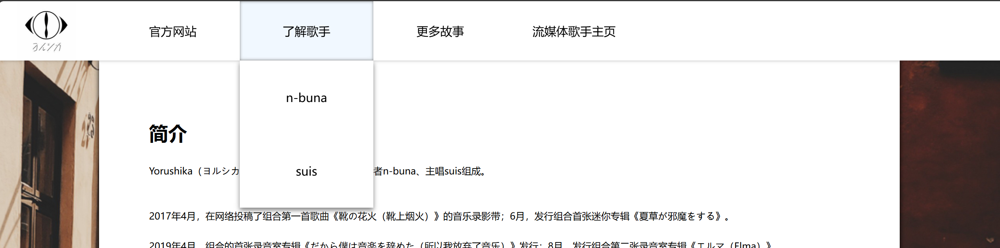

# 1 下拉菜单

## 1.1 一些记录

想要下拉菜单属性跟着上面的菜单栏：

1. 编写时下拉菜单（`.dropdown-content`​）设置为菜单栏（下为`.header`​）子元素，与菜单栏选项（下为`.navigator`​）同级并隐藏即 `display:none;`​，并设置 `flex-direction:column;`​
2. 下拉菜单中的具体选项设置为 `.dropdown-content`​ 下的子元素
3. 其css属性可以不设置，如有不同再专门添加
4. 位置设置方面：

    1. ​`.navigator`​ 设置 `position:sticky;`​ and `top:0;`​，以固定在屏幕顶端
    2. ​`.dropdown-content`​ 设置 `position:absolute`​，相对父级位置固定

## 1.2 知识点链接

1. CSS中 `position`​ 属性：[[CSS 入门#`position`​]]
2. HTML 中 `<a>`​ 元素：[[HTML 入门#^b7f9e9]]

## 1.3 示例代码：

```css
	/*CSS*/
	  /*顶部菜单栏背景*/
      .header {
        display: flex;
        align-items: center;
        width: 100%;
        height: 100px;
        background-color: white;
        box-shadow: 0 -4px 8px black;
        position: sticky;
        top: 0;
        z-index: 1;
        padding: 0 10% 0 0;
      }

      /*菜单栏选项卡*/
      .navigator {
        height: 100%;
        width: 225px;
        min-width: 150px;
        text-align: center;
        font-size: 20px;
        line-height: 100px;
        position: relative;
        transition: background-color 0.3s, box-shadow 0.3s;
      }

      .navigator:hover {
        box-shadow: inset 0 0 5px gray;
        background-color: aliceblue;
      }

      .navigator a {
        color: black;
        text-decoration: none;
        display: block;
      }

      /*下拉菜单*/
      .dropdown-content {
        display: none;
        position: absolute;
        background-color: white;
        width: 100%;
        box-shadow: 0px 4px 8px grey;
        z-index: 1;
        flex-direction: column;
      }

      .navigator:hover .dropdown-content {
        display: flex;
      }

      .dropdown-content a {
        padding: 12px 16px;
        text-align: center;
      }

      .dropdown-content a:hover {
        background-color: aliceblue;
      }

      /*菜单栏左侧图标*/
      .icon {
        display: flex;
        margin: 0 50px 0 30px;
        height: 100px;
      }
```

```html
<!--HTML-->
<div class="header">
	
    <div class="navigator">
        <a href="https://yorushika.com/">官方网站</a>
    </div>
    <div class="navigator">
        <a href="#">了解歌手</a>
        <div class="dropdown-content">
	        <a href="#">n-buna</a>
		    <a href="#">suis</a>
        </div>
    </div>
    <div class="navigator">
	        <a href="#">更多故事</a>
    </div>
    <div class="navigator">
        <a href="#">流媒体歌手主页</a>
    </div>
</div>
```

效果图：



