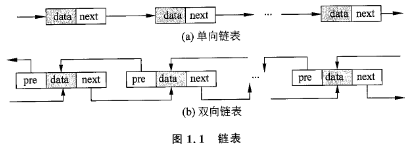
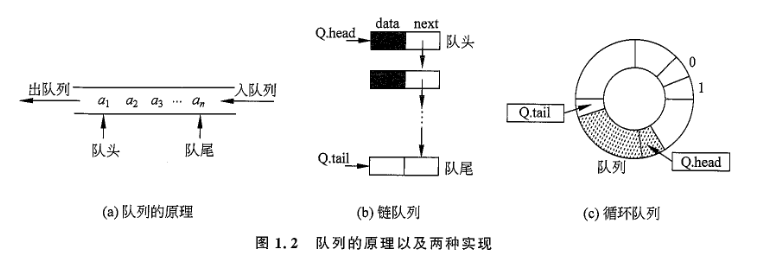

# 第1章 基础数据结构

## 1.1 链表

**特点**：用一组位于任意位置的存储单元存储线性表的数据元素，这组存储单元可以是连续的也可以是不连续的。

**操作**：初始化、插入、删除、遍历、查找、释放等。

**分类**：
- 按结构分类：
    - 单向链表
    - 双向链表
    - 循环链表
    - 十字链表
    - 多重链表
    - ...
- 按存储方式分类
    - 静态链表
    - 动态链表



使用链表：
1. 可以使用 STL list
2. 自己实现链表
    1. 动态链表
    2. 静态链表

竞赛中为了加快编码速度，通常使用**静态链表**3或 **STL list**。

### 1.1.1 动态链表

教科书式的标准做法。

优点：能及时释放空间，不使用多余内存。

缺点：需要管理空间，容易出错。

### 1.1.2 静态链表

### 1.1.3 STL list

可以像下面这样获得指向某一结点的指针（迭代器）：

```cpp
list<int> nodes;
list<int>::iterator it = nodes.begin(); // 指向第一个结点的迭代器
```

> 迭代器并不是指针，但可以像指针一样使用。

## 1.2 队列

遵循“先进先出”的原则。向**队尾 tail/rear 插入**元素，从**队头 head/front 删除**元素。（通常这么表示，而不是反过来头进尾出，这也符合常识）

两种实现方式：
1. 链队列
2. 循环队列

链队列可以看作是*单链表的一种特殊情况*。

循环队列是一种*顺序表*，在一组连续的存储单元中存储数据元素，利用**头指针**和**尾指针**分别指向队首元素和队尾元素，通过**模运算**实现循环。

*循环队列*能**解决溢出问题**。不循环的话，两个指针一直向后移动，最终会超出存储范围，造成溢出。

队列和栈的主要问题是查找较慢，需要从头到尾一个一个查找，时间复杂度为 O(n)。某些情况下可以使用**优先队列**，使*优先级最高（最大、最小）*的数先出队。



竞赛中一般使用 **STL queue** 或者**手写静态数组**来实现队列。

### 1.2.1 STL queue

主要操作：

```cpp
queue<Type> q; // 定义元素类型为 Type 的队列 q
q.push(item); // 向队尾插入元素 item
q.front(); // 返回队头元素，但不删除
q.pop(); // 删除队头元素
q.back(); // 返回队尾元素，但不删除
q.size(); // 返回队列中元素的个数
q.empty(); // 判断队列是否为空
```

### 1.2.2 手写循环队列

竞赛中一般使用静态分配的数组来实现循环队列。

### 1.2.3 双端队列

前面的队列只能在一端插入元素，在另一端删除元素，是**单端队列**。

**双端队列**允许在两端插入和删除元素。这也代表它同时具有**栈**和**队列**的性质。

常用 STL 的双端队列 `deque`，它的操作和 `queue` 类似：

```cpp
deque<Type> dq; // 定义元素类型为 Type 的双端队列 dq
dq[i]; // 访问双端队列中第 i 个元素
dq.front(); // 返回双端队列的第一个元素，但不删除
dq.back(); // 返回双端队列的最后一个元素，但不删除
dq.push_front(item); // 向双端队列的前面插入元素 item
dq.push_back(item); // 向双端队列的后面插入元素 item
dq.pop_front(); // 删除双端队列的第一个元素
dq.pop_back(); // 删除双端队列的最后一个元素
```

#### 经典应用：单调队列

单调队列是一种特殊的双端队列，其中的元素单调有序，且元素在队列中的顺序和原来在序列中的顺序相同。

经典题目：**滑动窗口最小值**，即给定一个长度为 n 的数组和一个大小为 k 的滑动窗口，求每个滑动窗口中的最小值。（见[洛谷P1886](https://www.luogu.com.cn/problem/P1886)）
