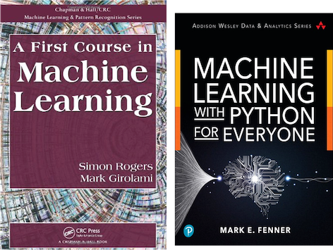

# 参考资料

## 网站

- [https://machinelearningmastery.com/](https://machinelearningmastery.com/)
- [https://scikit-learn.org/stable/index.html](https://scikit-learn.org/stable/index.html)
- [https://www.kaggle.com/](https://www.kaggle.com/)

## 书籍

- A First Course in Machine Learning - by Simon Rogers & Mark Girolami
- Machine Learning with Python for Everyone - by Mark E. Fenner

# 机器学习简介

## 机器学习的定义

机器学习是一种通过算法和模型使计算机从数据中自动学习并进行预测或决策的技术。

其**核心目标**是让计算机在没有明确编程指令的情况下，通过对大量数据的分析，识别模式和规律，从而构建适应新数据的模型。即让*计算机从数据中进行学习*。

**亚瑟·塞缪尔（Arthur Samuel）** 在1959年将机器学习定义为：

机器学习是计算机科学的一个子领域，它使计算机能够在没有明确编程的情况下进行学习。

**汤姆·米切尔（Tom Mitchell）** 在1998年提出了以下广为接受的定义：

如果计算机程序在完成某类任务 T 时，通过经验 E 在某一表现度量 P 下的表现有所提高，则称该程序从经验 E 中学习。

## 相关领域

### 与人工智能的关系

### 与数据科学与统计学的关系

## 示例

取自《Machine Learning Refined》第一章。

假设我们需要教会计算机如何区分猫和狗。

### 本任务的主要步骤

#### 数据收集

#### 特征设计

**特征(feature)**：描述数据的一些特点。比如在示例中，猫和狗的特征可能有颜色、大小、耳朵或鼻子的形状等。

- **表征学习(Representation Learning)** 是一种*关注学习特征*的机器学习形式
- **深度学习(Deep Learning)** 是一种*表征学习形式*，通过组合低层特征形成更抽象的高层特征

为了训练计算机执行这个任务，我们需要*设计适当的特征*。这个例子中我们假设使用两种特征：鼻子的大小和耳朵的形状。

描述数据集的一种常见方式是使用**设计矩阵(Design Matrix)**。这是一个矩阵，其中

- 每一行表示一个数据点
- 每一列表示一个特征

我们需要在数据集中划分一部分作为**训练集(Training Set)**，一部分作为**验证集(Validation Set)**。

#### 模型训练

这种表示下，猫和狗的识别可以转化为用一条直线 $y = w_0 + w_1 x$ 来分割两类数据点的问题。

需要求解的参数：

- $w_0$：纵轴截距
- $w_1$：斜率/梯度(gradient)

#### 模型验证

使用一些计算机未见的数据来测试模型，即**验证集(Validation Set)**。

在验证过程中，可能会出现数据的误分类。我们需要在这个过程中找到错误分类的原因，并想办法进行纠正。比如收集更多的数据用于训练，

### 机器学习过程

术语：

- 机器学习设计如何从**经验(Experience)** 中学习如何执行**任务(Task)**
- 经验以**数据集(Data Set)** 的形式呈现

### 机器学习步骤

