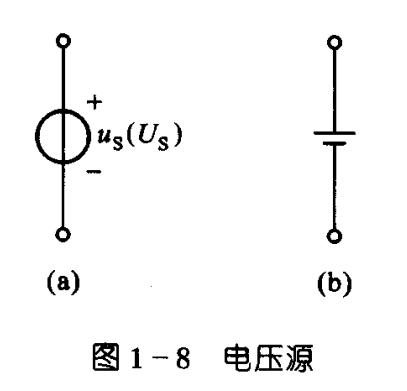
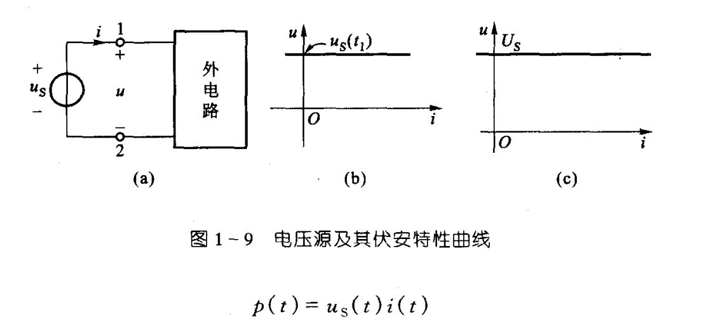
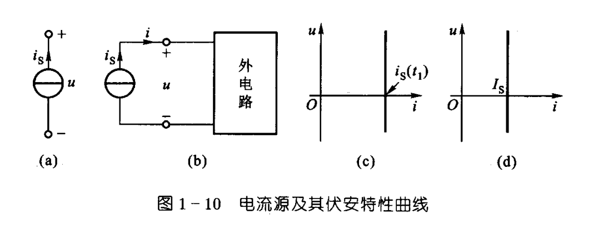
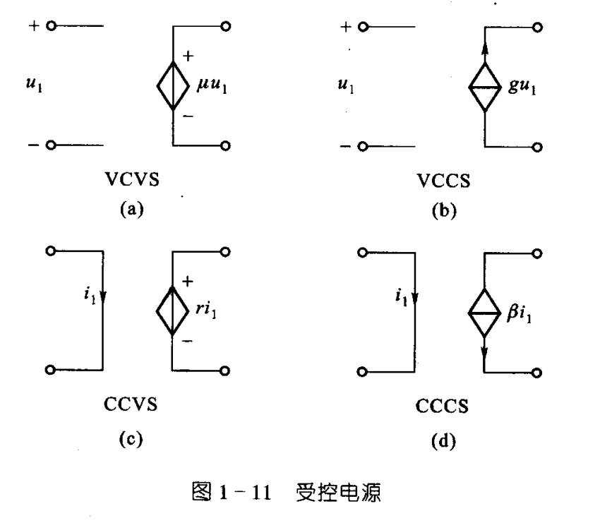

# 电路和电路模型

## 电路定义与名词解释

电路是由**电路部件**（例如电阻器、蓄电池等）和**电路器件**（例如晶体管、集成电路等）相互连接而成的电流通路装置。

实际电路中常借助电压、电流来传输电能或信号、处理信号、测量、控制、计算等功能。

- **电源**：电能或电信号的发生器。
- **负载**：用电设备。
- **激励源/激励**：电源的别称，因为电源的作用下产生电压、电流。
- **响应**：由激励在电路中产生的电压、电流。

有时会将激励称为输入，响应称为输出。

## 电路理论主要物理量

- 电流 $I$，单位 $\text{A}$ 安培
- 电压 $U$，单位 $\text{V}$ 伏特
- 电荷 $Q$，单位 $\text{C}$ 库仑
- 磁通 $\varPhi$，单位 $\text{Wb}$ 韦伯
- 电功率 $P$，单位 $\text{W}$ 瓦特
- 电能 $W$，单位 $\text{J}$ 焦耳

# 电流和电压的参考方向

## 参考方向

在研究某个元件或部分电路的电流或电压时有必要指定参考方向，因为电流和电压的实际方向可能未知（*类比工程力学受力分析，负值代表方向与指定方向相反*），也可能随时间变动。

电流的参考方向可以任意指定，一般用箭头表示或者双下标表示，如 $i_{AB}$ 代表参考方向是从 A 到 B。

电压可以指定参考方向或参考极性。表示两点间电压的时候，用正极性（+）表示高电位，负极性（-）表示低电位，**正极指向负极**的方向就是电压的参考方向。也可以用箭头或双下标表示，如 $u_{AB}$ 表示参考方向由 A 到 B。

- **关联参考方向**：当电流和电压的参考方向相同时，称为关联参考方向。
- **非关联参考方向**：当电流和电压的参考方向不同时，称为非关联参考方向。

## 国际单位制 SI 的倍数与分数词头

| 倍率      | 词头名称（中文） | 词头名称（英文） | 词头符号 | 倍率       | 词头名称（中文） | 词头名称（英文） | 词头符号 |
| --------- | ---------------- | ---------------- | -------- | ---------- | ---------------- | ---------------- | -------- |
| $10^{24}$ | 尧[它]           | yotta            | Y        | $10^{-1}$  | 分               | deci             | d        |
| $10^{21}$ | 泽[它]           | zetta            | Z        | $10^{-2}$  | 厘               | centi            | c        |
| $10^{18}$ | 艾[可萨]         | exa              | E        | $10^{-3}$  | 毫               | milli            | m        |
| $10^{15}$ | 拍[它]           | peta             | P        | $10^{-6}$  | 微               | micro            | $\mu$    |
| $10^{12}$ | 太[拉]           | tera             | T        | $10^{-9}$  | 纳[诺]           | nano             | n        |
| $10^9$    | 吉[咖]           | giga             | G        | $10^{-12}$ | 皮[可]           | pico             | p        |
| $10^6$    | 兆               | mega             | M        | $10^{-15}$ | 飞[母托]         | femto            | f        |
| $10^3$    | 千               | kilo             | k        | $10^{-18}$ | 阿[托]           | atto             | a        |
| $10^2$    | 百               | hecto            | h        | $10^{-21}$ | 仄[普托]         | zepto            | z        |
| $10^1$    | 十               | deca             | da       | $10^{-24}$ | 幺[科托]         | yocto            | y        |

# 电功率与能量

正电荷从高电位流向低电位的时候，电压的电场力对电荷做功，元件吸收能量；正电荷从低电位流向高电位的时候，电压的磁场力对电荷做功，元件释放能量。

在 $\mathrm{d}t$ 时间内，有 $\mathrm{d}q$ 的电荷敬礼电压 $u$ 从高电位到低电位，则电场力所做功也即元件吸收的能量为 

$$
\mathrm{d}W=u\mathrm{d}q
$$

假设 $i$ 与 $u$ 成关联参考方向，由 $i=\dfrac{\mathrm{d}q}{\mathrm{d}t}$，有

$$
\mathrm{d}W=ui\mathrm{d}t
$$

电功率是电功对时间的导数，则

$$
p=\dfrac{\mathrm{d}W}{\mathrm{d}t}=\dfrac{ui\mathrm{d}t}{\mathrm{d}t}=ui
$$

$t_0$ 到 $t$ 时间内，元件吸收的的能量为

$$
W(t)=\int \mathrm{d}W=\int_{q(t_0)}^{q(t)}u\mathrm{d}q=\int_{t_0}^{t}u(\xi)i(\xi)\mathrm{d}\xi
$$

当 $p>0$ 以及 $W>0$ 是，元件吸收功率与能量；当 $p<0$ 以及 $W<0$ 时，元件释放功率与能量。

# 电路元件

## 电路元件相关

电路元件是电路中最基本的组成单元。

元件的特性通过与端子有关的电路物理量来描述。

元件两个端子的电路物理量之间的代数函数关系称为元件的**端子特性**（又称**元件特性**）。

**集总参数(Lumped Parameter)元件**：有关电、磁场的物理现象都由元件来“集总”表征，在元件外部不存在任何电场与磁场。因为如果元件外部有电场，则进出端子的电流可能不同；如果元件外部有磁场，两个端子之间的电压就可能不是单值的。因此集总参数元件假定，任何时刻，流入二端元件的一个端子的电流一定等于从另一端子留出的电流，且两个端子间电压为单值量。

## 电路物理量

- 电压 $u$
- 电流 $i$
- 电荷 $q$
- 磁通 $\varPhi$：穿过单位面积的磁通量。
- 磁通链 $\varPsi$；穿过多匝线圈的总磁通量。

其中 $\varPsi=\sum \varPhi_i$。

## 元件特性

- 电阻元件：电压与电流的代数关系 $u=f(i)$
- 电容元件：电荷与电压的代数关系 $q=h(u)$
- 电感元件：磁通链与电流的代数关系 $\varPsi=g(i)$

当代数关系为线性时，元件称为**线性元件**；

当代数关系为非线性时，元件称为**非线性元件**。

电路元件还可以分为*时不变元件*和*时变元件*，*无源元件*和*有源元件*等。

# 电阻元件

## 线性电阻元件

元件特性（**伏安特性**）

$$
u=Ri
$$

令 $G=\dfrac{1}{R}$，变成

$$
i=Gu
$$

$G$ 被称为电阻元件的**电导**，单位是 $\text{S}$ 西门子（简称西）。

- **短路**：流过一个线性元件的电流无论何值，端电压恒为零。
- **开路**：一个线性元件的端电压无论何值，流过它的电流恒为零。

$u$ 和 $i$ 取关联参考方向时，电功率

$$
\begin{align*}
    p &= ui = Ri^2 = \frac{u^2}{R} \\
      &= Gu^2 = \frac{i^2}{G} \\
\end{align*}
$$

$R$ 和 $G$ 是正实常数，因此 $p\geqslant 0$，线性电阻元件是一种**无源元件**。

电阻元件从 $t_0$ 到 $t$ 的时间内吸收的电能为

$$
W = \int_{t_0}^{t} Ri^2(\xi)\mathrm{d}\xi
$$

制作材料的电阻率与温度有关，因此严格来讲电阻器带有非线性因素，但在工作条件下温度变化有限，因此可以用线性电阻元件作为理想模型。

线性电阻元件的伏安特性曲线在一三象限。如果一个电阻元件的伏安特性曲线在二四象限，则此元件电阻为负值，是发出电能的元件，一般需要专门设计。

## 非线性电阻元件

伏安特性

$$
u=f(i) \\ i=h(u)
$$

## 时变电阻元件

伏安特性

$$
u(t) = R(t) i(t), \, i(t) = G(t) u(t)
$$

# 电压源和电流源

实际电源有电池、发电机、信号源等。电压源与电流源从实际电源抽象出来得到电路模型，是二端有源元件。

## 电压源

是一个理想电路元件，其端电压 $u(t)$ 为

$$
u(t) = u_S(t)
$$

电压源电压 $u(t)$ 与通过元件的电流无关，始终保持为给定的时间函数 $u_S(t)$，称为电压源的**激励电压**。电流的大小由外电路决定。

当 $u_S(t)$ 为常数时，电压源称为**恒定电压源**或**直流电压源**，用 $U_S$ 表示。

电压源的电压与电流的参考方向取为非关联参考方向，此时得到电压源发出的功率为

$$
p(t) = u_S(t) i(t)
$$

这也是外电路吸收的功率。

## 电流源

是一个理想电路元件，其端电流 $i(t)$ 为

$$
i(t) = i_S(t)
$$

电流源电流 $i(t)$ 与通过元件的电压无关，始终保持为给定的时间函数 $i_S(t)$，称为电流源的**激励电流**。端电压由外电路决定。

当 $i_S(t)$ 为常数时，电流源称为**恒定电流源**或**直流电流源**，用 $I_S$ 表示。

电流源的电压与电流的参考方向取为非关联参考方向，此时得到电流源发出的功率为

$$
p(t) = u(t) i_S(t)
$$

这也是外电路吸收的功率。

电流源两端短路时，其端电压 $u=0$，$i=i_S$，短路电流就是激励电流。

## 正弦电压源与正弦电流源

电压源的 $u_S(t)$ 或电流源的 $i_S(t)$ 随时间作正弦变化，称为正弦电压源或正弦电流源。

以正弦电压源为例

$$
\begin{align*}
    u_S(t) &= U_m \sin(\frac{2\pi}{T}t + \phi) \\
           &= U_m \sin(2\pi f t + \phi) \\
           &= U_m \sin(\omega t + \phi)
\end{align*}
$$

- $U_m$ 是正弦电压源的最大电压。
- $T$ 是正弦电压源的周期。
- $f=\dfrac{1}{T}$ 是正弦电压源的频率，单位是赫兹（$\text{Hz}$）。
- $\omega=\dfrac{2\pi}{T}=2\pi f$ 是正弦电压源的角频率，单位是弧度每秒。
- $\phi$ 是正弦电压源的初相角。

正弦电压也可以用 sine 函数表示。

## 常见实际电源

常见的如**发电机**、**蓄电池**等工作原理接近**电压源**，其电路模型是*电压源与电阻的串联组合*。

**光电池**等一类器件，*工作时*的特性接近**电流源**，其电路模型是电流源与电阻的并联组合。

上述都为**独立**电源，与下文**受控**电源相对。

# 受控电源

受控电源共有四种:

- 电压控制电压源（VCVS）：$u=\mu u_1$
- 电压控制电流源（VCCS）：$i=gu_1$
- 电流控制电压源（CCVS）：$u=ri_1$
- 电流控制电流源（CCCS）：$i=\beta i_1$

其中 $\mu$ 和 $\beta$ 无量纲，$g$ 为电导常数，$r$ 为电阻常数。

# 基尔霍夫定律

集总电路由集总元件相互连接而成。基尔霍夫定律是集总电路的基本定律。

将电路中各个支路的支路电流与支路电压作为变量来看，这些变量受到两类约束：

1. 组成特性/电压电流关系（Voltage Current Relation, VCR）：如线性电阻元件电压与电流满足 $u=Ri$。
2. 几何约束/拓扑约束：元件的相互连接给支路电流之间或支路电压之间带来的约束关系，*由基尔霍夫定律体现*。

## 基尔霍夫电流定律 KCL(Kirchhoff's Current Law)

在*集总电路*中，任何时刻，对任一结点，**所有**流出节点的支路电流的**代数和恒为零**，其中规定流出结点的电流取正，流入结点的电流取负。即对于任一节点有

$$
\sum i=0
$$

换一种说法，即流出闭合面的电流等于流入同一闭合面的电流。即为**电流的连续性**。KCL 是电荷守恒的体现。

## 基尔霍夫电压定律 KVL(Kirchhoff's Voltage Law)

在*集总电路*中，任何时刻，沿任一回路，**所有**支路电压的**代数和恒为零**，其中需要指定绕行方向，与方向一致者取正，与方向相反者取负。即沿任一回路，有

$$
\sum u=0
$$

KVL 是电压与路径无关这一性质的反映，实际上也是能量守恒和转换定律的反映。

## 总结

KCL 在支路电流之间施加线性的约束关系；KVL 在支路电压之间施加线性的约束关系。这两个定律仅与元件的相互连接有关，与元件的性质无关。不论元件是线性元件还是非线性元件，时变元件还是时不变元件，基尔霍夫定律都适用。KCL 和 KVL 是集总电路的两个公设。

在使用时，一般指定支路电流与支路电压取关联参考方向。