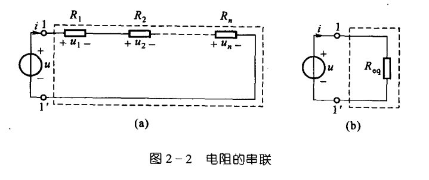
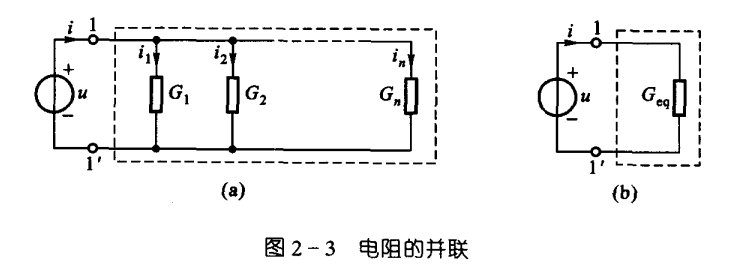
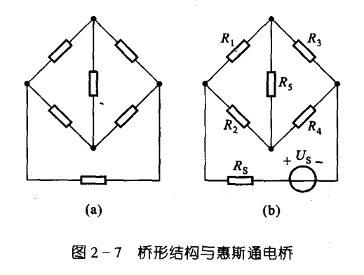
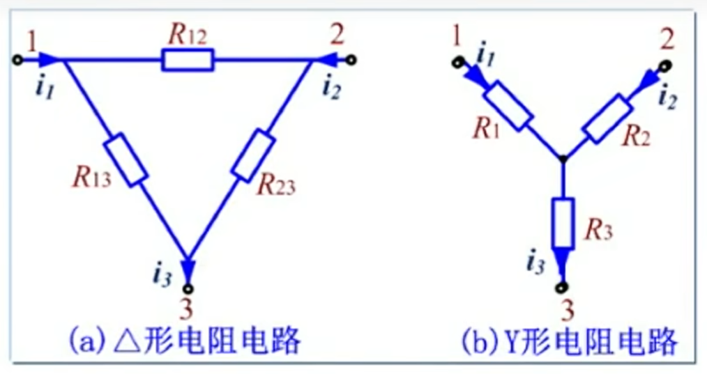

# 电路的等效变换

部分电路可以用一个伏安特性相同的元件来代替。该元件只能用来研究等效电路之外的部分，内部被代替的电路无法再进行分析。

# 电阻的串并联

串联

$$
R_{eq} = \sum R_i
$$

并联

$$
\begin{align*}
    {R_{eq}} &= \frac{1}{\sum \dfrac{1}{R_i}} \\
    G_{eq} &= \sum G_i
\end{align*}
$$

除了串联和并联外，还有一种连接方式是桥形连接。

电桥平衡时，$R_5$ 相当于开路，可以用串并联变换；电桥不平衡时，就无法运用串并联变换了，需要用下一节的电阻的 $\mathrm{Y}-\Delta$ 等效变换。

# 电阻的 $\mathrm{Y}$ 形联结和 $\Delta$ 联结的等效变换

将 $\mathrm{Y}$ 形电路的三个电阻分别用 $\Delta$ 形电路的三个电阻代替：

$$
\begin{aligned}
R_i &= \frac{\Delta 形i结点相邻两电阻乘积}{\Delta形三个电阻之和} \\\\
R_1 &= \frac{R_{13} R_{12}}{R_{12} + R_{23} + R_{13}} \\
R_2 &= \frac{R_{12} R_{23}}{R_{12} + R_{23} + R_{13}} \\
R_3 &= \frac{R_{23} R_{13}}{R_{12} + R_{23} + R_{13}}
\end{aligned}
$$

将 $\Delta$ 形电路的三个电阻用 $\mathrm{Y}$ 形电路的三个电阻代替：

$$
\begin{aligned}
R_{ij} &= \frac{\mathrm{Y}形三电阻两两乘积之和}{\mathrm{Y}形中非i,j结点连接的电阻} \\\\
R_{12} &= \frac{R_1 R_2 + R_2 R_3 + R_3 R_1}{R_3} \\
R_{23} &= \frac{R_1 R_2 + R_2 R_3 + R_3 R_1}{R_1} \\
R_{13} &= \frac{R_1 R_2 + R_2 R_3 + R_3 R_1}{R_2}
\end{aligned}
$$

若 $R_1=R_2=R_3$，则有 $R_{12}=R_{23}=R_{13}$，且 $\boxed{R_\Delta = 3 R_\mathrm{Y}}$
