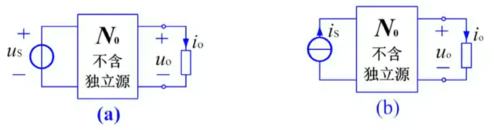

**线性性质**是线性电路的基本性质。所谓*线性电路*，是指由**线性元件**、**线性受控源**、**独立源**组成的电路。

*线性性质*包括**齐次性（比例性）**、**叠加性（可加性）**。

# 叠加定理

## 内容

对于*唯一解*的线性电路，当**只有一个激励源**（独立电压源或独立电流源）作用时，其响应（电路中任意处的电压与电流）与激励成正比。

对于图(a)：

- $i_0 = K_1 u_S$，$K_1$ 为常量，量纲为电导。
- $u_0 = K_2 u_S$，$K_2$ 为常量，无量纲。

对于图(b)：

- $i_0 = K_1 i_S$，$K_1$ 为常量，无量纲。
- $u_0 = K_2 i_S$，$K_2$ 为常量，量纲为电阻。