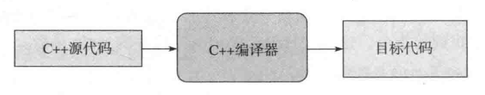
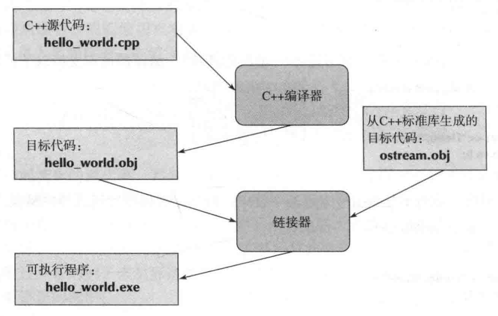
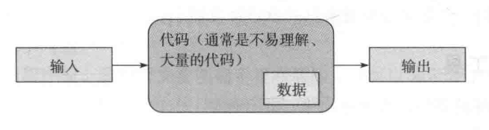

此为《C++程序设计原理与实践》一书的读书笔记。该书作者为 C++ 之父 Bjarne Stroustrup。

# 前言与引言

**本书涵盖的概念、技术和工具**：程序组织、调试和测试、类设计、计算、函数和算法设计、绘图方法（二维图形）、图形用户界面（GUI）、文本处理、正则表达式匹配、文件和流输入输出（I/O）、内存管理、科学/数值/工程计算、设计和编程思想、C++标准库、软件开发策略、C语言程序设计技术。

**可以学到的程序设计技术**：过程式程序设计（C语言程序设计风格）、数据抽象、面向对象程序设计（OOP）、泛型程序设计。

**程序设计**：表达代码意图所需要的思想、技术和工具。

相对于抽象的概念理论知识，大多数人们更容易理解**具体的实例与应用**。

前面章节内容本质上并不困难，学习者觉得困难往往是因为接触了很多**新的**、**不熟悉的**内容。

**老爷子的警告**：***不要***投入大量精力试图学习一些语言或者技术细节的**全部内容**（比如记住所有的C++内置类型及使用方法）！这样做往往会陷在细节中，难以把握整体。学习过程中略去一些细节，先来理解整体结构，能快速获取程序设计的**整体知识结构**。这种方法本质上是小孩子学习母语的方式，也是教授外语的最有效方法。

老爷子强调**思想**和**原理**。思想能指导我们如何去做，原理能帮助我们理解为什么这么做。掌握了思想和原理，我们还能推广到新的领域，解决新的问题。*相反，仅仅记住大量规则和语言特性有很大局限，是错误之源。*

**重复是学习的有效手段。**

几种不合适的教学方法：
- 自底向上：从学习底层细节开始。实际上，技术细节完全可以从手册中查询，没必要死记硬背。
- 自顶向下：专注于上层概念。这样会脱离实践，没有机会体会概念的实际意义。
- 软件工程理论优先：有与自顶向下一样的缺点。

# 第1章 计算机、人与程序设计

# 第2章 Hello, World!

## 2.3 编译



计算机可以执行的东西被称为**可执行代码**、**目标代码**或**机器代码**。

目标代码文件后缀：
- Windows: .obj
- Unix: .o

## 2.4 链接



程序往往由许多**编译单元**组成，每一个部分都需要被编译成目标代码。生成的目标代码文件需要被**链接器**组合成一个可执行文件。

目标代码和可执行程序***不能***在系统之间移植。

# 第3章 对象、类型和值

## 3.9 类型安全

**避免隐式类型转换**，因为隐式类型转换可能*发生窄化*导致信息丢失（如 int 到 char）。

C++11 引入了新的初始化方式可以*避免**窄化**转换*，即使用**通用统一初始化（{}记号）**：

```cpp
double x {2.7};
int y {x}; // 会报错：发生了由 double 到 int 的隐式类型转换
```

# 第4章 计算

## 4.1 简介



**计算**就是*基于输入生成输出的过程*。

## 4.2 目标和工具

编写代码的基本原则：

- 正确
- 简单
- 高效

## 4.3 表达式

### 4.3.1 常量表达式

**常量表达式**：在**编译时**就**已知值**的表达式。

在声明的前面加上 `constexpr` 关键字可以将一个变量声明为**常量表达式**。

```cpp
constexpr double pi = 3.1415926;
```

另一种情况，变量编译时未知，但在运行时**不变**，可以使用 `const` 关键字：

```cpp
const double pi = 3.1415926;
```

`const` 声明的变量很常见，原因是：
1. C++98 不支持 `constexpr`，只能使用 `const`。
2. 不是常量表达式（值在编译时未知）但初始化后不允许改变的变量本身十分常用。

### 4.3.2 运算符

如果需要实现

```cpp
a = a + 1;
a += 1;
```

建议写成

```cpp
++a;
```

因为后者**没有歧义**，并且更简洁。如果是前面的写法，或许会质疑原本想表达的意思会不会是 `a = b + 1` 或者 `a += 2` 而错写成了 `a = a + 1` 或者 `a += 1`。

### 4.3.3 类型转换

规则：如果算术表达式中含有 `double` 类型的话，就进行浮点型算数计算，结果为 `double` 类型；否则进行整型算数计算，结果为 `int` 类型。

将 `value` 转换为 `type` 的语法：

```cpp
type{value} // 可以避免窄化转换
type(value)
```

需要特别注意**浮点运算表达式中的整数除法**。

例如摄氏度转华氏度的公式是 $f = 9 / 5 \times c + 32$

错误的写法：

```cpp
double df = 9 / 5 * c + 32; // 9/5 是整数除法，结果为1
```

正确的写法：

```cpp
double df = 9.0 / 5 * c + 32; // 9.0/5 是浮点数除法，结果为1.8
```