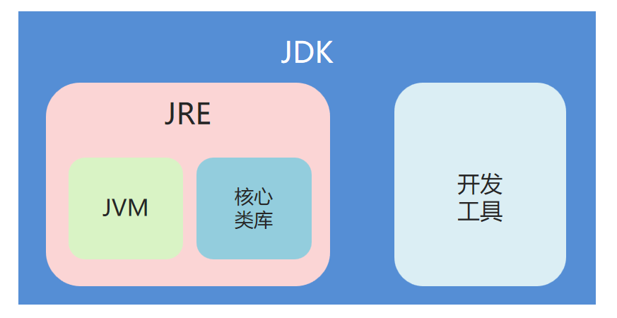
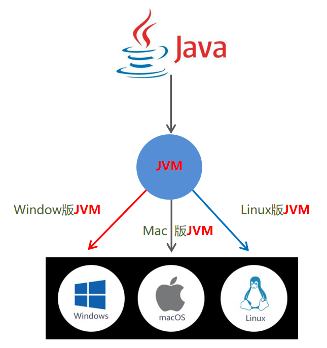

# Java 概述

## JVM、JRE和JDK的关系

**JVM(Java Virtual Machine)**：Java 虚拟机

**JRE(Java Runtime Environment)**：Java 运行环境，包含 JVM 和 Java 核心类库 (Java API)

**JDK(Java Development Kit)**：Java 开发工具包，包含 JRE 和开发工具 (如 Java 编译器 javac.exe)



因此进行 Java 的开发，必须安装 JDK。

## Java 跨平台原理

Java 程序的运行原理是：Java 源代码（.java）通过 Java 编译器（javac.exe）编译成字节码文件（.class），然后由 Java 虚拟机（JVM）解释执行。

因此操作系统上安装对应的 JVM，就可以实现 Java 程序的跨平台运行。



## JDK 的安装

### 下载安装

Windows 系统可以在 Oracle 的官方网站下载 JDK：[https://www.oracle.com/cn/java/technologies/downloads/](https://www.oracle.com/cn/java/technologies/downloads/)

Linux 可以直接 `sudo apt`。

例如：

```bash
sudo apt install openjdk-21-jdk
```

### JDK 安装目录结构

| 目录名称 | 说明                                                         |
| -------- | ------------------------------------------------------------ |
| bin      | 该路径下存放了JDK的各种工具命令。javac和java就放在这个目录。 |
| conf     | 该路径下存放了JDK的相关配置文件。                            |
| include  | 该路径下存放了一些平台特定的头文件。                         |
| jmods    | 该路径下存放了JDK的各种模块。                                |
| legal    | 该路径下存放了JDK各模块的授权文档。                          |
| lib      | 该路径下存放了JDK工具的一些补充JAR包.                        |

# Java 的编译与运行

## 常用 DOS 命令

|操作|说明|
|盘符:|盘符切换。E:回车，表示切换到E盘。|
|dir/ls|查看当前路径下的内容。|
|cd 目录|进入单级目录。|
|cd ..|回退到上一级目录|
|cls|清屏。|
|exit|退出命令提示符窗口。|

其中，`.` 代表当前目录，`..` 代表上一级目录。

## Java 的编译和运行

编译：`javac 源文件名.java`
执行：`java 类名`

例如：

```bash
javac HelloWorld.java
java HelloWorld
```

遇到找不到类的情况，可以尝试使用 `javac -cp . HelloWorld.java` 来编译，`java -cp . HelloWorld` 来运行。这里是指定当前目录为 classpath。

# Java 基础语法

## 注释

Java 中的注释有三种：

- 单行注释：`//`
- 多行注释：`/* */`
- 文档注释：`/** */`，用于生成 JavaDoc 文档。

# Java 基础语法

## 注释

Java 中的注释有三种：

- 单行注释：`//`，用于注释单行内容，从 `//` 开始到行尾的内容都会被编译器忽略。
    示例：
    ```java
    // 这是一个单行注释，用于说明下面代码的作用
    int age = 18; // 这里也可以写单行注释，说明变量 age 表示年龄
    ```
- 多行注释：`/* */`，用于注释多行内容，从 `/*` 开始，到 `*/` 结束，中间所有内容均为注释。
    示例：
    ```java
    /*
     * 这是一个多行注释
     * 可以跨越多行内容
     * 常用于对一段代码块的功能进行整体说明
     */
    public class HelloWorld {
        public static void main(String[] args) {
            System.out.println("Hello Java");
        }
    }
    ```
- 文档注释：`/** */`，用于生成 JavaDoc 文档（可通过 `javadoc` 命令生成 API 文档），支持标记符（如 `@author` 作者、`@version` 版本、`@param` 参数说明等）。
    示例：
    ```java
    /**
     * 这是一个计算两数之和的工具类方法
     * @author 开发者名称
     * @version 1.0
     * @param a 第一个整数参数
     * @param b 第二个整数参数
     * @return 两数之和的结果
     */
    public static int add(int a, int b) {
        return a + b;
    }
    ```
