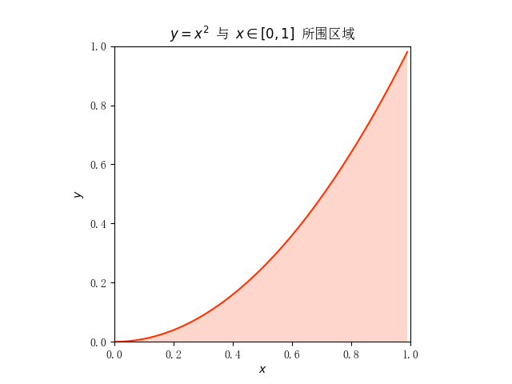

**计算思维上机实验报告**

# 1. 实验名称

实现抛物线 $y=x^2$ 与 $x\in[0,1]$ 所围区域面积的求解

# 2. 实验目的

使用 ***Python 符号计算库 sympy*** 和 ***蒙特卡洛方法*** 实现对抛物线 $y=x^2$ 与 $x\in[0,1]$ 所围区域面积的求解，并求取使得蒙特卡洛方法估计的面积值**误差小于等于 0.05 的最小样本点数**

# 3. 实验环境

**操作系统：**  Windows 11

**开发环境：**  VSCode + Python 3.12.4

**使用到的 Python 模块：** ​`matplotlib.pyplot`​ `sympy`​ `numpy`​

# 4. 实验步骤及源代码

## 4.1. 编程画图展示所围区域

### 4.1.1. 设置正常显示中文

由于默认情况下，`matplotlib.pyplot`​ 库不能正常显示中文，因此需要进行以下设置：

```python
plt.rcParams["font.sans-serif"] = ["SimSun"]  # 设置默认字体为宋体
plt.rcParams["axes.unicode_minus"] = False  # 用来正常显示负号
```

### 4.1.2. 构建函数 $y=x^2$.

依据题目显示，我们应该构建属于 $[0,1]$ 的 $x$ 的数组，并通过 $y=x^2$ 的关系式来构建 $y$ 的数组。

```python
# 生成x的取值范围，从0到1，步长为0.01，并生成y
x = np.arange(0, 1, 0.01)
y = x**2
```

### 4.1.3. 设置图画参数

为了使所画的图更加美观，因此进行设置：

- 设置坐标轴为相同的比例
- 设置 $x$ 和 $y$ 的范围为 $[0,1]$，并标注 $x$ 轴和 $y$ 轴
- 设置图表标题

```python
# 设置坐标轴为相同的比例
plt.axis("scaled")
# 设置x和y轴的范围为[0,1]，并标注x轴y轴
plt.xlim([0, 1])
plt.ylim([0, 1])
plt.xlabel("$x$")
plt.ylabel("$y$")
# 设置图表标题
plt.title(r"$y=x^2$ 与 $x\in[0,1]$ 所围区域")
```

### 4.1.4. 绘制图像、标注区域并显示图表

1. 使用 `plt.fill_between(x, y, facecolor="", alpha="")`​ 来填充区域：

   1. ​`x`​ 和 `y`​ 是要填充区域的上下边界
   2. ​`facecolor`​ 参数用于设置颜色，可以填写简写或是十六进制码
   3. ​`alpha`​ 参数用于设置透明度，范围为 $[0,1]$
2. 使用 `plt.plot(x, y, color="")`​ 来绘制函数图像

   1. ​`x`​ 和 `y`​ 分别为自变量和因变量
   2. ​`color`​ 用于设置颜色
3. 使用 `plt.show()`​ 来显示图表

```python
# 填充y=x^2与x轴之间的区域，颜色为红色，透明度为0.2
plt.fill_between(x, y, facecolor="#FF3300", alpha=0.2)
# 绘制y=x^2的曲线，颜色为红色
plt.plot(x, y, color="#FF3300")
# 显示图表
plt.show()
```

### 该部分完整代码

```python
plt.rcParams["font.sans-serif"] = ["SimSun"]  # 设置默认字体为宋体
plt.rcParams["axes.unicode_minus"] = False  # 用来正常显示负号


def func_draw_main_pic():
    """编程画图展示所围区域"""
    # 生成x的取值范围，从0到1，步长为0.01，并生成y
    x = np.arange(0, 1, 0.01)
    y = x**2

    # 设置坐标轴为相同的比例
    plt.axis("scaled")
    # 设置x和y轴的范围为[0,1]，并标注x轴y轴
    plt.xlim([0, 1])
    plt.ylim([0, 1])
    plt.xlabel("$x$")
    plt.ylabel("$y$")
    # 设置图表标题
    plt.title(r"$y=x^2$ 与 $x\in[0,1]$ 所围区域")

    # 填充y=x^2与x轴之间的区域，颜色为红色，透明度为0.2
    plt.fill_between(x, y, facecolor="#FF3300", alpha=0.2)
    # 绘制y=x^2的曲线，颜色为红色
    plt.plot(x, y, color="#FF3300")
    # 显示图表
    plt.show()
```

## 4.2. 求取蒙特卡洛方法计算精确面积值所需最小随机样本点数

### 4.2.1. 使用 `sympy`​ 库计算精确面积值

​

用数学公式表示图中小矩形的面积：

$$
\mathrm{d}S=y\cdot\mathrm{d}x=x^2\mathrm{d}x
$$

对两边求 $[0,1]$ 上的定积分：

$$
S=\int_0^1\mathrm{d}S=\int_0^1x^2\mathrm{d}x=\frac13x^3\vert_0^1=\frac13
$$

即为所求。

则使用 `sympy`​ 库计算定积分 $\int_0^1x^2\mathrm{d}x$ 即可。

**步骤如下：**

1. 构建符号变量 `x`​
2. 构建函数 $y=x^2$
3. 使用积分计算函数 `integrate(表达式, (积分变量, [下限], [上限]))`​ 计算定积分 $\int_0^1x^2\mathrm{d}x$ 的精确值

```python
r"""计算定积分 $\int_0^1 x^2 \mathrm{d}x$ 的值"""
# 创建符号变量 x
x = sp.Symbol("x")
# 定义函数 y 为 x 的平方
y = x**2
# 计算定积分，积分范围从 0 到 1
precise_value = sp.integrate(y, (x, 0, 1))
# 返回计算得到的定积分值
```

### 4.2.2. 蒙特卡洛方法估计面积值

**步骤如下：**

1. 生成样本点（坐标）：使用 `numpy.random.uniform()`​
2. 标记在抛物线 $y=x^2$ 下方的点
3. 统计满足条件的样本点数，除以总的样本点数，以获取面积估计值

```python
def func_mengtekaluo_area_value(NUMBER=1000):
    """
    蒙特卡洛方法计算面积值
    输入参数: NUMBER-样本点数
    返回值: (面积估计值, 误差)
    """

    # 生成指定范围内的随机坐标点
    coordinate = np.random.uniform(0, 1, size=(NUMBER, 2))  # 生成(NUMBER, 2)的随机点
    x = coordinate[:, 0]  # 提取 x 坐标
    y = coordinate[:, 1]  # 提取 y 坐标

    # 计算点是否在抛物线 y = x^2 之下
    marks = y - x**2 < 0  # 标记在抛物线下方的点

    # 估计面积，计算在抛物线下方的点的比例
    area_esti = sum(marks) / NUMBER  # 计算估计面积值
    error = np.abs(area_esti - precise_value)  # 计算与精确值的误差
    return area_esti, error
```

### 4.2.3. 求取最小样本点数

> 😣❓**什么情况下认为使用蒙特卡洛方法获得精确面积值 (误差&lt;=0.05) 的样本点数为最小？**
>
> - 将样本点数设置为 1，开始遍历，每次加一。每一个样本点数都进行一定数量的测试，如果在这些测试中出现了误差大于 0.05 的情况，就说明此时不是最小样本点，于是样本点数加一进行下一轮测试，直到某一样本点数经过所有测试次数都满足误差小于等于 0.05 为止。

**步骤如下：**

1. 传入测试次数 `TEST_NUMBER`​，设置初始样本点数为 1
2. 用 while 循环的方式来获取最小样本点数，并在循环内设置跳出条件

    1. 循环内首先设置一个标记变量，标记此时是否跳出，初始值为 `True`​
    2. 进行 `TEST_NUMBER`​ 次的循环，在循环中检验是否出现了误差大于 0.05 的情况，若出现则标记变量的值设为 `False`​
    3. 在循环后设置条件判断是否跳出，若是则返回此时样本点数
    4. 样本点数加一，进行下次循环

```python
def func_min_sample_number(TEST_NUMBER=1000):  # 传入测试次数
    sample_number = 1
    while True:
        indicator = True  # 标记是否寻到最小样本点数
        for _ in range(TEST_NUMBER):
            data = func_mengtekaluo_area_value(sample_number)
            error = data[1]
            if error > 0.05:  # 如果在TEST_NUMBER次测试中出现了误差大于0.05的情况
                indicator = False  # 标记该样本点数不是最小样本点数
                break  # 结束循环
        if indicator:  # 已寻找到最小样本点，将其作为函数返回值返回
            return sample_number
        sample_number += 1  # 未寻找到最小样本点，将样本点数加一进行下一次循环测试
```

## 4.3. 展示蒙特卡洛方法获取的面积值随随机样本点变化的趋势图

```python
def func_show_sample():
    """展示蒙特卡洛方法获取的面积值随随机样本点变化的趋势图"""
    # 计算误差数据
    areas = []
    MAX = 2000
    for NUMBER in range(1, MAX + 1):
        area = func_mengtekaluo_area_value(NUMBER)[0]
        areas.append(area)
    # 构建数组x,y
    x = np.arange(1, MAX + 1)
    y = np.array(areas)
    # 绘制图表
    plt.figure(figsize=(6, 3))
    plt.title("蒙特卡洛方法获取的面积值随随机样本点变化的趋势图")
    plt.ylim(0, 1)
    plt.plot([1, MAX], [precise_value, precise_value], color="r", linewidth=1)
    plt.scatter(x, y, s=0.5)
    plt.xlabel("样本点数")
    plt.ylabel("面积值")
    plt.show()
```

# 5. 实验结果

## 5.1. 所围区域

​

## 5.2. 最小随机样本点数

在传入测试次数 `TEST_NUMBER`​ 为 1000 次的情况下，给出 10 次输出结果：

674, 709, 739, 773, 684, 706, 785, 742, 707, 781

## 5.3. 面积值随机样本点变化的趋势图


# 6. 问题讨论

1. 如何在绘图时填充 $y=x^2$ 和 $x\in[0,1]$间的区域？

    - 经过翻看以往的 PPT，在概率论的计算实现PPT中似然概率示例代码中寻找到了解决方案。
2. 如何让图表正常显示中文？

    - 经过翻看，找到之前课上老师有讲过的实现方法。
3. 😣❓**什么情况下认为使用蒙特卡洛方法获得精确面积值 (误差&lt;=0.05) 的样本点数为最小？**

    - 将样本点数设置为 1，开始遍历，每次加一。每一个样本点数都进行一定数量的测试，如果在这些测试中出现了误差大于 0.05 的情况，就说明此时不是最小样本点，于是样本点数加一进行下一轮测试，直到某一样本点数经过所有测试次数都满足误差小于等于 0.05 为止。

# 7. 实验心得

1. 对 `matplotlib.pyplot`​ `sympy`​ `numpy`​ 模块的使用更加熟悉

   1. 熟悉了绘图操作，能熟练绘制散点图、函数图并对图表进行标注
   2. 熟悉了 `numpy`​ 中的数组 `array`​ 类型的操作
2. 对蒙特卡洛方法的认识更加深刻，能将问题用蒙特卡洛方法求解

‍
