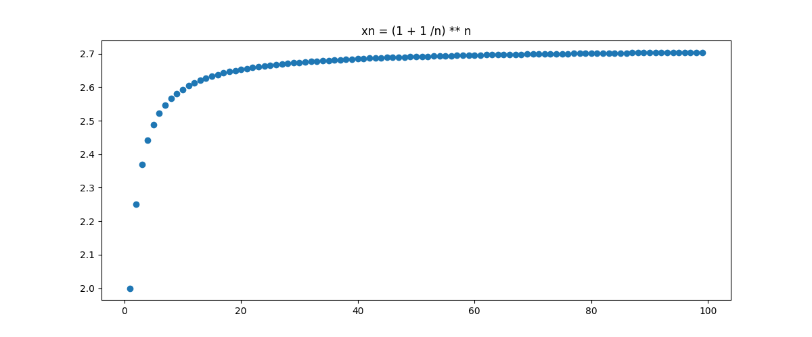
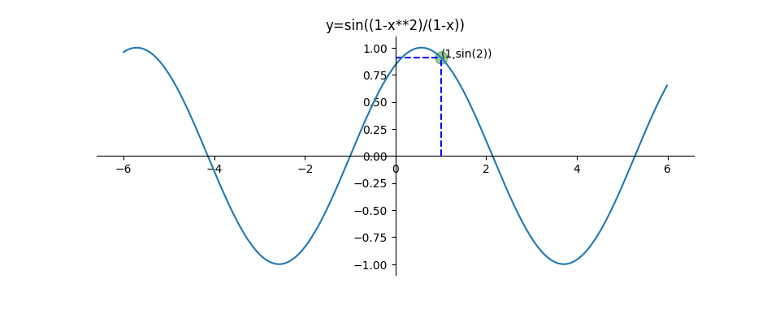
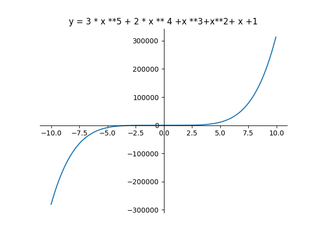
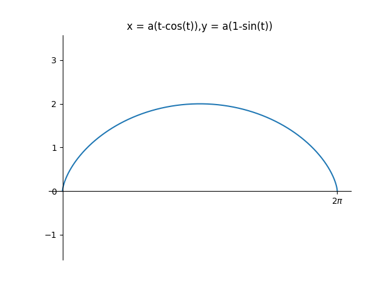
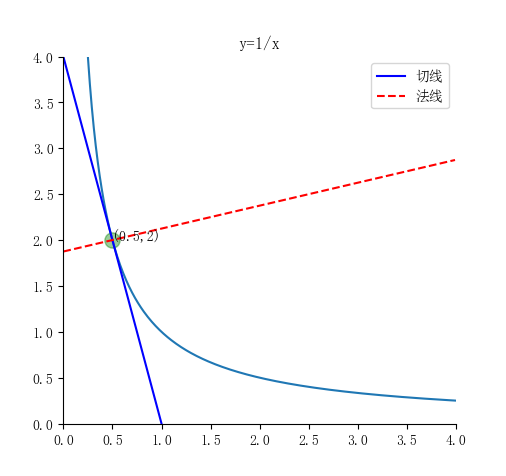

# <span id="20241206100418-yt6122o" style="display: none;"></span>1 常用的库：`sympy`​

基于*符号运算*，得到的结果会更加准确一些

```python
import sympy
print(sympy.sqrt(25), sympy.sqrt(7))
```

结果：`5 sqrt(7)`​

## 1.1 主要功能

### 1.1.1 符号变量

​`Symbol('变量')`​

​`symbols('变量1 变量2 ... 变量n')`​

```python
x = Symbol('x')
x, y, z = symbols('x y z')
```

### 1.1.2 求导

​`diff(表达式, 自变量, [求导次数])`​

```python
diff(x**2, x)
```

### 1.1.3 积分

支持不定积分与定积分。

​`integrate(表达式, (积分变量, [下限], [上限]))`​

```python
# 不定积分
integrate(x**2, x)

# 定积分
integrate(x**2, (x, 0, 1))
```

### 1.1.4 解方程

​`solve(表达式, 自变量)`​

```python
solve(x**2 - 4, x)
```

### 1.1.5 表达式简化

1. ​`expand()`​ 将表达式展开

    - 例如：使用函数展开 $(x+1)^2$ 得到 $x^2+2x+1$
2. ​`factor()`​ 因式分解
3. ​`collect()`​ 合并同类项

    - ​`collect(表达式, 自变量)`​
4. ​`cancel`​ 有理分式化简
5. ​`apart`​ 部分分式展开

    - 例如$\dfrac{4x^3 + 21x^2 + 10x + 12}{x^4 + 5x^3 + 5x^2 + 4x}$展开为$\dfrac{2 x - 1}{x^{2} + x + 1} - \dfrac{1}{x + 4} + \dfrac{3}{x}$

### 1.1.6 赋值操作

# 2 `numpy`​

## 2.1 与 `sympy`​ 的区别

​`sympy`​ 是符号计算，其中的函数都表示的是***符号***（如 `sympy.sin()`​）

​`numpy`​ 用于表示一些***数值***

因此**使用** **​`matplotlib.plot`​**​ **画图时只能用** **​`numpy`​**​

## 2.2 获得点集

### 2.2.1 `numpy.arange()`​

# <span id="20241206164128-gopmpe6" style="display: none;"></span>3 极限

## 3.1 做法

- `limit(表达式, 自变量, 变化趋势, dir=)`​

  - 变化趋势：取值“oo”（无穷），或者具体值
  - ​`dir = '+'`​：从正方向逼近
  - ​`dir = '-'`​：从反方向逼近

## 3.2 例子

### 3.2.1 求数列极限$\lim_{n\to\infty}\left(1+\frac{1}{n}\right)^{n}$

```python
import sympy as sp
import matplotlib.pyplot as plt
import numpy as np

n = sp.Symbol("n")  # 定义符号n
xn = (1 + 1 / n) ** n  # 输入数列
l = sp.limit(xn, n, "oo")  # 用l表示极限，输入：数列，变量，变化趋势
print("%s极限的值：%s" % (str(xn), str(l)))  # 打印

n = np.arange(1, 100, 1)  # 设置n取样点，1<n<100，间距为1
xn = (1 + 1 / n) ** n  # 输入数列
plt.figure(figsize=(12, 5))  # 设置作图环境
plt.title("xn = (1 + 1 /n) ** n")  # 显示标题文本
plt.scatter(n, xn)  # 绘制数列的散点图
plt.axis("on")  # 显示坐标轴
plt.show()  # 显示出所绘制的图像
```

**运行结果：**   
(1 + 1/n)**n极限的值：E  
​​

### 3.2.2 求极限$\lim_{x\to1}\sin\left(\frac{1-x^2}{1-x}\right)$的程序

```python
import sympy as sp
import matplotlib.pyplot as plt
import numpy as np

x = sp.Symbol("x")  # 定义变量x
y = sp.sin((1 - x**2) / (1 - x))  # 输入函数
lz = sp.limit(y, x, 1, dir="-")  # 用lz表示左极限
ly = sp.limit(y, x, 1, dir="+")  # 用ly表示右极限
print("%s 左极限是：%s" % (str(y), str(lz)))  # 打印
print("%s 右极限是：%s" % (str(y), str(ly)))  # 打印

ax = plt.gca()  # 获得当前的Axes对象ax
ax.spines["right"].set_color("none")  # 去掉右边框
ax.spines["top"].set_color("none")  # 去掉上边框
ax.spines["bottom"].set_position(("data", 0))  # 将坐标置于坐标0处
ax.spines["left"].set_position(("data", 0))  # 将坐标置于坐标0处
x = np.arange(-6, 6, 0.01)  # 设置x取样点
y = np.sin((1 - x**2) / (1 - x))  # 输入函数
plt.title("y=sin((1-x**2)/(1-x))")  # 给图形添加标题
plt.plot(
    [0, 1], [np.sin(2), np.sin(2)], linestyle="--", color="b"
)  # 绘制过[0,sin(2)],[1,sin(2)]两点的蓝色虚线
plt.plot(
    [1, 1], [0, np.sin(2)], linestyle="--", color="b"
)  # 绘制过[1,0],[1,sin(2)]两点的蓝色虚线
plt.text(1, np.sin(2), "(1,sin(2))")  # 绘制点的坐标
plt.scatter(
    1, np.sin(2), s=120, color="g", alpha=0.4
)  # 在点(1,sin(2)处绘制大小为120像素透明度为0.4的绿色点
plt.plot(x, y)  # 绘制函数图像
plt.show()  # 显示出所绘制的图像
```

**运行结果：**   
sin\(\(1 - x\*\*2\)/\(1 - x\)\) 左极限是：sin\(2\)  
sin\(\(1 - x\*\*2\)/\(1 - x\)\) 右极限是：sin\(2\)  
​​

# 4 导数与微分

## 4.1 做法

> ### 1.1.2 求导
>
> ​`diff(表达式, 自变量, [求导次数])`​
>
> ```python
> diff(x**2, x)
> ```

参数方程求导：$\frac{\mathrm{d}y}{\mathrm{d}x}=\frac{\mathrm{d}y}{\mathrm{d}t}/\frac{\mathrm{d}x}{\mathrm{d}t}$  

## 4.2 例子

### 4.2.1 一元函数

#### 4.2.1.1 设$f\left(x\right)=3x^5+2x^4+x^3+x^2+x+1$，求$f(x)$的微分及$f^{(4)}(1)$​的程序

```python
import sympy as sp  # 导入sympy记作sp
import numpy as np  # 导入numpy 记作np
import matplotlib.pyplot as plt  # 导入matplotlib.pyplot记作plt

x = sp.Symbol("x")  # 定义变量x
dx = sp.Symbol("dx")  # 定义符号dx
y = 3 * x**5 + 2 * x**4 + x**3 + x**2 + x + 1  # 输入函数
w = sp.diff(y, x, 1)  # 用w表示一阶导数
wf = w * dx  # 用wf表示微分
print("函数的微分为：%s" % wf)  # 打印
for n in range(1, 5):  # 在for循环中从1到4给n赋值
    y = d = sp.diff(y)  # 用d表示对y求导
    print("第%2d阶导数为：%s" % (n, d))  # 打印
ysjd = d.evalf(subs={x: 1})  # 用ysjd表示在表达式d中赋值x=1
print("当x=1时，四阶导数的值为：%d" % (ysjd))  # 打印

x = np.arange(-10, 10, 0.05)  # 设置x取样点
y = 3 * x**5 + 2 * x**4 + x**3 + x**2 + x + 1  # 输入函数
plt.plot(x, y)  # 绘制函数图像
plt.title("y = 3 * x **5 + 2 * x ** 4 +x **3+x**2+ x +1")  # 给图形添加标题
ax = plt.gca()  # 获得当前的Axes对象ax
ax.spines["right"].set_color("none")  # 去掉右边框
ax.spines["top"].set_color("none")  # 去掉上边框
ax.spines["bottom"].set_position(("data", 0))  # 将坐标置于坐标0处
ax.spines["left"].set_position(("data", 0))  # 将坐标置于坐标0处
plt.show()  # 显示出所绘制的图像
```

**运行结果：**   
函数的微分为：dx\*\(15\*x\*\*4 + 8\*x\*\*3 + 3\*x\*\*2 + 2\*x + 1\)  
第 1阶导数为：15\*x\*\*4 + 8\*x\*\*3 + 3\*x\*\*2 + 2\*x + 1  
第 2阶导数为：60\*x\*\*3 + 24\*x\*\*2 + 6\*x + 2  
第 3阶导数为：180\*x\*\*2 + 48\*x + 6  
第 4阶导数为：360\*x + 48  
当x\=1时，四阶导数的值为：408  
​​

#### 4.2.1.2 求参数方程$\begin{cases}x=a\left(t-\sin t\right)\\ y=a\left(1-\cos t\right)\end{cases}$所确定的函数$y=y(x)$的一阶导数和二阶导数

```python
import matplotlib.pyplot as plt  # 导入matplotlib.pyplot记作plt
import numpy as np  # 导入numpy 记作np
import sympy as sp  # 导入sympy记作sp

a = sp.Symbol("a")  # 定义变量a
t = sp.Symbol("t")  # 定义变量t
x = a * (t - sp.sin(t))  # 输入x的参数方程
y = a * (1 - sp.cos(t))  # 输入y的参数方程
d1 = sp.diff(y, t) / sp.diff(x, t)  # 用d1表示参数方程的一阶导数
print("原参数方程一阶导数结果为：%s" % d1)  # 打印
d2 = sp.diff(d1, t) / sp.diff(x, t)  # 用d2表示参数方程的二阶导数
print("原参数方程的二阶导数结果为：%s" % d2)  # 打印
d2 = sp.simplify(d2)  # 将d2化简
print("原参数方程的二阶导数化简为：%s" % d2)  # 打印

a = 1  # 给a赋值1
t = np.arange(0, 2 * np.pi, 0.01)  # 设置t取样点
x = a * (t - np.sin(t))  # 输入x的参数方程
y = a * (1 - np.cos(t))  # 输入y的参数方程
plt.plot(x, y)  # 绘制函数图像
plt.title("x = a(t-cos(t)),y = a(1-sin(t))")  # 给图形添加标题
plt.xticks([2 * np.pi], [r"$2\pi$"])  # 绘制x轴上的点2*pi
plt.axis("equal")  # x,y轴刻度等长
ax = plt.gca()  # 获得当前的Axes对象ax
ax.spines["right"].set_color("none")  # 去掉右边框
ax.spines["top"].set_color("none")  # 去掉上边框
ax.spines["bottom"].set_position(("data", 0))  # 将坐标置于坐标0处
ax.spines["left"].set_position(("data", 0))  # 将坐标置于坐标0处
plt.show()  # 显示出所绘制的图像
```

**运行结果：**   
原参数方程一阶导数结果为：sin\(t\)/\(1 - cos\(t\)\)  
原参数方程的二阶导数结果为：\(cos\(t\)/\(1 - cos\(t\)\) - sin\(t\)\*\*2/\(1 - cos\(t\)\)\*\*2\)/\(a\*\(1 - cos\(t\)\)\)  
原参数方程的二阶导数化简为：-1/\(a\*\(cos\(t\) - 1\)\*\*2\)  
​​

#### 4.2.1.3 求双曲线 $y=\dfrac{1}{x}$ 在$(\frac12,2)$的切线和法线

```python
import matplotlib.pyplot as plt  # 导入matplotlib.pyplot记作plt
import numpy as np  # 导入numpy 记作np
import sympy as sp  # 导入sympy记作sp

plt.rcParams["font.sans-serif"] = ["SimSun"]  # 设置默认字体为宋体
plt.rcParams["axes.unicode_minus"] = False  # 用来正常显示负号

x = sp.Symbol("x")  # 定义变量x
f = 1 / x  # 输入函数
d = sp.diff(f, x)  # 用d表示一阶导数
print("导数结果为：%s" % d)  # 打印
yd = d.evalf(subs={x: 1 / 2})  # 用yd表示x=1/2时的一阶导数
print("切点处切线的斜率：%s" % yd)  # 打印
qx = yd * (x - 0.5) + 2  # 输入切线方程
print("切线方程为：%s" % qx)  # 打印
fx = (-1 / yd) * (x - 0.5) + 2  # 输入法线方程
print("法线方程为：%s" % fx)  # 打印

x = np.arange(0, 4, 0.01)  # 设置x取样点
y = 1 / x  # 输入函数
qx = -4.0 * x + 4.0  # 输入切线方程
fx = 0.25 * x + 1.875  # 输入法线方程
plt.axis([0, 4, 0, 4])  # 建立绘图区域
plt.plot(x, y)  # 绘制函数图像
plt.title("y=1/x")  # 给图形添加标题
ax = plt.gca()  # 获得当前的Axes对象ax
ax.spines["right"].set_color("none")  # 去掉右边框
ax.spines["top"].set_color("none")  # 去掉上边框
ax.spines["bottom"].set_position(("data", 0))  # 将坐标置于坐标0处
ax.spines["left"].set_position(("data", 0))  # 将坐标置于坐标0处
plt.text(0.5, 2, "(0.5,2)")  # 在点(0.5,2)处标记
plt.scatter(0.5, 2, s=120, color="g", alpha=0.4)  # 绘制点 (0.5,2)
plt.plot(x, qx, color="blue", linestyle="-", label=r"切线")  # 绘制切线
plt.plot(x, fx, color="red", linestyle="--", label=r"法线")  # 绘制法线
plt.legend()  # 给图加上图例
plt.show()  # 显示出所绘制的图像
```

**运行结果：**   
导数结果为：-1/x\*\*2  
切点处切线的斜率：-4\.00000000000000  
切线方程为：4\.0 - 4\.0\*x  
法线方程为：0\.25\*x + 1\.875  
​​

# 5 积分

## 5.1 做法

> ### 1.1.3 积分
>
> 支持不定积分与定积分。
>
> ​`integrate(表达式, (积分变量, [下限], [上限]))`​
>
> ```python
> # 不定积分
> integrate(x**2, x)
>
> # 定积分
> integrate(x**2, (x, 0, 1))
> ```

## 5.2 例子

### 5.2.1 一元函数

#### 5.2.1.1 计算定积分 $\int_{-1}^{\sqrt3}\!\frac{1}{1+x^2}\,\mathrm{d}x$

```python
import sympy as sp  # 导入sympy记作sp
import numpy as np  # 导入numpy记作np
import matplotlib.pyplot as plt  # 导入matplotlib.pyplot记作plt

x = sp.Symbol("x")  # 定义变量x
y = 1 / (1 + x**2)  # 输入函数
bdjf = sp.integrate(y, x)  # 用bdjf表示不定积分，输入：函数，自变量
djf = sp.integrate(
    y, (x, -1, sp.sqrt(3))
)  # 用djf表示定积分，输入：函数，(自变量，下限，上限）
print("不定积分的结果为：%s" % bdjf)  # 打印
print("定积分的结果为：%s" % djf)  # 打印

x = np.arange(-3, 3, 0.01)  # 设置x范围
y = 1 / (1 + x**2)  # 输入函数
plt.plot(x, y)  # 绘制函数图像
plt.title("y =1/(1+ x ** 2) ")  # 显示标题文本
plt.plot([-1, -1], [0, 0.5], linestyle="--", color="b")  # 绘制过两点虚线
plt.plot(
    [np.sqrt(3), np.sqrt(3)], [0, 0.25], linestyle="--", color="b"
)  # 绘制过两点虚线
plt.xticks([-1, 0, np.sqrt(3)], ["-1", "0", r"sqrt(3)"])  # 绘制x轴上的点的坐标
ax = plt.gca()  # 获得当前的Axes对象ax
ax.spines["right"].set_color("none")  # 去掉右边框
ax.spines["top"].set_color("none")  # 去掉上边框
ax.spines["bottom"].set_position(("data", 0))  # 将坐标置于坐标0处
ax.spines["left"].set_position(("data", 0))  # 将坐标置于坐标0处
plt.show()  # 显示出所绘制的图像
```

#### 5.2.1.2 计算不定积分

同理。

# 6 常微分方程

## 6.1 一阶常微分方程

### 6.1.1 做法

1. 定义变量 x：`x = sp.Symbol("x")`​
2. 定义函数 f：`f = sp.Function("f")`​
3. 输入函数：`y = f(x)`​
4. 构建微分方程：`d = sp.Eq(左式, 右式)`​
5. 求解：`result = sp.dsolve(d, y)`​

    - ​`sp.dsolve(表达式, 函数)`​

### 6.1.2 例子

#### 6.1.2.1 求微分方程 $\frac{\mathrm{d}y}{\mathrm{d}x}+y=e^{-x}$ 的通解

```python
import sympy as sp  # 导入sympy记作sp

x = sp.Symbol("x")  # 定义变量
f = sp.Function("f")  # 创建函数
y = f(x)  # 输入函数
d = sp.Eq(y.diff(x) + y, sp.exp(-x))  # 用d表示输入的微分方程
wffc = sp.dsolve(d, y)  # 用wffc表示求解微分方程
print("微分方程的通解为：%s" % wffc)  # 打印
sp.pprint(sp.dsolve(d, y))  # 漂亮的打印
```

> **输出结果：**
>
> 微分方程的通解为：Eq(f(x), (C1 + x)*exp(-x))  
> f(x) = (C₁ + x)⋅ℯ$^{-x}$
