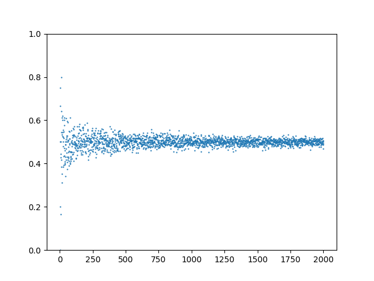
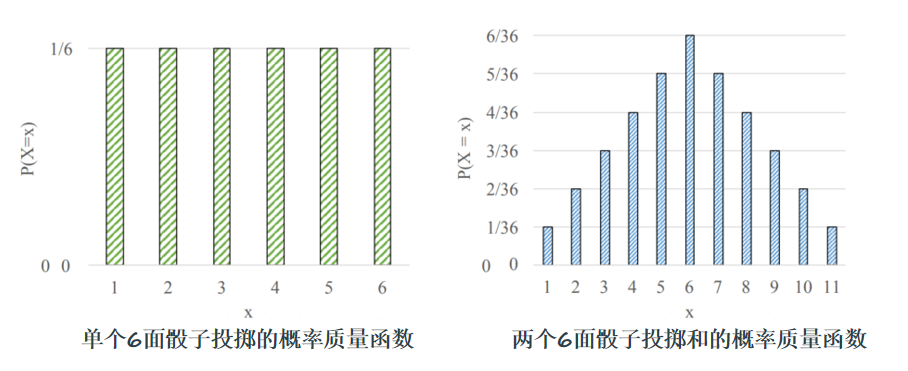

# 1 概率基础知识

## 1.1 样本空间和事件空间

**样本空间：** 实验的所有可能结果的集合。

**事件空间：** 是样本空间的某个子集，用集合符号表示为（E ∈ S ）

## 1.2 频数、频率和概率的统计学定义

**频数：** 在相同的条件下，进行了$n$次随机试验，在这$n$次试验中，事件$A$发生的次数$n_A$称为事件$A$发生的频数。

**频率：** 比值$\dfrac{n_A}{n}$称为事件$A$发生的频率。

**概率：** 当 $n$ 较小时频率波动幅度比较大，当 $n$ 逐渐增大时， 频率*趋于*​**稳定值**，这个稳定值从本质上反映了事件在试验中出现可能性的大小。它就是事件的概率。

## 1.3 概率的精确定义

$$
P(E)=\lim_{n\to\infty}\frac{n\left(E\right)}{n}
$$

假设你进行了$n$次实验。 事件$E$发生的概率是实验中**结果为**​**$E$**​**的次数**与**总实验次数**的*比值*（当实验次数趋近于无穷大时）。

## 1.4 示例：模拟抛硬币

```python
import random
import matplotlib.pyplot as plt

NUMBER = 2000  # 最大模拟次数


# 输入模拟次数，返回正面朝上的频率
def coin(number):
    up = 0
    for _ in range(number):
        if random.randint(0, 1) == 1:
            up += 1
    return up / number


# 将测试次数与频率对应存储到数组中，便于画图
numbers, freq = [], []
for number in range(1, NUMBER + 1, 1):
    numbers.append(number)
    freq.append(coin(number))


# 输入测试次数与频率，绘制散点图
def draw(numbers, freq):
    plt.ylim(0, 1)
    plt.scatter(numbers, freq, s=0.5)
    plt.show()


draw(numbers, freq)
```



# 2 计算机中随机数及Python实现

## 2.1 计算机中随机数

  


## 2.2 Python中实现随机数

### 2.2.1 `random`​ 库

#### 2.2.1.1 主要功能


#### 2.2.1.2 子函数

- `random()`：生成一个\[0.0, 1.0)之间的随机浮点数。
- `uniform(a, b)`：生成一个\[a, b]之间的随机浮点数。
- `randint(a, b)`：生成一个\[a, b]之间的随机整数。
- `randrange([start,] stop[, step])`：生成一个\[start, stop)之间以step为步长的随机整数。
- `choice(seq)`：从非空序列seq中随机选择一个元素。
- `shuffle(list)`：将list中的元素随机打乱。
- `sample(population, k)`：从population中随机选择k个不重复的元素。
- `normalvariate(mu, sigma)`：生成一个符合正态分布的随机数，mu是均值，sigma是标准差。

#### 2.2.1.3 `dir()`​ 函数

查看函数名称

`dir(funcName)` 返回该库中的所有函数名称

#### 2.2.1.4 `help()`​ 函数

带说明的函数列表

`help(funcName)` 返回该库中所有函数详细说明

# 3 概率进阶知识

## 3.1 条件概率

**定义1** 在事件$F$已经发生的情况下，事件$E$发生的概率

$$
P(E|F)=\dfrac{P\left(EF\right)}{P\left(F\right)}=\frac{P\left(E\cap F\right)}{P\left(F\right)}
$$

**定义2** （链式法则）

$$
P\left(EF\right)=P\left(E|F\right)P\left(F\right)
$$

$$
P\left(E_1E_2\ldots E_{n}\right)=P\left(E_1\right)P\left(E_2\vert E_1\right)\ldots P\left(E_{n}\vert E_1E_2\ldots E_{n-1}\right)
$$

## <span id="20241224165836-o9mqtgc" style="display: none;"></span>3.2 贝叶斯定理

是什么：


例子：


- **后验概率：**

  后验概率是结合先验概率和观测到的新证据后，对事件发生概率的更新结果。通过贝叶斯定理，将初始信念(先验概率) 与新的数据(似然) 进行综合，得出新的、更新后的概率，称为后验概率。后验概率代表了在考虑了当前观测信息之后，对事件可能性的新评价。
- **似然概率：**

  似然概率是指在**假设某一特定事件或假设为真**时，***观察到当前证据或数据的概率***。它反映了新观测到的信息在假设成立的前提下的可能性。似然概率是贝叶斯定理中的关键部分，因为它将观测信息与假设进行连接，用于更新对假设的信念。
- **先验概率：**

  对某一事件发生的初始估计概率，基于已有的背景知识或历史数据，在未考虑当前新信息的情况下得出。
- **归一化参数：**

  归一化参数是对贝叶斯定理中的分母项进行描述的参数，用于确保后验概率是有效的概率值（总和为1）。在贝叶斯定理中，归一化参数等于所有可能情况下的似然与先验概率的乘积之和。它保证了在考虑所有可能假设的情况下，总的概率质量维持在1，从而使后验概率在概率分布上成立。


## 3.3 独立性原理


> 注意多事件相互独立条件是对于***任意子集***上式都成立

## 3.4 随机事件模拟

### 3.4.1 Python中使用 `set`​类 表示事件

​`set`​类 即**集合**，用 `set()`​ 来初始化空集合（*不能用*  *​`{}`​*  *来初始化空集合，会被识别为字典*）

常用函数与运算符：


### 3.4.2 随机事件模拟案例

考虑抛一枚六面体骰子，观察出现的点数的随机试验。

- **事件A1**：表示事件“出现偶数点”，即 $A_1 = \{2, 4, 6\}$。
- **事件A2**：表示事件“出现的点数不超过3”，即 $A_2 = \{1, 2, 3\}$。

用 Python 中 set 对象来表示相关的随机事件及其运算：

$A_1\cup A_2$, $A_1\cap A_2$, $A_1-A_2$, $\overline{A_1}$, 并验证$\overline{A_1 \cup A_2}=\overline{A_1}\cap \overline{A_2}$, $\overline{A_1\cap A_2}=\overline{A_1}\cup \overline{A_2}$

‍

```python
"""代码如下"""
S = set([1, 2, 3, 4, 5, 6]) # 全集S(样本空间)
A1 = set([2, 4, 6]) # S的子集A1(随机事件:偶数点)
A2 = set([1, 2, 3]) # A2:点数不超过3

print("S=%s:抛掷骰子的样本空间." % S)
print("A1=%s:偶数点." % A1)
print("A2=%s:点数不超过3." % A2)
print("A1+A2=%s:偶数点或点数不超过3." % (A1 | A2)) # A1+A2:偶数点或点数不超过3
print("A1*A2=%s:不超过3的偶数点." % (A1 & A2)) # A1*A2:不超过3的偶数点
print("A1-A2=%s:超过3的偶数点." % (A1 - A2)) # A1-A2:超过3的偶数点
print("A1=%s:奇数点." % (S - A1)) # A1的补集(A1的对立事件)
print("(A1+A2)_=A1_*A2_ is %s." % (S - (A1 | A2) == (S - A1) & (S - A2))) # 并集的补集等于补集的交集
print("(A1*A2)_=A1+A2 is %s." % (S - (A1 & A2) == (S - A1) | (S - A2))) # 交集的补集等于补集的并集
```

> 输出：  
> S\=\{1, 2, 3, 4, 5, 6\}:抛掷骰子的样本空间\.  
> A1\=\{2, 4, 6\}:偶数点\.  
> A2\=\{1, 2, 3\}:点数不超过3\.  
> A1+A2\=\{1, 2, 3, 4, 6\}:偶数点或点数不超过3\.  
> A1\*A2\=\{2\}:不超过3的偶数点\.A1-A2\=\{4, 6\}:超过3的偶数点\.A1\=\{1, 3, 5\}:奇数点\.\(A1+A2\)\_\=A1\*A2 is True\.  
> \(A1\*A2\)\_\=A1+A2 is True\.

## 3.5 古典概型

### 3.5.1 定义与实现

**定义：** 如果随机试验E的样本空间是一个有限集合，且每一个样本点作为基本事件发生的***概率均相等***，称E是一个**等概模型**或**古典概型**。

假定以 $S$ 为样本空间的随机试验是一个等概模型, 事件 $A⊆S$ 。若能算得 $|S|=n$, $|A|=m$, 我们知道 $P(A)=\dfrac{m}{n}$ 。我们把这样的计算方法定义成下列的 Python 函数。

```python
from sympy import Rational

def P(A, S):  # 古典概型下事件A的概率
    n = len(A)  # 事件A的样本点数
    m = len(S)  # 事件S的样本点数
    return Rational(n, m)  # 返回n/m的分数形式
```

### 3.5.2 应用

将一枚均匀硬币抛掷三次，计算事件：

- $A_1$：“恰有一次出现正面”的概率$P(A_1)$ ；
- $A_2$：“至少有一次出现正面”的概率$P(A_2)$。

```python
from sympy import Rational
from sympy.utilities.iterables import variations as permutations  # 有限集合的排列
from sympy.utilities.iterables import subsets as combinations  # 组合数


def P(A, S):  # 古典概型下事件A的概率
    n = len(A)  # 事件A的样本点数
    m = len(S)  # 事件S的样本点数
    return Rational(n, m)  # 返回n/m的分数形式


def subSet(A, condition):  # 设置符合条件condition的事件
    B = set()  # B初始化为空集
    for x in A:  # 在A中寻找符合条件的样本点
        if condition(x):
            B.add(x)  # 加入B
    return B


S = set(permutations([0, 1], 3, True))
A1 = subSet(S, lambda a: sum(a) == 1)
A2 = subSet(S, lambda a: 1 in a)
P1 = P(A1, S)
P2 = P(A2, S)
print("S = %s" % S)
print("P(A1) = %s" % P1)
print("P(A2) = %s" % P2)
```

> **输出：**
>
> S = {(1, 0, 1), (1, 1, 0), (0, 1, 0), (0, 0, 0), (1, 0, 0), (0, 0, 1), (1, 1, 1), (0, 1, 1)}  
> P(A1) = 3/8  
> P(A2) = 7/8

## 3.6 随机变量分布模拟与绘图

### 3.6.1 随机变量

**分类：**

- **离散型：** 取有限个可能取值或可数个可能取值。
- **连续型：** 可以在一个区间或若干个区间取值。

### 3.6.2 概率质量函数（PFM）

概率质量函数（PMF）将随机变量的可能结果映射到相应的概率。



### 3.6.3 期望值

其他名称：平均值、期望值、加权平均值、质心、一阶矩

**定义：**

$$
E(X)=\sum_{i=1}^{n}x_{i}p\left(x_{i}\right)
$$

### 伯努利分布（0-1）

‍

## 3.7 蒙特卡洛模拟

概念：

- 统计模拟方法，是以概率统计理论为核心的数值计算方法
- 核心思想是使用随机数(或更常见的伪随机数)来大量重复地随机采样,通过对采样结果进行统计分析而得到数值结果

步骤：

1. 构造或描述概率过程，将不具有随机性质的问题转化为具有随机性质的问题。
2. 从已知的概率分布中进行大量的随机抽样
3. 对随机抽样的结果进行统计分析，确定估计量，对应所要求的问题的解

### 3.7.1 估算平方根 $\sqrt{2}$.

步骤：

- 生成$[0，2]$范围内的服从均匀分布的随机数
- 对随机数取平方$x^2=4,[0,4]$(样本空间)
- 统计随机数落到$[0,2]$范围的数量(事件空间)
- 概率为事件空间/样本空间 $\cfrac{\sqrt2}{2}$

```python
# 生成$[0，2]$范围内的服从均匀分布的随机数
import random
x = []
count = 10000000
for i in range(count):
    temp = 2 * random.random()
    x.append(temp)

# 对随机数取平方$x^2=4,[0,4]$(样本空间)
x_sq = []
for num in x:
    x_sq.append(num**2)

# 统计随机数落到$[0,2]$范围的数量(事件空间)
x_event = [a for a in x_sq if a <= 2] # 用列表表达式获得事件空间
count_event = len(x_event)

# 概率为事件空间/样本空间 $\dfrac{\sqrt2}{2}$
est_sqrt_2 = 2*count_event/len(x_sq)

print("蒙特卡洛模拟：",est_sqrt_2)
print("系统函数：",2**0.5)
print("误差：",abs(est_sqrt_2-2**0.5))
```

### 3.7.2 估算圆周率 $\pi$

步骤：

1. **构造概率过程**：正方形内的点落到内切圆中的概率
2. **从均匀分布中进行大量的随机抽样**：在生成正方形范围内的服从均匀分布的随机数
3. **对随机抽样的结果进行统计分析**，确定估计量，对应所要求的问题的解：统计落到圆形范围内的随机数的数量，计算频率，多次重复试验，则可获得近似概率

方法一：用 `random` 和 `list` 实现 $x\in[-1,1],y \in [-1,1]$

```python
import random
import math

n = 1000000  # 投点数
k = 0  # 落在圆内的点计数

for _ in range(n):
    x1, x2 = random.uniform(-1, 1), random.uniform(-1, 1)  # 随机生成一个点
    if math.sqrt(x1**2 + x2**2) < 1:
        k += 1
pi = 4 * k / n
print(pi)
```

方法二：用 `numpy` 实现 $x\in[-1,1],y \in [-1,1]$

- 生成正方形范围内的随机整数
- 统计落在圆内的点
- 计算 $\pi$

```python
# 生成正方形范围内的随机整数
import numpy as np

np.random.seed(11)
## [-1,1]区域里有500个点，使用坐标表示
X = np.random.uniform(-1, 1, size=(100, 2))
x = X[:, 0]
y = X[:, 1]

# 统计落在圆内的点
masks = np.sqrt(x**2 + y**2) < 1

# 计算 $\pi$
pi_est = 4 * sum(masks) / len(x)
print("蒙特卡洛方法：", pi_est)
print("误差", abs(pi_est - np.pi))

# 绘制统计图
import matplotlib.pyplot as plt
fig, ax = plt.subplots()
## 画一个单位圆
circ = plt.Circle((0, 0), radius=1, edgecolor="b", facecolor="None")
plt.text(0, 0, ".center")
ax.add_patch(circ)
## 画出落在圆中的点
plt.scatter(x[masks], y[masks], marker="x", alpha=0.5, color="r")
plt.axis("scaled")
plt.title('Estimated $\\pi$ = %1.3f' %(pi_est))
plt.xlim(-1, 1)
plt.ylim(-1, 1)
plt.show()
```

## 3.8 朴素贝叶斯

- 一种基于概率论的***机器学习分类算法***

有关贝叶斯定理的内容详见[3.2 贝叶斯定理](#20241224165836-o9mqtgc)

**步骤**

- 收集数据，并提取特征。
- 对于每个类别，计算其在所有样本中出现的概率，称之为先验概率。
- 对于每个特征，计算它在每个类别下的概率，称之为似然概率。
- 根据贝叶斯定理，计算给定特征下，每个类别出现的概率，称之为后验概率。
- 根据后验概率的大小判定分类。
