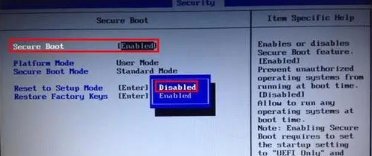
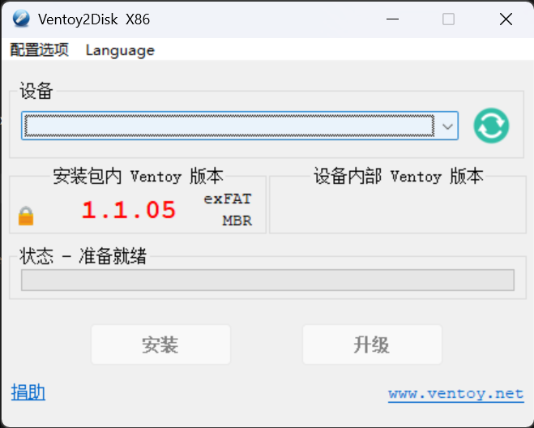
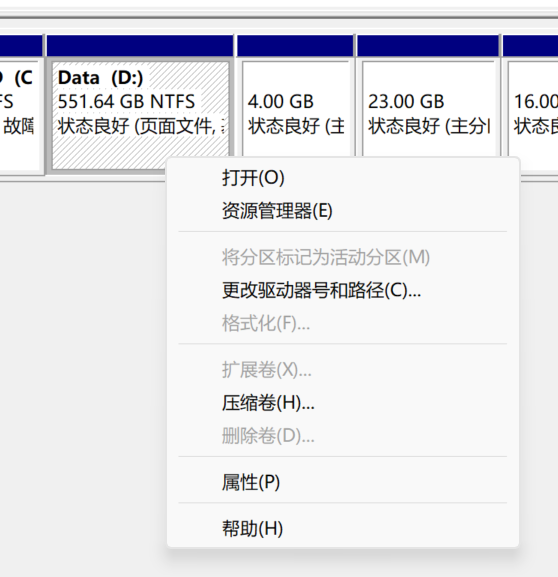

# 在 Windows 11 上安装其他系统

## 一些可能通用的问题

### BitLocker 加密

BitLocker 加密是微软为 Windows 提供的加密功能，如果一个盘符被 BitLocker 加密，安装的其他系统可能无法读取其中的数据。

解决方法：

- 设置 -> 隐私和安全性 -> 安全性 -> 设备加密，将其中的设备加密选项关闭。
- 或者在控制面板中选择 系统与安全 -> BitLocker 驱动器加密，将其关闭。

### 安全启动（Secure Boot）未关闭

部分设备因为未关闭安全启动，在设置了开机第一启动项目位U盘后，并不能从U盘安装启动盘来启动，我们需要进入 BIOS 设置找到 Secure Boot 项目，通过回车键将其状态从“Enabled”变为“Disabled”。

扩展说明：安全启动是电脑行业成员开发的一种安全标准，用于帮助确保设备仅使用受原始设备制造商 (OEM) 信任的软件进行启动。 当电脑启动时，固件会检查每个启动软件片段的签名，包括 UEFI 固件驱动程序、EFI 应用程序和操作系统。 如果签名有效，则电脑将会启动，而固件会将控制权转递给操作系统。

## deepin 操作系统

### 下载镜像

在官网上下载对应版本的系统镜像。

### 制作启动盘

官方推荐使用 [Ventoy](https://www.ventoy.net/cn/index.html) 制作启动盘。

下载 Ventoy 并解压，打开 Ventoy2Disk.exe，选择 u 盘，点击安装。

选择下载的 deepin 镜像，复制到制作好的启动盘中，这样启动盘就制作好了。

### 确保具有足够未分配空间

想要安装双系统，需要硬盘存在未分配的空间。

如果有足够的未分配空间，则可以在安装过程中使用该空间。

如果没有未分配的空间，需要进行磁盘卷压缩。

方法：右键此电脑-管理-存储-磁盘管理，在需要压缩的磁盘上右键-压缩卷。

在压缩卷的时候可能会遇到可压缩空间小于空闲空间的情况：

#### 可压缩空间小于空闲空间

1. 可能是因为有文件碎片导致的，可以尝试使用碎片整理工具进行碎片整理。
2. 可能是因为系统分区的文件系统不支持压缩卷操作，NTFS 文件系统支持压缩卷操作。
3. 可能存在不可移动的文件。

---

如果存在不可移动的文件，则无法压缩卷，解决方法如下：

在 `C:\Windows\System32\winevt\Logs\Application.evtx` 文件中，找到对应事件 ID 为 259 的事件，查看不可移动的文件路径

1. `\$Extend\$UsnJrnl:$J:$DATA`
   1. 这是 NTFS 文件系统标签，包含日志、文件系统标签、索引
   2. 解决方式：以管理员身份运行 cmd，输入以下命令：
      1. `fsutil usn deletejournal /n <盘符>:`
2. `\pagefile.sys::$DATA`
   1. 这个是 Windows 系统的虚拟内存文件
   2. 解决方式：控制面板-高级系统设置-高级-性能-设置-虚拟内存，选择盘符，将对应盘符文件调小或者改为无分页文件

---

在去除不可移动的文件后，可以成功压缩卷了。

预留出足够的未分配空间，然后在安装过程中使用该空间。

### 安装系统

以拯救者 2024 Y7000P 笔记本为例。

首先在电脑开机前将启动盘插入。

按下电源开关，并立即连续按下 F2 键，进入 BIOS 设置。

在 BIOS 中启动选项中，找到启动设备，将其设置为 U 盘启动。

保存并退出 BIOS 设置，电脑自动关机。

再按下电源开关，并立即连续按下 F12 键，进入启动菜单（Boot Menu）。

在启动菜单中，选择对应的启动盘，按下回车键，进入 deepin 安装界面。

根据提示进行安装即可。

想要切换回 Windows 系统，只需要在开机的时候按 F12 进入启动菜单（Boot Menu）。
