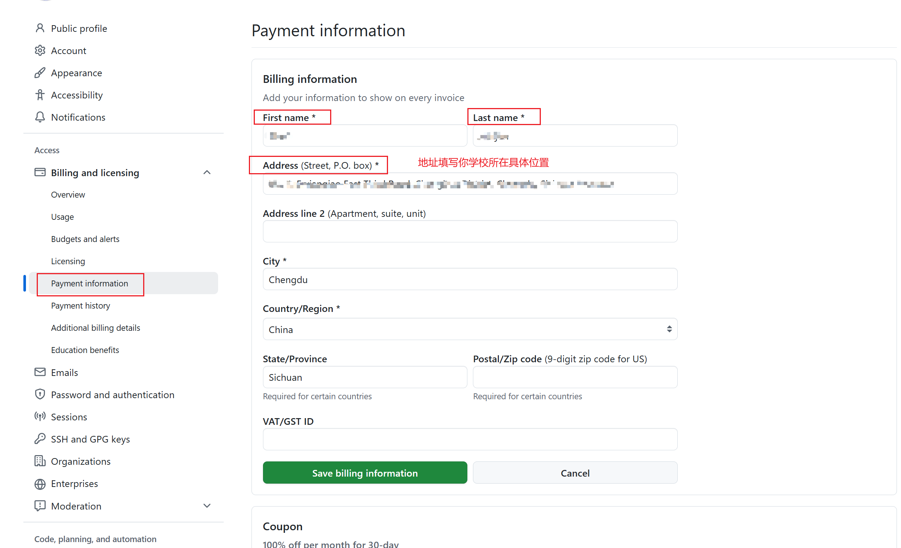
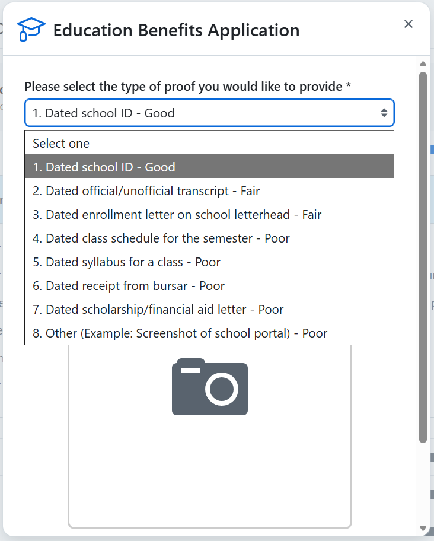

**参考文章：**

[GitHub学生认证（最全）2025年5月21日最新版](https://zhuanlan.zhihu.com/p/1908643143429129800)

[github学生认证常见问题解决方案（已Approved）](https://zhaojianjun2004.github.io/2025/09/16/github_student/)

# github 学生认证申请

## payment information填写

这个填写主要是解决问题：

- Please complete your [GitHub billing information](https://github.com/settings/billing/payment_information) with your full name exactly as it appears in your academic affiliation document. You do not have to add a payment method. You may need to log out and log back in to GitHub before reapplying. If you have only a single legal name, enter it in both the first and last name fields.

  请使用与学术隶属关系文档中显示的全名完全一致地填写您的 [GitHub 账单信息](https://github.com/settings/billing/payment_information) 。您不必添加付款方式。在重新申请之前，您可能需要注销并重新登录 GitHub。如果您只有一个法定姓名，请在名字和姓氏字段中输入该名称。

- You are unlikely to be verified until you have completed your [GitHub user profile](https://docs.github.com/en/account-and-profile/tutorials/personalize-your-profile) with your full name exactly as it appears in your academic affiliation document. Please do not use a variation of your name or a nickname. Once you have updated your profile information log out and log back into GitHub before re-applying.

  在完成 [GitHub 用户个人资料](https://docs.github.com/en/account-and-profile/tutorials/personalize-your-profile) 之前，你不太可能通过验证，全名与学术隶属关系文档中显示的姓名完全一致。请不要使用您姓名或昵称的变体。更新个人资料信息后，注销并重新登录 GitHub，然后再重新申请。



!!! warning "注意！"
    这个地方的填写，Address需要填写你学校的具体位置，你可以选择使用[百度地图](https://map.baidu.com/)查找到你学校的具体位置，然后使用翻译软件去翻译成英文填写。
    姓名填写本人的姓名拼音，注意大小写，比如张三，First Name 填写 San， Last Name 填写 Zhang。

## start an application

### 信息填写


进入界面之后，选择Student， 然后填写所在学校的英文名称（注意不是拼音），然后是学校邮箱（最好是学校邮箱，否则填写个人邮箱试一试，作者没有测试过可行性，不过听说可以）


然后点击`Share Localtion`，注意给github定位权限，然后获取到数据之后，点击`continue`。

接着是**重点！！**

### 上传证明材料

这一步需要你上传你是学生的证明，一般我们可以用学信网上的学籍证明。一步认证方式较2022年发生了较大变换。现在使用智能识别，只允许拍照，不再允许上传文件，这一点比较麻烦。 

1. 拍照使用手机的后置相机比较方便，推荐edge浏览器，前后摄像头切换非常好用。不推荐使用电脑进行这一步。
2. *一次肯定成功不了*，大部分人都是7次到20次左右。你之前提交的图片也会被视为支撑材料，我猜测一方面他们的后台算法是图片相似度比对+ocr文字识别比对+关键词比对。图片越清晰，账户数据匹配越相似，所需要的提交次数越少。
3. 猜测他们的后台算法是图片相似度比对+ocr文字识别比对+关键词比对，尤其是OCR是重中之重，因此怎么制作手机拍摄后仍然清晰的图片就非常关键。
4. 最好使用校园网进行认证，如果校园网暂时访问不了GitHub，建议等几天或者多试试；**使用VPN会很麻烦，需要输入使用VPN理由，地址认证等等**。

我们使用文本文档来作为证明材料（**本人成功**）。因此先创建一个文本文件或者word文件，将下述内容填写清楚之后，放到屏幕上等待后续操作：

```plaintext
Student Verification Report
Name:                       
School:                    
Student ID:                
Study Form: Distance learning
Validate Until:07/2026
```



选择第一个`Dated school ID-good`。

然后，如果自己在学校，但是定位不准导致出现这个问题，我们必须选择第二项：`All coursework is via distance learning`。

证明材料，和前面的方式一样，使用文本文档然后拍照的形式：

```
Student xxx（姓名和前面一致）, is allowed to study via distance learning in xxx（学校英文名，和前面一致）
```

注意拍完整。

然后基本上就通过了。可以等一分钟的样子，然后刷新，发现Approved，那就成功了。等三天人工验证，差不多就可以白嫖copilot了。