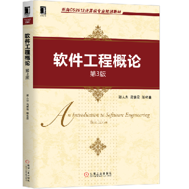
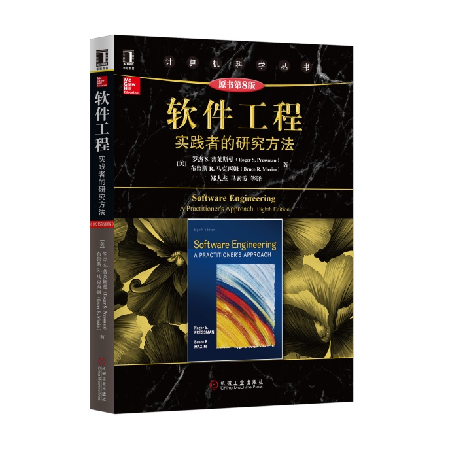

‍

---

# 1 教材和参考书

- 教材

  - 《软件工程概论》（第 3 版），郑人杰、马素霞 等编著，机械工业出版社，2020 年 1 月。
  - 

- 参考书

  - 《软件工程：实践者的研究方法（第 8 版）》Roger S. Pressman 著，郑人杰、马素霞 等译，机械工业出版社，2016 年 11 月。
  - 

# 2 软件的概念

- **软件**：是计算机系统中与硬件相互依存的另一部分，它是包括程序，数据及其相关文档的完整集合。
- **程序**：是按事先设计的功能和性能要求执行的指令序列。
- **数据**：是使程序能正常操纵信息的数据结构。
- **文档**：是与程序开发，维护和使用有关的图文材料。

# 3 软件的分类

## 3.1 系统软件

与硬件频繁交互，提供有效的用户服务、资源共享、进程管理和数据结构处理。

1. **操作系统**

    - Windows
    - Linux
2. **数据库管理系统**

    - MySQL
    - Oracle
3. **设备驱动程序**

    - 打印机驱动
    - 网卡驱动
4. **通信和网络处理程序**

    - 网络协议栈（如 TCP/IP）
    - 
      ```plaintext
      主机1（Server端）               主机2（Client端）
            │                             │
            │<──1. 发送连接请求─────────────│
            │                             │
            │──2. 建立TCP连接─────────────>│
            │                             │
      ```

## 3.2 支撑软件（工具软件）

协助用户开发软件。

### 3.2.1 纵向支撑软件

**功能范围**：分析、设计、编码、测试工具等
**代表工具**：

- PyCharm
- Visual Studio 系列

### 3.2.2 横向支撑软件

**功能范围**：项目管理工具、配置管理工具等
**代表平台**：

- CODING：[https://e.coding.net/login](https://e.coding.net/login)
- GitHub：[https://github.com](https://github.com)

## 3.3 应用软件

在系统软件的支持下，在特定领域内开发，为特定目的服务的软件

## 3.4 可复用软件

已开发好的软件组件，可在不同项目中重复使用。

- 标准函数库、类库、构件库等

|库名称|类型|功能示例|
| ------| ----------------| -------------------------------------|
|**C 标准库**|标准函数库|​`头文件<stdio.h>`​：提供 `printf()` ​等输入输出函数|
|**Python 标准库**|类库|​`math.sqrt()`​：基础数学运算和常量|
|**NumPy**|数值计算库|多维数组运算、线性代数等|
|**PyTorch**|深度学习库|神经网络构建与训练|
|**matplotlib**|绘图库|数据可视化（折线图、散点图等）|
|**pandas**|数据分析和处理库|表格数据处理（如 CSV 读写、数据清洗）|

# 4 软件危机

- 软件自身特点方面：

  - 软件的发展速度远远滞后于硬件的发展速度，不能满足社会日益增长的软件需求。
  - 软件开发周期长、成本高、质量差、维护困难。
- 其他原因
- 除了软件本身的特点，软件危机发生的主要原因有：

  - 缺乏软件开发的经验和有关软件开发数据的积累，使得开发工作的计划很难制定。
  - 软件人员与用户的交流存在障碍，使得获取的需求不充分或存在错误 。
  - 软件开发过程不规范。如，没有真正了解用户的需求就开始编程序。
  - 随着软件规模的增大，其复杂性往往会呈指数级升高。需要很多人分工协作，不仅涉及技术问题，更重要的是必须有科学严格的管理。
  - 缺少有效的软件评测手段，提交用户的软件质量不能完全保证。

# 5 软件工程

为了客服软件危机而提出。旨在将工程化的方法用于软件开发。

## 5.1 若干定义

- Boehm：运用现代科学技术知识来设计并构造计算机程序及为开发、运行和维护这些程序所必需的相关文件资料。
- IEEE： 软件工程是开发、运行、维护和修复软件的系统方法。
- Fritz Bauer：建立并使用完善的工程化原则，以较经济的手段获得能在实际机器上有效运行的可靠软件的一系列方法。

概括地说，软件工程是指导软件**开发**和**维护**的工程性学科，它以计算机科学理论和其他相关学科的理论为指导，采用**工程化**的概念、原理、技术和方法进行软件的开发和维护，把**经过时间考验且证明是正确的**管理技术和**当前能够得到的最好的**技术方法结合起来，以较少的代价获得高质量的软件并维护它。

## 5.2 目标

软件工程的目标是运用先进的软件开发技术和管理方法来提高软件的**质量**和**生产率**，也就是要以较短的周期、较低的成本生产出高质量的软件产品，并最终实现软件的工业化生产。

### 5.2.1 基本目标

- 付出较低的开发成本
- 达到要求的软件功能
- 取得较好的软件性能
- 开发的软件易于移植
- 需要较低的维护费用
- 能按时完成开发工作，及时交付使用

```mermaid
graph LR
A[低成本开发]
B[易于维护]
C[高可靠性]
D[高性能]
E[按时交付]

A <-->|互斥| B
B <-.互补.-> C
A <-->|互斥| C
A <-->|互斥| D
A <-.互补.-> E
E <-->|互斥| D
D <-->|互斥| C
```

### 5.2.2 软件质量特性

|质量特性|含义|子特性|
| ----------| ------------------------------------------------------------------| ------------------------------|
|功能性|软件所实现的功能达到它的设计规范和满足用户需求的程度|适合性、正确性、安全保密性|
|可靠性|在规定的时间和条件下，软件能够正常维持其工作的能力|成熟性、恢复性、容错性|
|易用性|为了使用该软件所需要的能力|易理解性、易学习性、易操作性|
|效率|在规定的条件下用软件实现某种功能所需要的计算机资源的有效性|时间特性、资源特性|
|维护性|当环境改变或软件运行发生故障时，为使其恢复正常运行所做努力的程度|易分析性、易修改性、易测试性|
|可移植性|软件从某一环境转移到另一环境时所做努力的程度|适应性、易替换性|

## 5.3 需要的转变

- 转变对软件的认识

  - ```mermaid
    graph LR
    A[程序] -->|上升| B[系统] 
    ```

- 转变思维定式

  - ```mermaid
    graph LR
    A[程序员] -->|上升| B[系统工程师] 
    ```

# 6 软件生存期

软件也有一个孕育、诞生、成长、成熟和衰亡的生存过程，我们称这个过程为**软件生命周期**或**软件生存期**。

分为三个时期：

- 软件定义时期

  - 问题定义
  - 可行性研究
  - 需求分析

- 软件开发时期

  - 系统设计

    - 概要设计
    - 详细设计
  - 系统实现

    - 编码
    - 测试
- 软件维护时期

  - 维护

## 6.1 软件定义时期

- 确定总目标和可行性；
- 导出策略和系统功能；
- 估计资源和成本；
- 制定工程进度表

### 6.1.1 问题定义

回答问题：要解决的问题是什么？

提交书面报告，关于以下方面：

- 问题性质
- 工程目标
- 工程规模

### 6.1.2 可行性研究

回答问题：上一个阶段所确定的问题是否有行得通的解决办法？

提交可行性研究报告，从以下几个角度来研究**可行性**：

- 技术
- 经济
- 社会因素
- ……

### 6.1.3 需求分析和定义

回答问题：目标系统必须做什么？

- 对用户提出的要求进行分析并给出需求对应的确切的描述

  - 明确功能需求与非功能需求
  - 建立分析模型，从功能、数据、行为等方面描述系统的静态特性和动态特性

- 对目标系统提出完整、准确、清晰、具体的要求。

- 编写软件需求说明书或系统功能说明书及初步的系统用户手册，之后提交管理机构评审。

## 6.2 软件开发时期

具体设计和实现前一个时期即软件定义时期定义的软件。

### 6.2.1 概要设计

**任务**：*概括地*回答怎样实现目标系统

需要设计程序的**体系结构**，即确定程序***由哪些模块组成***以及***模块间的关系***。

**提交的文档**：**概要设计说明书**。

### 6.2.2 详细设计

**任务**：怎样*具体地*实现这个系统

需要详细地**设计每个模块**，确定实现模块功能所需要的**算法和数据结构**。

编写单元测试计划和集成测试计划。

**提交的文档**：软件的**详细设计说明书**。

### 6.2.3 程序编码和单元测试

**任务**：写出**正确**的**容易理解**、**容易维护**的程序模块

**提交的文档**：项目的**源程序**、**详尽的程序说明**和**单元测试报告**。

### 6.2.4 集成测试和系统测试

**任务**：通过各种类型的测试及相应的调试使软件达到预定的要求

**提交的文档**：项目的**测试计划**、**详细测试方案**以及**实际测试结果**等。

## 6.3 软件维护时期

|类型|含义|示例|
| ------------| ------------------------------------------| --------------------------------------|
|改正性维护|诊断和改正在使用过程中发现的软件错误|特定牌型引发了游戏崩溃，发布修复补丁|
|适应性维护|修改软件以适应环境的变化|游戏需要从桌面端移植到移动端|
|完善性维护|根据用户的要求改进或扩充软件，使它更完善|增加新玩法或游戏道具|
|预防性维护|修改软件为将来的维护活动预先做准备|定期代码审查和性能测试，识别潜在瓶颈|

## 6.4 开发过程中的典型文档

|文档|说明|
| --------------------| ------------------------------------------------------------------|
|软件需求规格说明书|描述将要开发的软件做什么|
|项目计划|描述将要完成的任务及其顺序，并估计所需要的时间及工作量|
|软件测试计划|描述如何测试软件，使之确保软件应实现规定的功能，并达到预期的性能|
|软件设计说明书|描述软件的结构，包括概要设计及详细设计|
|用户手册|描述如何使用软件|

# 7 软件工程方法概述

软件工程包含**技术**和**管理**两方面的内容，是技术和管理紧密结合所形成的工程学科。

**方法学(methedology)/范型(paradigm)** ：软件开发全过程中使用的一整套技术方法的集合。

目前使用最广泛的软件工程方法学：

- 传统方法学（结构化方法学）
- 面向对象方法学

方法学包含的三要素：

- **方法(method)** ：为开发提供了“如何做”的技术
- **工具(tool)** ：为**方法**的运用提供了自动的或半自动的*软件支撑环境*
- **过程(process)** ：获得高质量软件所需要完成的**一系列任务的框架**，规定了完成各项任务的**工作步骤**。

‍
