‍

---

# 1 需求获取与需求分析阶段的任务

# 2 结构化分析方法

*传统的*分析建模方法。英文为 structured analysis (SA)。

*最有代表性*的是一种**面向数据流**进行需求分析的方法。

结构化分析方法建立的**结构化分析模型**如下：

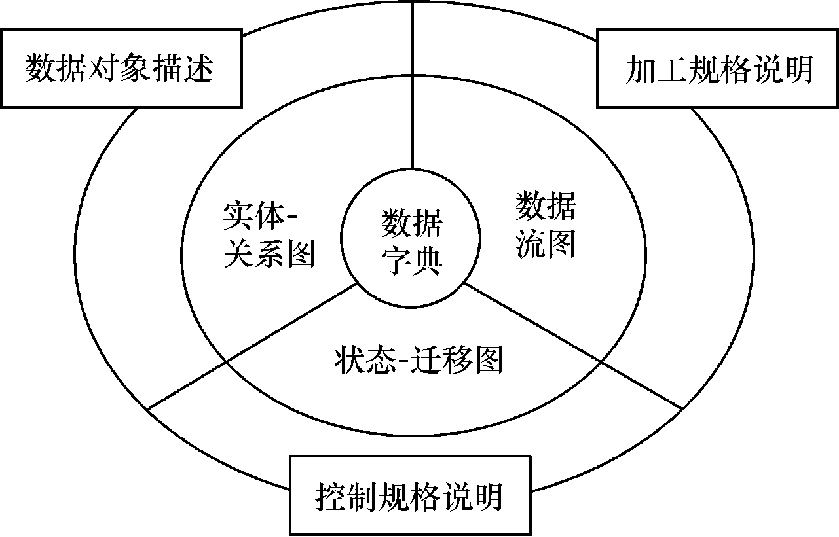

|要素|解释|
| -------------------------| ----------------------------------------------------------------------------|
|数据字典|核心，包括在目标系统中使用和生成的**所有数据对象**|
|数据流图（DFD） *Data Flow Diagram* |用于**功能建模**，描述数据在系统中如何被传送或变换，以及描述如何对数据流进行变换的功能|
|实体-关系图（ER图） *Entity-Relationship Diagram* |用于**数据建模**，描述数据对象及数据对象之间的关系|
|状态-迁移图（STD） *State Transition Diagram* |用于**行为建模**，描述系统对外部事件如何响应、如何动作|

## 2.1 功能建模 - 数据流图 DFD

功能建模的思想就是用*抽象模型*的概念，按照软件**内部数据传递、变换**的关系，自顶向下逐层分解，直到找到满足功能要求的所有可实现的软件为止。

### 2.1.1 数据流图的基本图形符号

|符号|含义|
| ------------------------------------------------------| ------------------------------------------------------------|
||**加工**。对输入数据进行变换以产生输出数据，其中要**注明加工的名字**。|
||**外部实体**，即数据输入源（source）或数据输出汇点（sink）。其中要**注明数据源或数据汇点的名字**。|
||数据存储。要用*名词或名词性短语*​**为数据存储命名**。|
||数据流。描述被加工数据及传递方向。箭头旁边要**注明数据流的名字**，可用*名词或名词性短语*命名。 |

当有多个数据流流向一个加工，或一个加工产生两个及以上的数据流，这些数据流往往会存在一定关系，用以下符号表示：

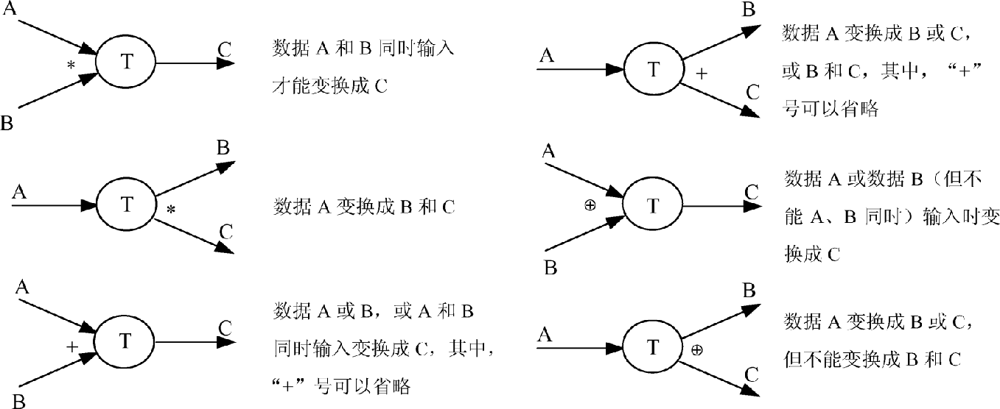

### 2.1.2 环境图(context diagram)

也称为**顶层数据流图 / 0 层数据流图**。

仅包括**一个**数据处理过程，也就是要开发的**目标系统**。

**作用**：是**确定**系统在其环境中的**位置**，通过确定系统的*输入和输出与外部实体的关系*确定其**边界**。

典型的环境图：

招生系统的环境图示例：

### 2.1.3 数据流图的分层

对于稍微复杂一些的实际问题，在数据流图上常常出现十几个甚至几十个加工，这样的数据流图看起来不直观，不易理解。可以**将数据流图分层**。

按照系统的**层次结构**进行**逐步分解**，并以分层的数据流图反映这种结构关系，能清楚地表达整个系统，也容易理解。

招生系统的环境图的分层示例：

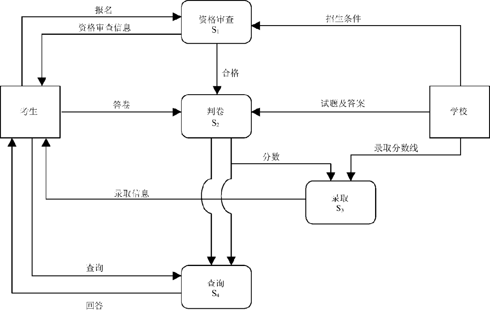

数据流图分层示意图：

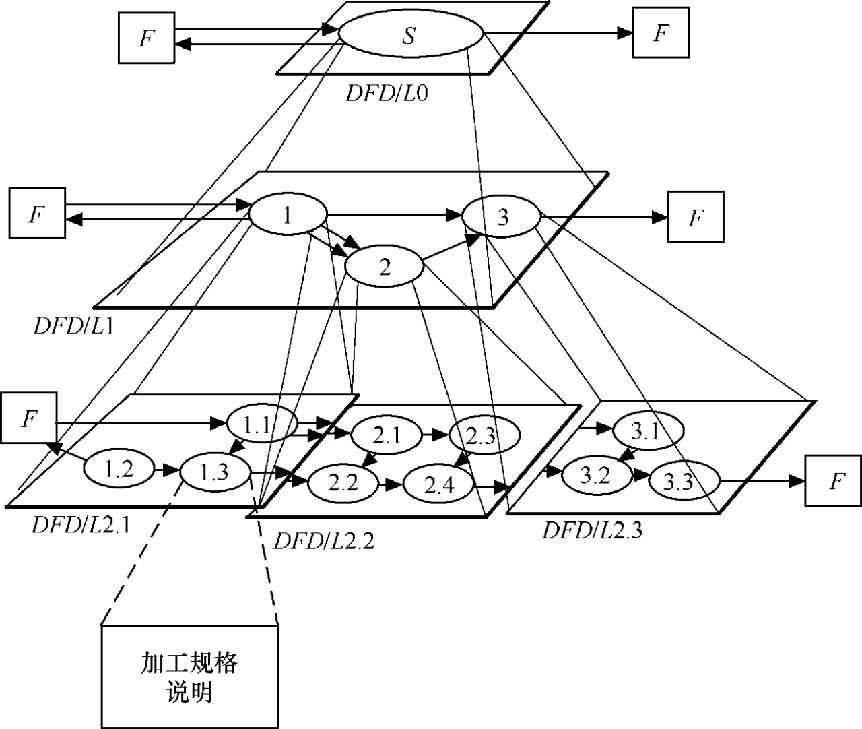

### 2.1.4 实例研究：银行储蓄系统

银行储蓄系统的业务流程：

- 储户填写的存款单或取款单由业务员键入系统；
- 如果是*存款*则系统记录存款人姓名、住址（或电话号码）、身份证号码、存款类型、存款日期、到期日期、利率、密码（可选）等信息，并印出存单给储户；
- 如果是*取款*而且开户时留有密码，则系统首先核对储户密码，若密码正确或存款时未留密码，则系统计算利息并印出利息清单给储户。
- 要求画出分层的数据流图，并细化到2层数据流图。

1. 识别外部实体及输入输出数据流

    1. 外部实体：储户、业务员。
    2. 输入数据：如果需要储户输入密码，储户才直接与系统进行交互。储户填写的存款或取款信息通过业务员键入系统，可以将存款及取款信息抽象为事务。
    3. 输出数据：存款单，利息清单。
2. 画出环境图

    1. 

3. 画出一层数据流图

    1. 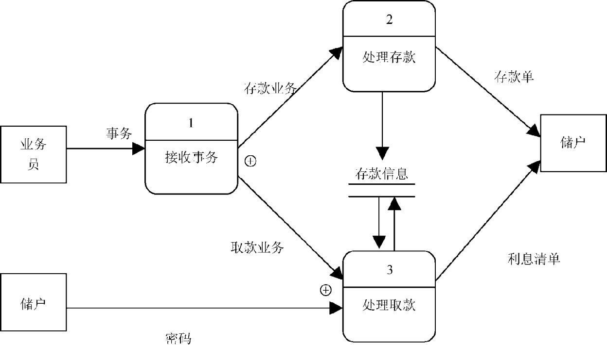
4. 画出二层数据流图

    1. 处理存款的  
        ​
    2. 处理取款的  
        ​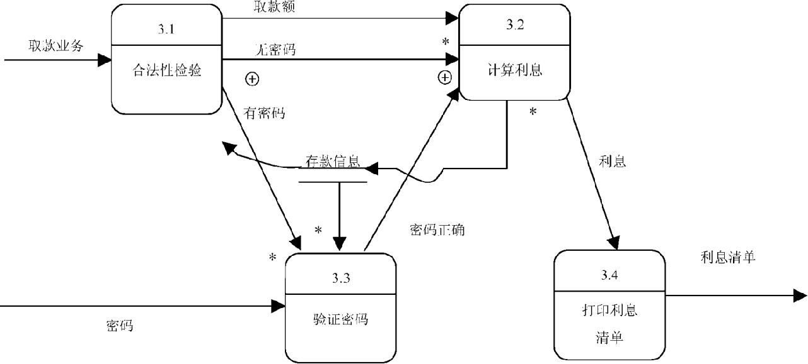

## 2.2 数据建模 - 实体-关系图 ER图

在结构化分析方法中，使用**实体-关系**建模技术来建立数据模型。

这种技术是在较高的抽象层次（概念层）上对数据库结构进行建模的流行技术。

ER图中仅包含 3 种相互关联的元素：

- **数据对象**（实体）
- 描述数据对象的**属性**
- 数据对象彼此间相互连接的**关系**

### 2.2.1 基本符号表示

|元素|含义|表示法|
| ------------------| --------------------------------------------------------------------------------------------------------------| --------------------------------------------------------------------------------------------------------|
|数据对象（实体）|目标系统所需要的**复合信息**（即具有若干不同属性的信息）**的表示**，可以是外部实体、事物、角色、行为或事件、组织单位、地点或结构等|**矩形**|
|属性|定义了数据对象的**特征**，如数据对象学生的学号、姓名、性别、专业等，课程的课程编号、课程名称、学分等|**椭圆或圆角矩形**，用**无向边**将属性和实体连接起来|
|关系|不同数据对象的实例之间具有的关联关系|**无向边**，两端应标识出关联实例的数量，也称为关联的**重数**。|
|关系的属性|关系本身具有的属性，在多对多的关系中尤其常见|在表示关系的无向边上再加一个**菱形框**，并在菱形框中标明关系的名字，属性同样用**椭圆形或圆角矩形**表示，并用**无向边**将关系与其属性连接起来。|

‍

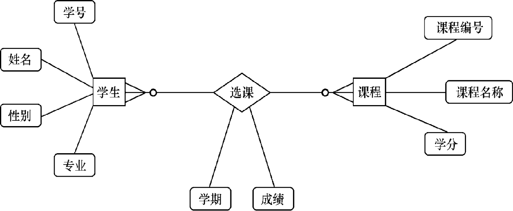

### 2.2.2 关联数量的表示

关联可以从重数角度分为 3 种：

1. 一对一（1:1）关联
2. 一对多（1:m）关联
3. 多对多（m:n）关联

实例关联还有**必须**和**可选**之分。

在ER图中用圆圈表示所关联的实例是可选的，隐含表示“0”，没有出现圆圈就意味着是必须的。出现在连线上的短竖线可以看成是“1”。

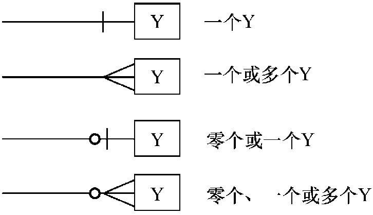

举例：

### 2.2.3 实例研究：银行储蓄系统

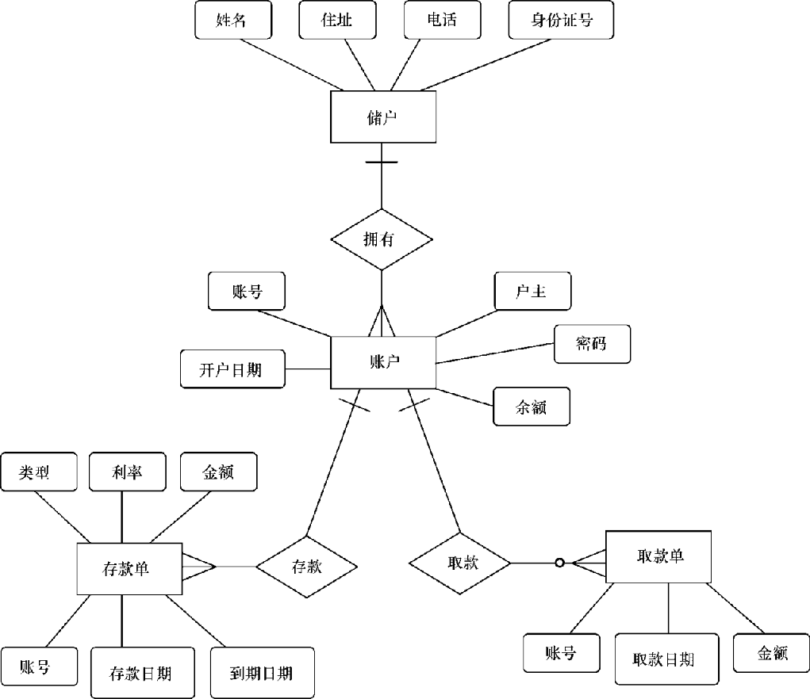

## 2.3 行为建模 - 状态-迁移图 STD

通过描绘系统的状态及引起系统状态转换的事件，来表示系统的行为。

又称**状态转换图**，简称**状态图**。

### 2.3.1 基本符号表示

|元素|含义|表示法|备注|
| ----------| ------------------------------------------------------------------------------------------------------------------------------------------------------------| ------------------------------------------------------------------------------------------------------------------| --------------------------------------------------------------------------------------------------------------------------------------------------------------------------------------|
|状态|是任何可以*被观察*到的**系统行为模式**，规定了系统对事件的响应方式。系统对事件的响应，既可以是做一个（或一系列）动作，也可以是仅仅改变系统本身的状态，还可以是既改变状态又做动作。|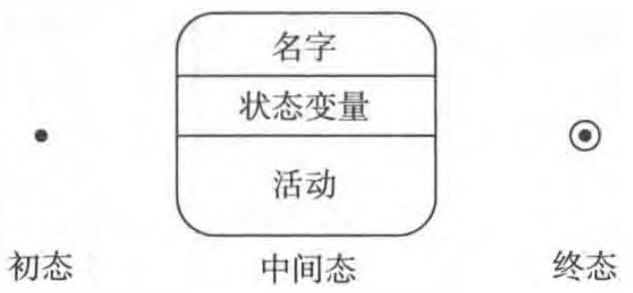 *初态*是**实心圆**，*中间态*是**圆角矩形**，*终态*是**牛眼图形** 活动部分的语法： 事件名（参数表）/ 动作表达式 |一张图只能有**一个初态**，可以有**多个终态或者没有**。中间态包含三个部分，*第二、第三部分可选*。 “事件名”可以是任何事件的名称，需要时可以为事件指定参数表；“动作表达式”指定应做的动作。|
|状态转换|两个状态之间带箭头的连线|带箭头的连线。 状态的变迁*通常是*由事件触发的，在**箭头线上方**标注触发转换的**事件表达式**。 |源状态的*内部活动执行完*之后**自动触发转换**，则箭头线上**不标注事件**。|
|事件|事件是在某个特定时刻发生的事情，它是对*引起系统做动作*或*状态转换*的**外部事件的抽象**。|事件表达式的语法如下： 事件说明 [守卫条件] / 动作表达式 |(1) *事件说明*的语法如下：事件名（参数表） (2) *守卫条件*是一个布尔表达式。事件发生且布尔表达式为真则发生状态转换；没有事件说明则状态是否转换取决于守卫条件。 (3) *动作表达式*是一个过程表达式，当**状态转换开始时**执行该表达式。 |

常用的 3 种标准事件名：

- **entry**：事件指定进入该状态的动作
- **exit**：事件指定退出该状态的动作
- **do**：事件则指定在该状态下的动作

### 2.3.2 实例研究：银行储蓄系统

存款过程状态图：

取款过程状态图：

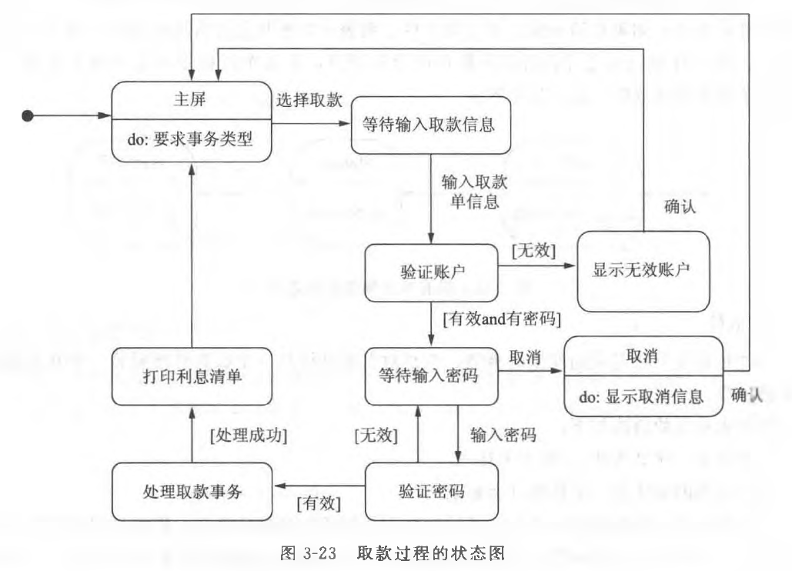

‍
