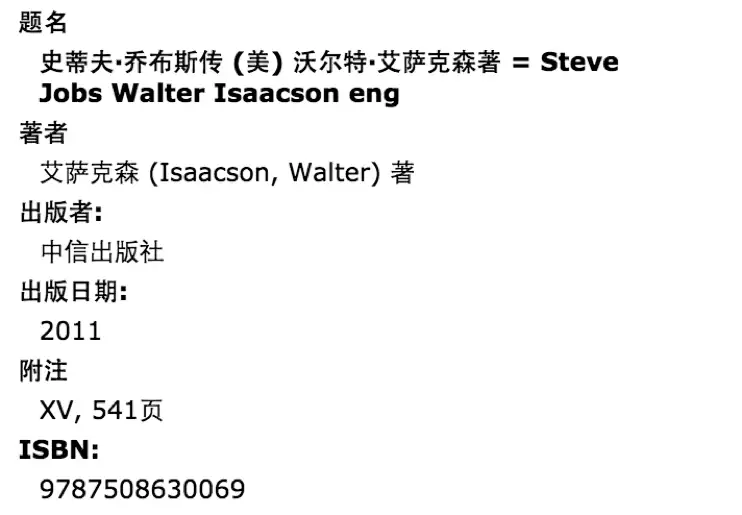

---

# 元数据

元(meta)，一般被我们翻译成“关于……的……”。

事实上，这个前缀来源于希腊文，表示“在……之后”，在某样事情结束之后，就含有了“归纳”、“总结”的意思呢？因此，元，就代表着“本原”、“体系”的意思。

元数据(meta data)——“data about data” 关于数据的数据，一般是[结构化数据](https://zhida.zhihu.com/search?content_id=21642841&content_type=Answer&match_order=1&q=%E7%BB%93%E6%9E%84%E5%8C%96%E6%95%B0%E6%8D%AE&zhida_source=entity)（如存储在数据库里的数据，规定了字段的长度、类型等）。

元数据是指从信息资源中抽取出来的用于说明其特征、内容的结构化的数据(如题名,版本、出版数据、相关说明,包括检索点等)，用于组织、描述、检索、保存、管理信息和知识资源。

比如，关于一本书（信息资源），我们在[图书馆系统](https://zhida.zhihu.com/search?content_id=21642841&content_type=Answer&match_order=1&q=%E5%9B%BE%E4%B9%A6%E9%A6%86%E7%B3%BB%E7%BB%9F&zhida_source=entity)中检索可以得到如下信息

​​

一个基本的元数据由元数据项目和元数据内容的构成。这里，“题名”就是它的元数据项目，“史蒂夫·乔布斯传 (美) [沃尔特·艾萨克森](https://zhida.zhihu.com/search?content_id=21642841&content_type=Answer&match_order=1&q=%E6%B2%83%E5%B0%94%E7%89%B9%C2%B7%E8%89%BE%E8%90%A8%E5%85%8B%E6%A3%AE&zhida_source=entity)著 \= Steve Jobs Walter Isaacson eng”就是元数据内容。再比如，“著者”、“出版者”都是元数据项目，而“艾萨克森 (Isaacson, Walter) 著”和“[中信出版社](https://zhida.zhihu.com/search?content_id=21642841&content_type=Answer&match_order=1&q=%E4%B8%AD%E4%BF%A1%E5%87%BA%E7%89%88%E7%A4%BE&zhida_source=entity)”就是元数据内容。学过数据库的应该不难理解\~

‍
