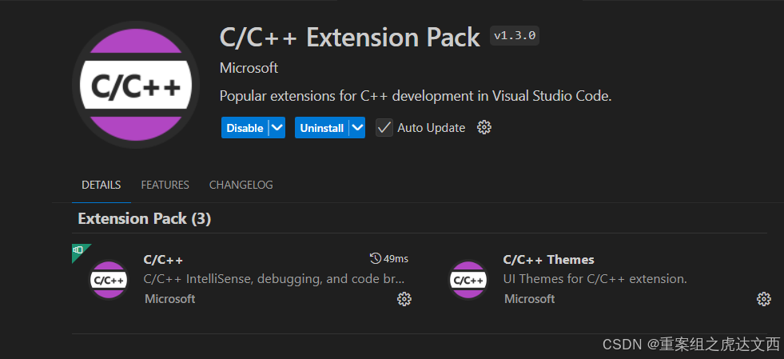
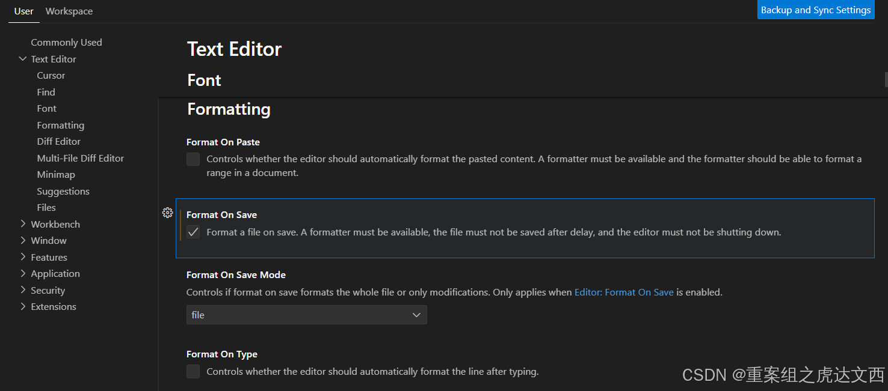
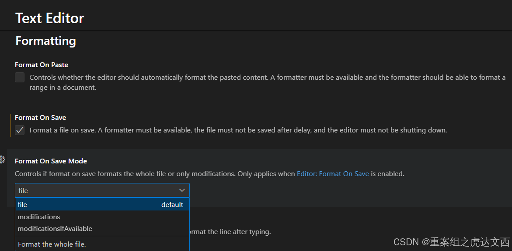
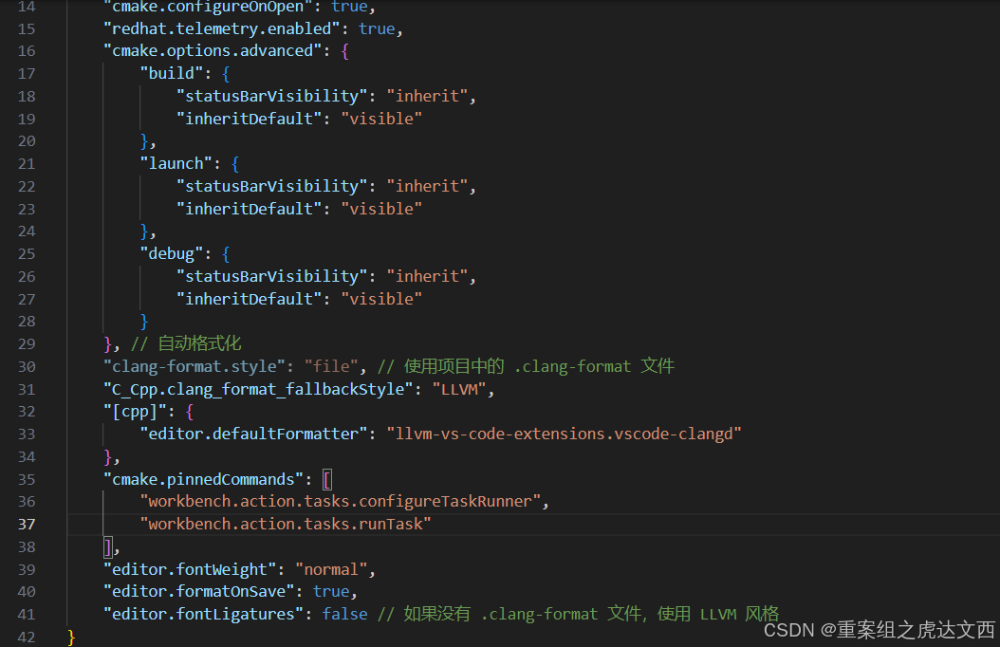
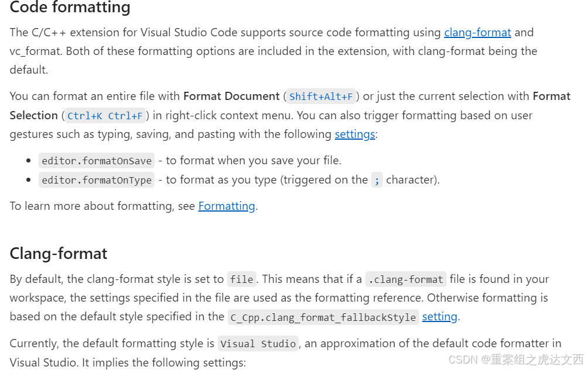

‍

---

# 1 C/C++

## 1.1 C/C++ Extension Pack 插件自定义格式化设置

**VSCode 的 C/C++ 插件** 内置了 **clang-format**。安装 C/C++ 插件（Microsoft） 后，无需额外安装 clang-format，插件会自动使用内置的 clang-format 来进行代码格式化。



不需要额外安装clang-format

打开C/C++ Extension Pack设置，定位到formatting设置



- **Format On Paste**：粘贴代码自动格式化

- **Format On Save：** 保存时格式化

- **Format On Save Mode：** 这个设置在启用**Format On Save**功能时，VS Code 会格式化整个文件或只格式化修改过的部分。



- **file（默认选项）:** 选择此选项保存文件时，VS Code 会格式化整个文件。即使你只修改了部分内容，保存时所有内容都会被格式化。
- **modifications:**   
  这个选项意味着只有修改过的代码（即你最近编辑过的部分）会在保存时被格式化。未修改的部分保持原样。
- **modificationsIfAvailable:**   
  如果编辑器能识别到修改部分，则仅格式化修改的部分。如果无法识别，就格式化整个文件。

**这些选项只会在启用了Format On Save前提下生效。**

最后一个**Format on type**是键入格式化，比如键入；就会格式化。

## 1.2 配置clang-format文件

在设置好C/C++ Extension Pack之后，最后一步就是配置clang-format文件了，打开settings.json文件可以看到如果不配置clang-format文件，clang-format会使用默认的风格格式化代码。



在vscode官方文档中也提到了这一点



自定义格式化风格可点击查看→[Clang-Format官方文档](https://clang.llvm.org/docs/ClangFormatStyleOptions.html "Clang-Format官方文档")

```plaintext
BasedOnStyle: LLVM
 
# 强制花括号遵循 Allman 风格
BreakBeforeBraces: Allman
 
# 对齐连续的宏定义
AlignConsecutiveMacros: AcrossEmptyLinesAndComments
 
# 控制行宽，避免行太长
ColumnLimit: 120
 
# 控制空格和标点符号风格
SpaceBeforeParens: ControlStatements  # 控制语句的括号前有空格
SpaceBeforeAssignmentOperators: true  # 赋值操作符前插入空格
 
# 缩进设置
IndentWidth: 4  # 使用4个空格缩进
 
# 控制每行最大空行数（避免空行过多）
MaxEmptyLinesToKeep: 1
 
# 启用注释对齐，注释前保留一个空格
AlignTrailingComments: true  
SpacesBeforeTrailingComments: 1  
 
# 对齐转义的换行符到左侧
AlignEscapedNewlinesLeft: true
 
# 允许将参数换行，但保持多个参数在同一行（打包参数）
AllowAllParametersOfDeclarationOnNextLine: true
BinPackParameters: true  # 启用参数打包，减少换行次数
```

## 1.3 其他资料参考

还有很多需要注意的编写规范，一篇文章肯定是连皮毛都讲不完的。

推荐阅读《c语言规范》、《华为c编程规范》和《c专家编程》
