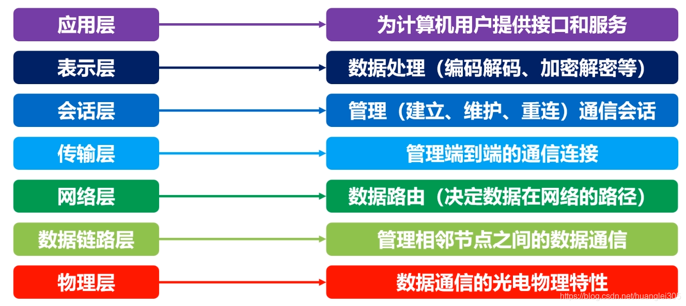
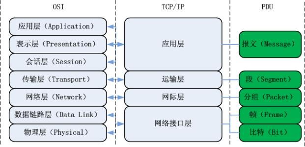

‍

---

# 1 计算机网络概述

## 1.1 分类

按照网络作用的范围：

- 广域网 WAN
- 城域网 MAN
- 局域网 LAN

按照网络的使用者：

- 公用网络
- 专用网络

## 1.2 计算机网络的层次结构

### 1.2.1 层次结构设计的基本原则

- 各层之间是相互独立的；
- 每一层需要有足够的灵活性；
- 各层之间完全解耦。

### 1.2.2 OSI 体系结构

### 1.2.3 TCP/IP 四层模型

### 1.2.4 TCP/IP 四层模型与 OSI 体系结构对比

### 1.4 计算机网络的性能指标

**速率**：bps\=bit/s  
**时延**：发送时延、传播时延、排队时延、处理时延  
**往返时间RTT：**​*数据报文在端到端通信中的来回一次的时间。*

# 物理层

**物理层的作用**：连接不同的物理设备，传输比特流。该层为上层协议提供了一个传输数据的可靠的物理媒体。简单的说，物理层确保原始的数据可在各种物理媒体上传输。

**物理层设备**：

- **中继器【Repeater，也叫放大器】** ：同一局域网的再生信号；两端口的网段必须同一协议；5-4-3规程： 10BASE-5以太网中，最多串联4个中继器，5段中只能有3个连接主机；
- **集线器**：同一局域网的再生、放大信号（多端口的中继器）；半双工，不能隔离冲突域也不能隔离广播域。

**信道的基本概念**：信道是往一个方向传输信息的媒体，一条通信电路包含一个发送信道和一个接受信道。

1. 单工通信信道：只能一个方向通信，没有反方向反馈的信道；
2. 半双工通信信道：双方都可以发送和接受信息，但不能同时发送也不能同时接收；
3. 全双工通信信道：双方都可以同时发送和接收。

‍
